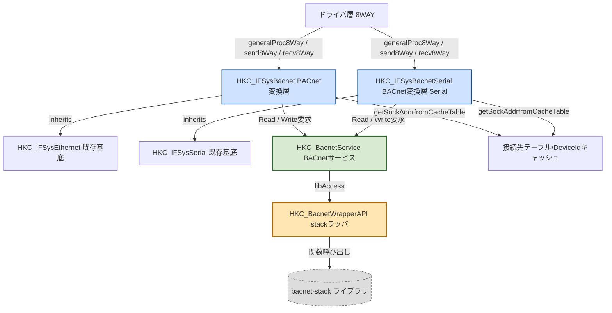
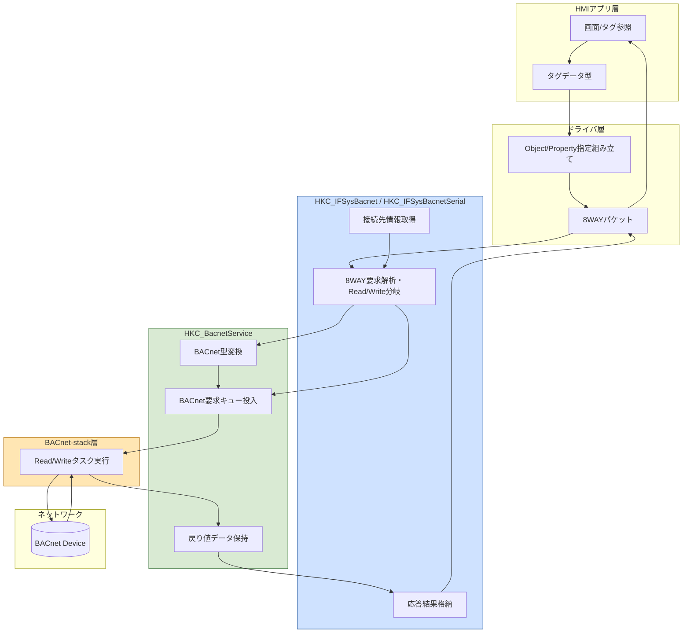
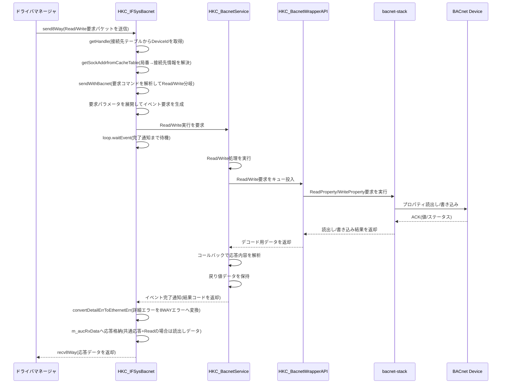
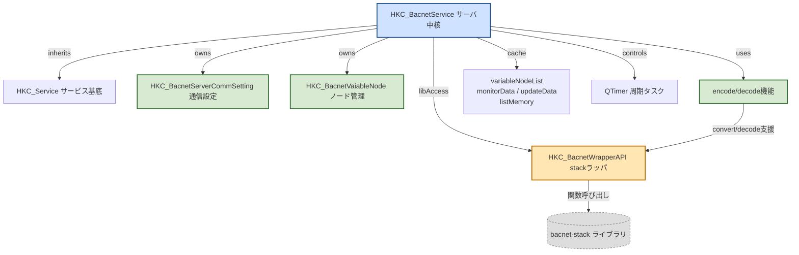
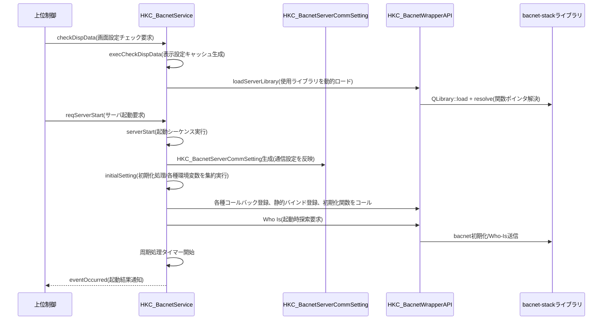
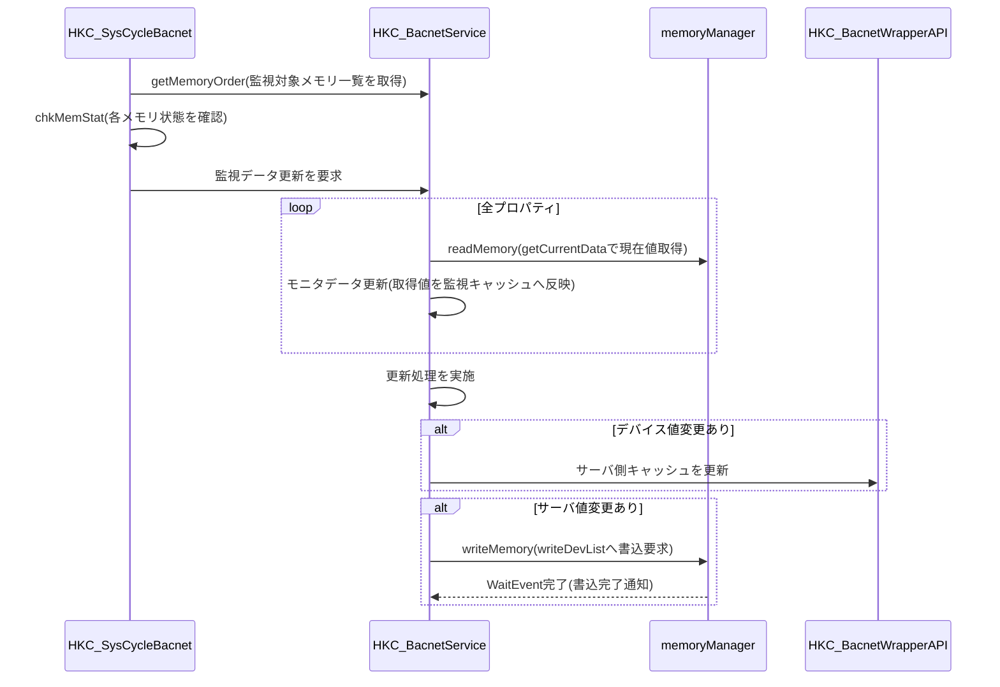
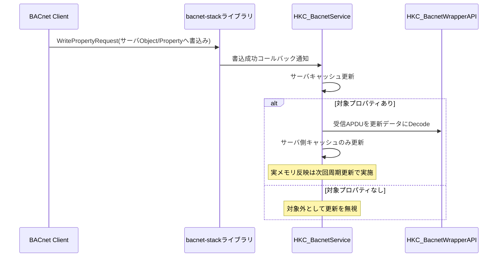
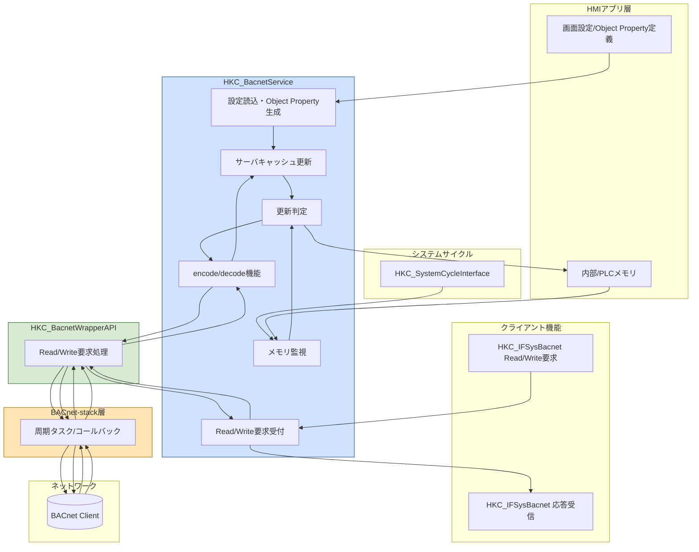

# BACnetクライアント機能

## 目次

- [BACnetクライアント機能](#bacnetクライアント機能)
  - [機能概要](#機能概要)
  - [クラス構成](#クラス構成)
  - [構造図（Mermaid）](#構造図mermaid)
    - [クラス構成図](#クラス構成図)
    - [データフロー図](#データフロー図)
    - [シーケンス図（Read/Write要求）](#シーケンス図readwrite要求)
- [BACnetサーバ機能](#bacnetサーバ機能)
  - [機能概要](#機能概要-1)
  - [クラス構成](#クラス構成-1)
  - [構造図（Mermaid）](#構造図mermaid-1)
    - [クラス構成図](#クラス構成図-1)
    - [シーケンス図（サーバ起動）](#シーケンス図サーバ起動)
    - [シーケンス図（周期更新）](#シーケンス図周期更新)
    - [シーケンス図（外部クライアントによるサーバデータ更新）](#シーケンス図外部クライアントによるサーバデータ更新)
    - [データフロー図](#データフロー図-1)
- [モニタッチで対応するプロパティ一覧](#モニタッチで対応するプロパティ一覧)
  - [共通事項](#共通事項)
  - [Analog Input (AI)](#analog-input-ai)
  - [Analog Output (AO)](#analog-output-ao)
  - [Binary Input (BI)](#binary-input-bi)
  - [Binary Output (BO)](#binary-output-bo)
  - [Device](#device)
  - [BIT_STRING ビット定義](#bit_string-ビット定義)
    - [BACnetStatusFlags](#bacnetstatusflags)
    - [BACnetServicesSupported](#bacnetservicessupported)
    - [BACnetObjectTypesSupported](#bacnetobjecttypessupported)
- [BACnetライブラリ管理プロパティ 読み取りマクロ](#bacnetライブラリ管理プロパティ-読み取りマクロ)
  - [機能概要](#機能概要-2)
  - [パラメータ](#パラメータ)
  - [動作仕様](#動作仕様)
  - [対象プロパティと出力形式](#対象プロパティと出力形式)
  - [Priority Array の読み取りについて](#priority-array-の読み取りについて)
- [BACnet Priority Write / Relinquish 書き込みマクロ](#bacnet-priority-write--relinquish-書き込みマクロ)
  - [機能概要](#機能概要-3)
  - [パラメータ](#パラメータ-1)
  - [動作仕様](#動作仕様-1)
  - [対応プロパティ](#対応プロパティ)
  - [NULL 書き込み（Relinquish）の注意事項](#null-書き込みrelinquishの注意事項)

## 機能概要

BACnetクライアント機能は、HMI画面側からドライバ経由でBACnet機器へアクセスし、Object/PropertyのRead/Writeを行う機能です。  
ドライバとHMIアプリ間は既存の8WAY通信I/Fでやり取りされ、HKC_IFSysBacnet系クラスが8WAY要求をBACnetサービス呼び出しへ変換します。  
本セクションではクライアントI/F層を対象とし、HKC_BacnetService以降（サービス内部処理、ラッパ、スタック内部）は対象外とします。

| 項目 | 内容 |
|---|---|
| 通信I/F | 8WAY通信I/F（send8Way/recv8Way/generalProc8Way） |
| 対応機能 | ReadProperty / WriteProperty |
| 対応データ型 | T.P.D |
| 接続先解決 | 接続先テーブル情報からDeviceIdを取得して要求先を決定 |
| 呼出先 | HKC_BacnetServiceにReadProperty/WriteProperty要求を依頼 |
| 範囲外 | HKC_BacnetService以降の内部処理（ライブラリ呼び出し、Who-Is、静的バインド管理など）は本セクションの対象外 |


## クラス構成

| 分類 | クラス/構造体 | 役割 | ファイル |
|---|---|---|---|
| 主体（ドライバ-BACnet変換） | HKC_IFSysBacnetEthernet | HKC_IFSysEthernetを継承。8WAY要求を解析し、ReadProperty/WriteProperty要求をHKC_BacnetServiceへ中継。接続先テーブルからDeviceIdを取得し、応答データを8WAY受信バッファへ格納。 | V10/src/com/interface/library/BACnet/HKC_IFSysBacnetEthernet.h<br>V10/src/com/interface/library/BACnet/HKC_IFSysBacnetEthernet.cpp |
| 主体（ドライバ-BACnet変換: Serial拡張予定） | HKC_IFSysBacnetSerial | HKC_IFSysBacnetEthernetと同一の役割・処理構成を想定。相違点は継承元のみで、HKC_IFSysEthernetの代わりにHKC_IFSysSerialを継承する想定。ReadProperty/WriteProperty要求の中継先やサービス層以降の構成は共通。 | V10/src/com/interface/library/BACnet/HKC_IFSysBacnetSerial.h<br>V10/src/com/interface/library/BACnet/HKC_IFSysBacnetSerial.cpp |
| 制御（BACnetサービス） | HKC_BacnetService | reqReadProperty/reqWritePropertyを受け、BACnet処理を実行して戻り値データを保持。クライアントIFからgetReturnDataで参照される。内部でHKC_BacnetWrapperAPIを保持。 | V10/src/sys/service/HKC_BacnetService.h<br>V10/src/sys/service/HKC_BacnetService.cpp |
| 補助（ライブラリラッパ） | HKC_BacnetWrapperAPI | bacnet-stack関連ライブラリのロード/アンロード、関数ポインタ解決、各API呼び出しをラップ。address_add/address_set_device_TTL等の呼び出し窓口。 | V10/src/sys/service/BACnet/HKC_BacnetWrapperAPI.h<br>V10/src/sys/service/BACnet/HKC_BacnetWrapperAPI.cpp |
| 補助（I/F要求応答構造体） | Bacnet_Send_Common<br>Bacnet_Recv_Common<br>Bacnet_Send_ReadProperty<br>Bacnet_Send_WriteProperty | HKC_IFSysBacnetEthernet/HKC_IFSysBacnetSerialの送受信バッファで使用する要求/応答データ形式。 | Grobal/include/DrvLibraryStruct.h |
| 外部基底クラス | HKC_IFSysEthernet | Ethernet 8WAY通信の共通処理を提供。HKC_IFSysBacnetEthernetはこれを継承し、BACnet独自のsend/recv処理を実装。 | V9/src/com/interface/HKC_IFSysEthernet.h<br>V9/src/com/interface/HKC_IFSysEthernet.cpp |
| 外部基底クラス | HKC_IFSysSerial | Serial 8WAY通信の共通処理を提供する想定基底クラス。HKC_IFSysBacnetSerialではこの基底に差し替える。 | V9/src/com/interface/HKC_IFSysSerial.h |

## 構造図（Mermaid）

### クラス構成図



### データフロー図



### シーケンス図（Read/Write要求）



# BACnetサーバ機能

## 機能概要

BACnetサーバ機能は、HMI製品側で`HKC_BacnetService`がBACnetサービスを実行し、外部BACnetクライアントからのRead/Write要求に応答しながら、
HMI内部メモリ（内部/PLCデバイス値）とサーバキャッシュを同期する機能です。
ライブラリ本体にはbacnet-stackを使用し、ライブラリのロードおよびAPI呼び出しは`HKC_BacnetWrapperAPI`でラップされています。

サーバ動作はサービススレッド`HKC_BacnetService`で管理され、システム周期処理`HKC_SysCycleBacnet`から
周期的なメモリ監視（`getMemoryOrder`/`chkMemStat`）とデータ反映が呼び出されます。
外部クライアントからの書き込みはライブラリコールバックを経由して、次回周期処理で実メモリへ反映されます。

| 項目 | 内容 |
|---|---|
| 有効化方法 | 専用の構成ファイルでBACnet関連ソースを組み込み（`V10/work/bacnet.pri`） |
| 使用ライブラリ | bacnet-stack（DLL: `libbacnet-stack.dll`） |
| サーバ初期化 | 環境変数設定、コールバック登録など |
| クライアント要求受付 | Read/Write要求を非同期実行し、結果をイベントで通知 |
| 外部書き込み反映 | コールバック機能を使用してサーバキャッシュ更新 |
| メモリ同期 | サイクルによる周期処理で反映 |
| BACnet対応機能 | T.P.D |
| BACnet対応Object Type | T.P.D |
| BACnet対応Object Property | T.P.D |


## クラス構成

| 分類 | クラス/構造体 | 役割 | ファイル |
|---|---|---|---|
| 主体（サービス） | HKC_BacnetService | HKC_Serviceを継承するBACnetサービスの中核クラス。サーバ起動/停止、初期設定、Object生成、監視メモリ更新、ReadProperty/WriteProperty要求受付、戻り値保持、サーバキャッシュ更新を担う。内部で通信設定、ノード一覧、監視データ、更新データ、タイマ、ライブラリアクセサを保持する。 | V10/src/sys/service/HKC_BacnetService.h<br>V10/src/sys/service/HKC_BacnetService.cpp |
| 制御（周期） | HKC_SysCycleBacnet | HKC_SystemCycleInterfaceを継承し、システム周期で対象メモリのchkMemStatを実施した後、HKC_BacnetServiceのデータ更新処理を呼び出して監視対象データを更新する。 | V10/src/app/control/syscycle/HKC_SysCycleBacnet.h<br>V10/src/app/control/syscycle/HKC_SysCycleBacnet.cpp |
| 制御（ライブラリ抽象化） | HKC_BacnetWrapperAPI | QObject派生。bacnet-stack系ライブラリの動的ロード、関数ポインタ解決、各種BACnet API呼び出しをラップする。Read/Write要求、Who-Is、静的バインド登録、各種encode/decode補助などの窓口となる。 | V10/src/sys/service/BACnet/HKC_BacnetWrapperAPI.h<br>V10/src/sys/service/BACnet/HKC_BacnetWrapperAPI.cpp |
| 補助（通信設定） | HKC_BacnetServerCommSetting | 通信設定を保持するクラス。IPアドレス、デバイス名、セッションタイムアウト、接続形式、自局DeviceIdなどを保持し、内部でキャッシュ登録を行う。 | V10/src/sys/service/HKC_BacnetService.h<br>V10/src/sys/service/HKC_BacnetService.cpp |
| 補助（ノード） | HKC_BacnetVaiableNode | BACnetのObject/Propertyに対応する内部ノード表現。 | V10/src/sys/service/HKC_BacnetService.h<br>V10/src/sys/service/HKC_BacnetService.cpp |
| 補助（変換ユーティリティ） | HKD_BacnetNodeInfoConvert 名前空間 | BACNET_APPLICATION_DATA_VALUEとQVector<quint8>、メモリ要求、ノードキー情報の相互変換を行う関数群を提供する。書込用Variant生成、読出し値変換、ノードキー生成、メモリオーダー補正などを担う。 | V10/src/sys/service/HKC_BacnetService.h<br>V10/src/sys/service/HKC_BacnetService.cpp |


## 構造図（Mermaid）

### クラス構成図



### シーケンス図（サーバ起動）



### シーケンス図（周期更新）



### シーケンス図（外部クライアントによるサーバデータ更新）



### データフロー図



# モニタッチで対応するプロパティ一覧

## 共通事項

- 以下の表は ASHRAE 135-2024 の各 Object Type 仕様表に基づき、モニタッチが対応するプロパティの一覧です。
- 「ASHRAE区分」は ASHRAE 135-2024 上の必須/オプショナル区分を示します：「Required」= 必須、「Optional」= 任意。
- 「R」= Read Only、「RW」= Read/Write。
- データ型は bacnet-stack の `BACNET_APPLICATION_DATA_VALUE.tag` に対応する `BACNET_APPLICATION_TAG_*` 定数で示します。
- 「サーバ更新区分」は bacnet-stack サーバ側からのプロパティ更新タイミングを示します。
  - `ライブラリ固定` … bacnet-stack ライブラリ内部で固定値を設定・保持する。アプリ側の `_Set` 関数呼び出し・キャッシュ管理は不要
  - `初回設定（const）` … 起動時に 1 回 `_Set` 関数で設定。以降は外部WPによる変更が発生しないため、アプリ側のキャッシュ管理は不要
  - `初回設定（WP更新あり）` … 起動時に 1 回 `_Set` 関数で設定。以降は外部WPによる変更が発生する可能性があるため、アプリ側でキャッシュを保持し変化時に差分更新が必要
  - `毎スキャン` … 値が動的に変化するため周期処理で `_Set` / `getter` により毎スキャン更新
  - `ライブラリ管理` … bacnet-stack ライブラリが自動管理する。要素数が不定または動的増減するプロパティ（`Object_List`、`Device_Address_Binding` 等）はバッファ超過・領域破壊の危険があるためアプリ側からの `_Set` およびキャッシュ保持は不可。`Priority_Array` については要素数は16固定だが、各要素が `NULL`（リリンキッシュ済み）または実値の選択型であり、リリンキッシュ状態をキャッシュメモリで表現する適切な番兵値が存在しないため同様にキャッシュ保持は行わない。読み取りが必要な場合は専用マクロを使用する（詳細は[BACnetライブラリ管理プロパティ 読み取りマクロ](#bacnetライブラリ管理プロパティ-読み取りマクロ)を参照）
- `ライブラリ管理` プロパティをアプリ側から読み取る場合は、以下のパラメータを持つ**専用マクロ**を新規作成することで対応する。詳細は[BACnetライブラリ管理プロパティ 読み取りマクロ](#bacnetライブラリ管理プロパティ-読み取りマクロ)を参照。
- AO / BO の `Present_Value` 書き込みには **WriteProperty Priority** が必要です。Priority はインスタンス単位で個別に設定可能としますが、設定値は固定となり動作中の動的変更は行いません。
  - Priority 範囲: 1（最優先・Manual-Life Safety）〜 16（最低優先度）
  - 推奨: HMI が唯一の制御源の場合は Priority 1、外部クライアントとの共存が必要な場合は Priority 8 以下

---

## Analog Input (AI)

ASHRAE 135-2024 Table 12-2 に基づくモニタッチ対応プロパティ。

| プロパティ名 | Property Identifier | ASHRAE区分 | アクセス | BACnetデータ型 | `BACNET_APPLICATION_TAG` | サーバ更新区分 |
|---|---|---|---|---|---|---|
| Object_Identifier | 75 | Required | R | BACnetObjectIdentifier | `BACNET_APPLICATION_TAG_OBJECT_ID` | ライブラリ固定 |
| Object_Name | 77 | Required | R | CharacterString | `BACNET_APPLICATION_TAG_CHARACTER_STRING` | 初回設定（const） |
| Object_Type | 79 | Required | R | BACnetObjectType (ENUMERATED) | `BACNET_APPLICATION_TAG_ENUMERATED` | ライブラリ固定 |
| Present_Value | 85 | Required | R | REAL | `BACNET_APPLICATION_TAG_REAL` | 毎スキャン |
| Status_Flags | 111 | Required | R | BACnetStatusFlags (BIT STRING) | `BACNET_APPLICATION_TAG_BIT_STRING` | 毎スキャン |
| Event_State | 36 | Required | R | BACnetEventState (ENUMERATED) | `BACNET_APPLICATION_TAG_ENUMERATED` | 毎スキャン |
| Out_Of_Service | 81 | Required | RW | BOOLEAN | `BACNET_APPLICATION_TAG_BOOLEAN` | 毎スキャン |
| Units | 117 | Required | RW | BACnetEngineeringUnits (ENUMERATED) | `BACNET_APPLICATION_TAG_ENUMERATED` | 初回設定（const） |

> `Present_Value` は `Out_Of_Service = TRUE` の場合のみ書き込み可。

> `Status_Flags` の各ビット定義は [BACnetStatusFlags](#bacnetstatusflags) を参照。

---

## Analog Output (AO)

ASHRAE 135-2024 Table 12-4 に基づくモニタッチ対応プロパティ。

| プロパティ名 | Property Identifier | ASHRAE区分 | アクセス | BACnetデータ型 | `BACNET_APPLICATION_TAG` | サーバ更新区分 |
|---|---|---|---|---|---|---|
| Object_Identifier | 75 | Required | R | BACnetObjectIdentifier | `BACNET_APPLICATION_TAG_OBJECT_ID` | ライブラリ固定 |
| Object_Name | 77 | Required | R | CharacterString | `BACNET_APPLICATION_TAG_CHARACTER_STRING` | 初回設定（const） |
| Object_Type | 79 | Required | R | BACnetObjectType (ENUMERATED) | `BACNET_APPLICATION_TAG_ENUMERATED` | ライブラリ固定 |
| Present_Value | 85 | Required | RW | REAL | `BACNET_APPLICATION_TAG_REAL` | 毎スキャン |
| Status_Flags | 111 | Required | R | BACnetStatusFlags (BIT STRING) | `BACNET_APPLICATION_TAG_BIT_STRING` | 毎スキャン |
| Event_State | 36 | Required | R | BACnetEventState (ENUMERATED) | `BACNET_APPLICATION_TAG_ENUMERATED` | 毎スキャン |
| Out_Of_Service | 81 | Required | RW | BOOLEAN | `BACNET_APPLICATION_TAG_BOOLEAN` | 毎スキャン |
| Units | 117 | Required | RW | BACnetEngineeringUnits (ENUMERATED) | `BACNET_APPLICATION_TAG_ENUMERATED` | 初回設定（const） |
| Priority_Array | 87 | Required | R | BACnetPriorityArray (16要素配列) | `BACNET_APPLICATION_TAG_NULL` / `BACNET_APPLICATION_TAG_REAL` | ライブラリ管理 |
| Relinquish_Default | 104 | Required | RW | REAL | `BACNET_APPLICATION_TAG_REAL` | 初回設定（const） |

> **Present_Value 書き込み Priority 設計方針**
> - Priority はインスタンス単位で個別に設定可能とする。設定値は固定となり、動的変更は行わない
> - `priority` パラメータはWP時に使用する

> `Status_Flags` の各ビット定義は [BACnetStatusFlags](#bacnetstatusflags) を参照。

---

## Binary Input (BI)

ASHRAE 135-2024 Table 12-6 に基づくモニタッチ対応プロパティ。

| プロパティ名 | Property Identifier | ASHRAE区分 | アクセス | BACnetデータ型 | `BACNET_APPLICATION_TAG` | サーバ更新区分 |
|---|---|---|---|---|---|---|
| Object_Identifier | 75 | Required | R | BACnetObjectIdentifier | `BACNET_APPLICATION_TAG_OBJECT_ID` | ライブラリ固定 |
| Object_Name | 77 | Required | R | CharacterString | `BACNET_APPLICATION_TAG_CHARACTER_STRING` | 初回設定（const） |
| Object_Type | 79 | Required | R | BACnetObjectType (ENUMERATED) | `BACNET_APPLICATION_TAG_ENUMERATED` | ライブラリ固定 |
| Present_Value | 85 | Required | R | BACnetBinaryPV (ENUMERATED: INACTIVE=0 / ACTIVE=1) | `BACNET_APPLICATION_TAG_ENUMERATED` | 毎スキャン |
| Status_Flags | 111 | Required | R | BACnetStatusFlags (BIT STRING) | `BACNET_APPLICATION_TAG_BIT_STRING` | 毎スキャン |
| Event_State | 36 | Required | R | BACnetEventState (ENUMERATED) | `BACNET_APPLICATION_TAG_ENUMERATED` | 毎スキャン |
| Out_Of_Service | 81 | Required | RW | BOOLEAN | `BACNET_APPLICATION_TAG_BOOLEAN` | 毎スキャン |
| Polarity | 90 | Required | RW | BACnetPolarity (ENUMERATED: NORMAL=0 / REVERSE=1) | `BACNET_APPLICATION_TAG_ENUMERATED` | 初回設定（const） |

> `Present_Value` は `Out_Of_Service = TRUE` の場合のみ書き込み可。

> `Status_Flags` の各ビット定義は [BACnetStatusFlags](#bacnetstatusflags) を参照。

---

## Binary Output (BO)

ASHRAE 135-2024 Table 12-8 に基づくモニタッチ対応プロパティ。

| プロパティ名 | Property Identifier | ASHRAE区分 | アクセス | BACnetデータ型 | `BACNET_APPLICATION_TAG` | サーバ更新区分 |
|---|---|---|---|---|---|---|
| Object_Identifier | 75 | Required | R | BACnetObjectIdentifier | `BACNET_APPLICATION_TAG_OBJECT_ID` | ライブラリ固定 |
| Object_Name | 77 | Required | R | CharacterString | `BACNET_APPLICATION_TAG_CHARACTER_STRING` | 初回設定（const） |
| Object_Type | 79 | Required | R | BACnetObjectType (ENUMERATED) | `BACNET_APPLICATION_TAG_ENUMERATED` | ライブラリ固定 |
| Present_Value | 85 | Required | RW | BACnetBinaryPV (ENUMERATED: INACTIVE=0 / ACTIVE=1) | `BACNET_APPLICATION_TAG_ENUMERATED` | 毎スキャン |
| Status_Flags | 111 | Required | R | BACnetStatusFlags (BIT STRING) | `BACNET_APPLICATION_TAG_BIT_STRING` | 毎スキャン |
| Event_State | 36 | Required | R | BACnetEventState (ENUMERATED) | `BACNET_APPLICATION_TAG_ENUMERATED` | 毎スキャン |
| Out_Of_Service | 81 | Required | RW | BOOLEAN | `BACNET_APPLICATION_TAG_BOOLEAN` | 毎スキャン |
| Polarity | 90 | Required | RW | BACnetPolarity (ENUMERATED: NORMAL=0 / REVERSE=1) | `BACNET_APPLICATION_TAG_ENUMERATED` | 初回設定（const） |
| Priority_Array | 87 | Required | R | BACnetPriorityArray (16要素配列) | `BACNET_APPLICATION_TAG_NULL` / `BACNET_APPLICATION_TAG_ENUMERATED` | ライブラリ管理 |
| Relinquish_Default | 104 | Required | RW | BACnetBinaryPV (ENUMERATED) | `BACNET_APPLICATION_TAG_ENUMERATED` | 初回設定（const） |

> **Present_Value 書き込み Priority 設計方針**
> - Priority はインスタンス単位で個別に設定可能とする。設定値は固定となり、動的変更は行わない
> - `priority` パラメータはWP時に使用する

> `Status_Flags` の各ビット定義は [BACnetStatusFlags](#bacnetstatusflags) を参照。

---

## Device

ASHRAE 135-2024 Table 12-11 に基づくモニタッチ対応プロパティ。

| プロパティ名 | Property Identifier | ASHRAE区分 | アクセス | BACnetデータ型 | `BACNET_APPLICATION_TAG` | サーバ更新区分 |
|---|---|---|---|---|---|---|
| Object_Identifier | 75 | Required | R | BACnetObjectIdentifier | `BACNET_APPLICATION_TAG_OBJECT_ID` | ライブラリ固定 |
| Object_Name | 77 | Required | RW | CharacterString | `BACNET_APPLICATION_TAG_CHARACTER_STRING` | 初回設定（WP更新あり） |
| Object_Type | 79 | Required | R | BACnetObjectType (ENUMERATED) | `BACNET_APPLICATION_TAG_ENUMERATED` | ライブラリ固定 |
| System_Status | 112 | Required | R | BACnetDeviceStatus (ENUMERATED) | `BACNET_APPLICATION_TAG_ENUMERATED` | 毎スキャン |
| Vendor_Name | 121 | Required | R | CharacterString | `BACNET_APPLICATION_TAG_CHARACTER_STRING` | 初回設定（const） |
| Vendor_Identifier | 120 | Required | R | Unsigned16 | `BACNET_APPLICATION_TAG_UNSIGNED_INT` | 初回設定（const） |
| Model_Name | 70 | Required | R | CharacterString | `BACNET_APPLICATION_TAG_CHARACTER_STRING` | 初回設定（const） |
| Firmware_Revision | 44 | Required | R | CharacterString | `BACNET_APPLICATION_TAG_CHARACTER_STRING` | 初回設定（const） |
| Application_Software_Version | 12 | Required | R | CharacterString | `BACNET_APPLICATION_TAG_CHARACTER_STRING` | 初回設定（const） |
| Protocol_Version | 98 | Required | R | Unsigned | `BACNET_APPLICATION_TAG_UNSIGNED_INT` | ライブラリ固定 |
| Protocol_Revision | 139 | Required | R | Unsigned | `BACNET_APPLICATION_TAG_UNSIGNED_INT` | ライブラリ固定 |
| Protocol_Services_Supported | 97 | Required | R | BACnetServicesSupported (BIT STRING) | `BACNET_APPLICATION_TAG_BIT_STRING` | ライブラリ固定 |
| Protocol_Object_Types_Supported | 96 | Required | R | BACnetObjectTypesSupported (BIT STRING) | `BACNET_APPLICATION_TAG_BIT_STRING` | ライブラリ固定 |
| Object_List | 76 | Required | R | BACnetObjectIdentifier の配列 | `BACNET_APPLICATION_TAG_OBJECT_ID` | ライブラリ管理 |
| Max_APDU_Length_Accepted | 62 | Required | R | Unsigned | `BACNET_APPLICATION_TAG_UNSIGNED_INT` | ライブラリ固定 |
| Segmentation_Supported | 107 | Required | R | BACnetSegmentation (ENUMERATED) | `BACNET_APPLICATION_TAG_ENUMERATED` | ライブラリ固定 |
| APDU_Timeout | 11 | Required | RW | Unsigned | `BACNET_APPLICATION_TAG_UNSIGNED_INT` | 初回設定（WP更新あり） |
| Number_Of_APDU_Retries | 73 | Required | RW | Unsigned | `BACNET_APPLICATION_TAG_UNSIGNED_INT` | 初回設定（WP更新あり） |
| Device_Address_Binding | 30 | Required | R | BACnetAddressBinding のリスト | — | ライブラリ管理 |
| Database_Revision | 155 | Required | R | Unsigned | `BACNET_APPLICATION_TAG_UNSIGNED_INT` | 毎スキャン |

> `Protocol_Services_Supported` の各ビット定義は [BACnetServicesSupported](#bacnetservicessupported) を参照。

> `Protocol_Object_Types_Supported` の各ビット定義は [BACnetObjectTypesSupported](#bacnetobjecttypessupported) を参照。

---

## BIT_STRING ビット定義

ASHRAE 135-2024 Chapter 21 "Enumerated Values and Bit String Values" に基づく、各 BIT_STRING プロパティのビット位置と説明。  
bacnet-stack の `bacenum.h` はこれらのビット番号を直接定数値として定義しており、本表はそれに準拠する。

### アプリ側キャッシュの割り当て方針

BIT_STRING プロパティのキャッシュバイト数はユーザーが設定で指定する。

| 区分 | 内容 |
|---|---|
| キャッシュサイズ | ユーザーが対象プロパティごとにバイト数を指定する。モニタッチの基準がワード単位のため、**2 バイト単位**で指定する |
| リード時の動作 | 指定バイト数の範囲内に含まれるビットのみアプリキャッシュへ反映する。指定バイト数を超えるビットは無視する |
| ライト | 対象外（BIT_STRING プロパティへの書き込みは行わない） |
| サーバ機能 | クライアント機能と同一の方針とする |

> `Protocol_Services_Supported`（50 bit）および `Protocol_Object_Types_Supported`（64 bit）は bacnet-stack のバージョンアップにより  
> ビット数が増加する可能性がある。キャッシュバイト数を小さく設定した場合、新規追加ビットは反映されないが動作上の問題は生じない。  
> ビット定義の最新情報は使用する bacnet-stack バージョンの `bacenum.h` を参照すること。

---

### BACnetStatusFlags

`Status_Flags`（AI / AO / BI / BO 共通）のビット定義。4 ビット固定。

| Bit 番号 | `bacenum.h` 定数 | 説明 |
|---|---|---|
| 0 | `STATUS_FLAG_IN_ALARM` | `Event_State` が `NORMAL` 以外のとき `1`（アラーム状態） |
| 1 | `STATUS_FLAG_FAULT` | `Reliability` が `RELIABLE` 以外のとき `1`（信頼性異常） |
| 2 | `STATUS_FLAG_OVERRIDDEN` | ローカルオーバーライド中のとき `1` |
| 3 | `STATUS_FLAG_OUT_OF_SERVICE` | `Out_Of_Service = TRUE` のとき `1` |

---

### BACnetServicesSupported

`Protocol_Services_Supported`（Device）のビット定義。bacnet-stack V1.4.2 時点で 50 ビット。ASHRAE 135 の改訂により増加する可能性がある。

| Bit 番号 | `bacenum.h` 定数 | BACnet サービス名 | 区分 |
|---|---|---|---|
| 0 | `SERVICE_SUPPORTED_ACKNOWLEDGE_ALARM` | AcknowledgeAlarm | Confirmed |
| 1 | `SERVICE_SUPPORTED_CONFIRMED_COV_NOTIFICATION` | ConfirmedCOVNotification | Confirmed |
| 2 | `SERVICE_SUPPORTED_CONFIRMED_EVENT_NOTIFICATION` | ConfirmedEventNotification | Confirmed |
| 3 | `SERVICE_SUPPORTED_GET_ALARM_SUMMARY` | GetAlarmSummary | Confirmed |
| 4 | `SERVICE_SUPPORTED_GET_ENROLLMENT_SUMMARY` | GetEnrollmentSummary | Confirmed |
| 5 | `SERVICE_SUPPORTED_SUBSCRIBE_COV` | SubscribeCOV | Confirmed |
| 6 | `SERVICE_SUPPORTED_ATOMIC_READ_FILE` | AtomicReadFile | Confirmed |
| 7 | `SERVICE_SUPPORTED_ATOMIC_WRITE_FILE` | AtomicWriteFile | Confirmed |
| 8 | `SERVICE_SUPPORTED_ADD_LIST_ELEMENT` | AddListElement | Confirmed |
| 9 | `SERVICE_SUPPORTED_REMOVE_LIST_ELEMENT` | RemoveListElement | Confirmed |
| 10 | `SERVICE_SUPPORTED_CREATE_OBJECT` | CreateObject | Confirmed |
| 11 | `SERVICE_SUPPORTED_DELETE_OBJECT` | DeleteObject | Confirmed |
| 12 | `SERVICE_SUPPORTED_READ_PROPERTY` | ReadProperty | Confirmed |
| 13 | `SERVICE_SUPPORTED_READ_PROP_CONDITIONAL` | ReadPropertyConditional | Confirmed（廃止） |
| 14 | `SERVICE_SUPPORTED_READ_PROP_MULTIPLE` | ReadPropertyMultiple | Confirmed |
| 15 | `SERVICE_SUPPORTED_WRITE_PROPERTY` | WriteProperty | Confirmed |
| 16 | `SERVICE_SUPPORTED_WRITE_PROP_MULTIPLE` | WritePropertyMultiple | Confirmed |
| 17 | `SERVICE_SUPPORTED_DEVICE_COMMUNICATION_CONTROL` | DeviceCommunicationControl | Confirmed |
| 18 | `SERVICE_SUPPORTED_PRIVATE_TRANSFER` | ConfirmedPrivateTransfer | Confirmed |
| 19 | `SERVICE_SUPPORTED_TEXT_MESSAGE` | ConfirmedTextMessage | Confirmed |
| 20 | `SERVICE_SUPPORTED_REINITIALIZE_DEVICE` | ReinitializeDevice | Confirmed |
| 21 | `SERVICE_SUPPORTED_VT_OPEN` | VT-Open | Confirmed（廃止） |
| 22 | `SERVICE_SUPPORTED_VT_CLOSE` | VT-Close | Confirmed（廃止） |
| 23 | `SERVICE_SUPPORTED_VT_DATA` | VT-Data | Confirmed（廃止） |
| 24 | `SERVICE_SUPPORTED_AUTHENTICATE` | Authenticate | Confirmed（廃止） |
| 25 | `SERVICE_SUPPORTED_REQUEST_KEY` | RequestKey | Confirmed（廃止） |
| 26 | `SERVICE_SUPPORTED_I_AM` | I-Am | Unconfirmed |
| 27 | `SERVICE_SUPPORTED_I_HAVE` | I-Have | Unconfirmed |
| 28 | `SERVICE_SUPPORTED_UNCONFIRMED_COV_NOTIFICATION` | UnconfirmedCOVNotification | Unconfirmed |
| 29 | `SERVICE_SUPPORTED_UNCONFIRMED_EVENT_NOTIFICATION` | UnconfirmedEventNotification | Unconfirmed |
| 30 | `SERVICE_SUPPORTED_UNCONFIRMED_PRIVATE_TRANSFER` | UnconfirmedPrivateTransfer | Unconfirmed |
| 31 | `SERVICE_SUPPORTED_UNCONFIRMED_TEXT_MESSAGE` | UnconfirmedTextMessage | Unconfirmed |
| 32 | `SERVICE_SUPPORTED_TIME_SYNCHRONIZATION` | TimeSynchronization | Unconfirmed |
| 33 | `SERVICE_SUPPORTED_WHO_HAS` | Who-Has | Unconfirmed |
| 34 | `SERVICE_SUPPORTED_WHO_IS` | Who-Is | Unconfirmed |
| 35 | `SERVICE_SUPPORTED_READ_RANGE` | ReadRange | Confirmed |
| 36 | `SERVICE_SUPPORTED_UTC_TIME_SYNCHRONIZATION` | UTCTimeSynchronization | Unconfirmed |
| 37 | `SERVICE_SUPPORTED_LIFE_SAFETY_OPERATION` | LifeSafetyOperation | Confirmed |
| 38 | `SERVICE_SUPPORTED_SUBSCRIBE_COV_PROPERTY` | SubscribeCOVProperty | Confirmed |
| 39 | `SERVICE_SUPPORTED_GET_EVENT_INFORMATION` | GetEventInformation | Confirmed |
| 40 | `SERVICE_SUPPORTED_WRITE_GROUP` | WriteGroup | Unconfirmed |
| 41 | `SERVICE_SUPPORTED_SUBSCRIBE_COV_PROPERTY_MULTIPLE` | SubscribeCOVPropertyMultiple | Confirmed |
| 42 | `SERVICE_SUPPORTED_CONFIRMED_COV_NOTIFICATION_MULTIPLE` | ConfirmedCOVNotificationMultiple | Confirmed |
| 43 | `SERVICE_SUPPORTED_UNCONFIRMED_COV_NOTIFICATION_MULTIPLE` | UnconfirmedCOVNotificationMultiple | Unconfirmed |
| 44 | `SERVICE_SUPPORTED_CONFIRMED_AUDIT_NOTIFICATION` | ConfirmedAuditNotification | Confirmed |
| 45 | `SERVICE_SUPPORTED_AUDIT_LOG_QUERY` | AuditLogQuery | Confirmed |
| 46 | `SERVICE_SUPPORTED_UNCONFIRMED_AUDIT_NOTIFICATION` | UnconfirmedAuditNotification | Unconfirmed |
| 47 | `SERVICE_SUPPORTED_WHO_AM_I` | Who-Am-I | Unconfirmed |
| 48 | `SERVICE_SUPPORTED_YOU_ARE` | You-Are | Unconfirmed |
| 49 | `SERVICE_SUPPORTED_AUTH_REQUEST` | Auth-Request | Confirmed |

---

### BACnetObjectTypesSupported

`Protocol_Object_Types_Supported`（Device）のビット定義。bacnet-stack V1.4.2 時点で 64 ビット（bit0〜63）。ASHRAE 135 の改訂により増加する可能性がある。ビット番号は `BACNET_OBJECT_TYPE` 列挙値と一致する。

| Bit 番号 | `bacenum.h` 定数 | Object Type 名 |
|---|---|---|
| 0 | `OBJECT_ANALOG_INPUT` | Analog Input |
| 1 | `OBJECT_ANALOG_OUTPUT` | Analog Output |
| 2 | `OBJECT_ANALOG_VALUE` | Analog Value |
| 3 | `OBJECT_BINARY_INPUT` | Binary Input |
| 4 | `OBJECT_BINARY_OUTPUT` | Binary Output |
| 5 | `OBJECT_BINARY_VALUE` | Binary Value |
| 6 | `OBJECT_CALENDAR` | Calendar |
| 7 | `OBJECT_COMMAND` | Command |
| 8 | `OBJECT_DEVICE` | Device |
| 9 | `OBJECT_EVENT_ENROLLMENT` | Event Enrollment |
| 10 | `OBJECT_FILE` | File |
| 11 | `OBJECT_GROUP` | Group |
| 12 | `OBJECT_LOOP` | Loop |
| 13 | `OBJECT_MULTI_STATE_INPUT` | Multi-state Input |
| 14 | `OBJECT_MULTI_STATE_OUTPUT` | Multi-state Output |
| 15 | `OBJECT_NOTIFICATION_CLASS` | Notification Class |
| 16 | `OBJECT_PROGRAM` | Program |
| 17 | `OBJECT_SCHEDULE` | Schedule |
| 18 | `OBJECT_AVERAGING` | Averaging |
| 19 | `OBJECT_MULTI_STATE_VALUE` | Multi-state Value |
| 20 | `OBJECT_TRENDLOG` | Trend Log |
| 21 | `OBJECT_LIFE_SAFETY_POINT` | Life Safety Point |
| 22 | `OBJECT_LIFE_SAFETY_ZONE` | Life Safety Zone |
| 23 | `OBJECT_ACCUMULATOR` | Accumulator |
| 24 | `OBJECT_PULSE_CONVERTER` | Pulse Converter |
| 25 | `OBJECT_EVENT_LOG` | Event Log |
| 26 | `OBJECT_GLOBAL_GROUP` | Global Group |
| 27 | `OBJECT_TREND_LOG_MULTIPLE` | Trend Log Multiple |
| 28 | `OBJECT_LOAD_CONTROL` | Load Control |
| 29 | `OBJECT_STRUCTURED_VIEW` | Structured View |
| 30 | `OBJECT_ACCESS_DOOR` | Access Door |
| 31 | `OBJECT_TIMER` | Timer |
| 32 | `OBJECT_ACCESS_CREDENTIAL` | Access Credential |
| 33 | `OBJECT_ACCESS_POINT` | Access Point |
| 34 | `OBJECT_ACCESS_RIGHTS` | Access Rights |
| 35 | `OBJECT_ACCESS_USER` | Access User |
| 36 | `OBJECT_ACCESS_ZONE` | Access Zone |
| 37 | `OBJECT_CREDENTIAL_DATA_INPUT` | Credential Data Input |
| 38 | `OBJECT_BITSTRING_VALUE` | Bitstring Value |
| 39 | `OBJECT_CHARACTERSTRING_VALUE` | CharacterString Value |
| 40 | `OBJECT_DATE_PATTERN_VALUE` | Date Pattern Value |
| 41 | `OBJECT_DATE_VALUE` | Date Value |
| 42 | `OBJECT_DATETIME_PATTERN_VALUE` | Datetime Pattern Value |
| 43 | `OBJECT_DATETIME_VALUE` | Datetime Value |
| 44 | `OBJECT_INTEGER_VALUE` | Integer Value |
| 45 | `OBJECT_LARGE_ANALOG_VALUE` | Large Analog Value |
| 46 | `OBJECT_OCTETSTRING_VALUE` | OctetString Value |
| 47 | `OBJECT_POSITIVE_INTEGER_VALUE` | Positive Integer Value |
| 48 | `OBJECT_TIME_PATTERN_VALUE` | Time Pattern Value |
| 49 | `OBJECT_TIME_VALUE` | Time Value |
| 50 | `OBJECT_NOTIFICATION_FORWARDER` | Notification Forwarder |
| 51 | `OBJECT_ALERT_ENROLLMENT` | Alert Enrollment |
| 52 | `OBJECT_CHANNEL` | Channel |
| 53 | `OBJECT_LIGHTING_OUTPUT` | Lighting Output |
| 54 | `OBJECT_BINARY_LIGHTING_OUTPUT` | Binary Lighting Output |
| 55 | `OBJECT_NETWORK_PORT` | Network Port |
| 56 | `OBJECT_ELEVATOR_GROUP` | Elevator Group |
| 57 | `OBJECT_ESCALATOR` | Escalator |
| 58 | `OBJECT_LIFT` | Lift |
| 59 | `OBJECT_STAGING` | Staging |
| 60 | `OBJECT_AUDIT_LOG` | Audit Log |
| 61 | `OBJECT_AUDIT_REPORTER` | Audit Reporter |
| 62 | `OBJECT_COLOR` | Color |
| 63 | `OBJECT_COLOR_TEMPERATURE` | Color Temperature |

---

# BACnetライブラリ管理プロパティ 読み取りマクロ

## 機能概要

`ライブラリ管理` に区分されたプロパティ（`Object_List`、`Device_Address_Binding`、`Priority_Array` 等）を専用に読み取るマクロ。

これらは bacnet-stack ライブラリが内部で自動管理するため、アプリ側でのキャッシュ保持ができない。読み取りが必要な場合は本マクロを使用する。

`ライブラリ管理` 以外の通常プロパティの読み取りは、通常のクライアント読み取り機能（8WAY通信経由）を使用する。

本マクロはプロセス内の bacnet-stack 内部関数を直接呼び出すため、ネットワーク通信・APDU は関係しない。

> [!WARNING]
> **本マクロは「自デバイスのBACnetサーバ」が保持するプロパティを内部から直接参照するものです。**  
> リモートBACnet機器からのネットワーク越しの ReadProperty とは**別の機能**となります。  

---

## パラメータ

| パラメータ名 | 方向 | 型 | 説明 |
|---|---|---|---|
| Object Type | 入力 | BACNET_OBJECT_TYPE | 対象オブジェクト種別（例：`OBJECT_DEVICE`） |
| Object Instance | 入力 | uint32_t | 対象インスタンス番号 |
| Object Property | 入力 | BACNET_PROPERTY_ID | 対象プロパティID（例：`PROP_OBJECT_LIST`） |
| Array Index | 入力 | uint32_t | 配列プロパティのインデックス（非配列の場合は `BACNET_ARRAY_ALL`）。`PROP_PRIORITY_ARRAY` を個別スロット取得する場合は 1〜16 を指定 |
| 最大出力バイト数 | 入力 | uint16_t | 出力先に書き込み可能な最大バイト数（16bit単位） |
| 出力先メモリアドレス | 入力/出力 | 内部/PLCメモリ情報 | 読み取り結果を書き込む出力先メモリ |
| 実際の出力バイト数 | 出力 | uint16_t | 取得したデータのバイト数を格納する（エラー時も同様） |

---

## 動作仕様

1. 指定された Object Type / Instance / Property / Array Index に対応する bacnet-stack 内部関数を呼び出し、データを取得する
2. 取得したデータのバイト数が最大出力バイト数以内であれば、出力先メモリに書き込み、実際の出力バイト数を返す
3. 取得したバイト数が最大出力バイト数を超えた場合は**エラー**とし、出力先への書き込みは行わない（実際の出力バイト数 = 必要なバイト数）
4. 対応プロパティ以外が指定された場合は**エラー**とする

---

## 対象プロパティと出力形式

| Object Type | Property | 出力データ形式 | 備考 |
|---|---|---|---|
| Device | `PROP_OBJECT_LIST` | `BACNET_OBJECT_ID` 構造体の配列（各8バイト: type=4B + instance=4B） | 件数は `Device_Object_List_Count()` で取得可 |
| Device | `PROP_DEVICE_ADDRESS_BINDING` | `BACNET_ADDRESS_BINDING` 構造体のリスト | 件数は実行時まで不定 |
| AO/BO/AV/BV 等 | `PROP_PRIORITY_ARRAY` | Priority スロット値の配列（Array Index 指定で個別スロット取得も可） | 詳細は下記参照 |

> 出力データの形式はプロパティによって異なる。ユーザーは最大出力バイト数に十分な領域を確保した上で本マクロを呼び出すこと。

---

## Priority Array の読み取りについて

`PROP_PRIORITY_ARRAY` はコマンダブルプロパティ（AO / BO / AV / BV 等）が持つ配列プロパティで、Array Index によって取得範囲を制御できる。

| Array Index 指定 | 取得内容 |
|---|---|
| `BACNET_ARRAY_ALL`（`~0`） | 全16スロット分のデータをまとめて取得 |
| `1〜16` | 指定した Priority スロット1件のみ取得 |

書き込みマクロの Priority / Array Index との対応は以下の通り：

| 操作 | 読み取りマクロ Array Index | 書き込みマクロ Priority | 書き込みマクロ Array Index |
|---|---|---|---|
| Priority Array の全スロット読み取り | `BACNET_ARRAY_ALL` | — | — |
| Priority Array の特定スロット読み取り | 1〜16 | — | — |
| Priority Write（値書き込み） | — | 1〜16 | `BACNET_ARRAY_ALL` または対象スロット |
| Relinquish（NULL 書き込み） | — | 1〜16（解放するスロット） | `BACNET_ARRAY_ALL` または対象スロット |

### NULL（リリンキッシュ）スロットの出力形式

Priority Array の各スロットは BACnet 仕様上 `NULL` または実値の選択型である。 `NULL` を表現するため、各スロットの出力を以下の固定レイアウトとする。

**1スロットあたりの出力レイアウト**

| バイトオフセット | サイズ | 内容 |
|---|---|---|
| +0 | 1バイト | リリンキッシュフラグ（`1` = リリンキッシュ済み、`0` = 有効値あり） |
| +1〜 | データ型のバイト数 | Priority Array の値（リリンキッシュ時は `0` 固定） |

**Object Type 別の1スロットサイズ**

| Object Type | 有効値のデータ型 | 値部のバイト数 | 1スロット合計バイト数 |
|---|---|---|---|
| AO | REAL | 4バイト | 5バイト（フラグ1 + 値4） |
| BO | ENUMERATED（INACTIVE=0 / ACTIVE=1） | 4バイト | 5バイト（フラグ1 + 値4） |

**出力例（AO、Priority 3 がリリンキッシュ済み / Priority 8 に 50.0 が書き込まれている場合）**

```
Priority 3: [01] [00 00 00 00]   ← リリンキッシュ済み（フラグ=1、値=0固定）
Priority 8: [00] [42 48 00 00]   ← 有効値 50.0f（フラグ=0、値=IEEE 754）
```

`BACNET_ARRAY_ALL` 指定で全16スロットを一括取得した場合、出力は Priority 1〜16 の順に各スロット（5バイト）が連続して並ぶ（合計 16 × 5 = 80バイト）。

---

# BACnet Priority Write / Relinquish 書き込みマクロ

## 機能概要

bacnet-stack 内部関数を直接呼び出し、コマンダブルプロパティへの Priority Write および Relinquish（NULL 書き込み）を実施する専用マクロ。

対象は **AO / BO の `Present_Value`** に限定する。これらのプロパティは Priority Array を持つコマンダブルプロパティであり、bacnet-stack 内部の setter に Priority を渡す必要があるため、通常の 8WAY ライト経路とは別のアプローチが必要である。

本マクロはプロセス内の bacnet-stack 内部関数を直接呼び出すため、ネットワーク通信・APDU は関係しない。

> [!WARNING]
> **本マクロは「自デバイスのBACnetサーバ」が保持するプロパティを内部から直接書き換えるものです。**  
> リモートBACnet機器からのネットワーク越しの WriteProperty とは**別の機能**となります。  

---

## パラメータ

| パラメータ名 | 方向 | 型 | 説明 |
|---|---|---|---|
| Object Type | 入力 | BACNET_OBJECT_TYPE | 対象オブジェクト種別（例：`OBJECT_ANALOG_OUTPUT`） |
| Object Instance | 入力 | uint32_t | 対象インスタンス番号 |
| Object Property | 入力 | BACNET_PROPERTY_ID | 対象プロパティID（例：`PROP_PRESENT_VALUE`） |
| Array Index | 入力 | uint32_t | 配列プロパティのインデックス（非配列の場合は `BACNET_ARRAY_ALL`） |
| Priority | 入力 | uint8_t | Priority Array への書き込み優先度（1〜16）。Priority Write 不要の場合は `0` を指定 |
| NULL 書き込みフラグ | 入力 | bool | `true` のとき NULL（Relinquish）書き込みを行う。`true` の場合、書き込み値は無視される |
| 書き込み値 | 入力 | 内部/PLCメモリ情報 | 書き込むデータを格納したメモリ。NULL 書き込みフラグが `true` の場合は参照されない |
| 書き込みバイト数 | 入力 | uint16_t | 書き込み値のバイト数。NULL 書き込みフラグが `true` の場合は参照されない |

---

## 動作仕様

1. **対応プロパティチェック**：対応プロパティ以外が指定された場合は**エラー**とし、内部キャッシュの更新は行わない
2. NULL 書き込みフラグが `true` の場合は、Priority に `BACNET_APPLICATION_TAG_NULL` を書き込む（Relinquish 操作）。書き込み値・書き込みバイト数は無視する
3. NULL 書き込みフラグが `false` の場合は、書き込み値を指定されたプロパティへ書き込む
4. Priority に `1～16` が指定された場合は Priority Write として扱い、対応する Priority Array スロットへ値または NULL を書き込む
5. Priority に `0` が指定された場合は Priority 指定なし（非コマンダブルプロパティへの通常書き込み）として扱う

---

## 対応プロパティ

| Object Type | Property | 主な用途 |
|---|---|---|
| AO (`OBJECT_ANALOG_OUTPUT`) | `PROP_PRESENT_VALUE` | Priority Write / Relinquish |
| BO (`OBJECT_BINARY_OUTPUT`) | `PROP_PRESENT_VALUE` | Priority Write / Relinquish |

> 上記以外の Object Type / Property の組み合わせが指定された場合はエラーを返す。

---

## NULL 書き込み（Relinquish）の注意事項

- NULL 書き込みはコマンダブルプロパティ（AO / BO / AV / BV 等の `Present_Value`）に対してのみ有効
- NULL を書き込むと、指定した Priority スロットの占有が解放され、より低い Priority の値が有効になる（または `Relinquish_Default` に戻る）
- 非コマンダブルプロパティに対して NULL を書き込んだ場合はエラーが返ることがある（機器依存）

