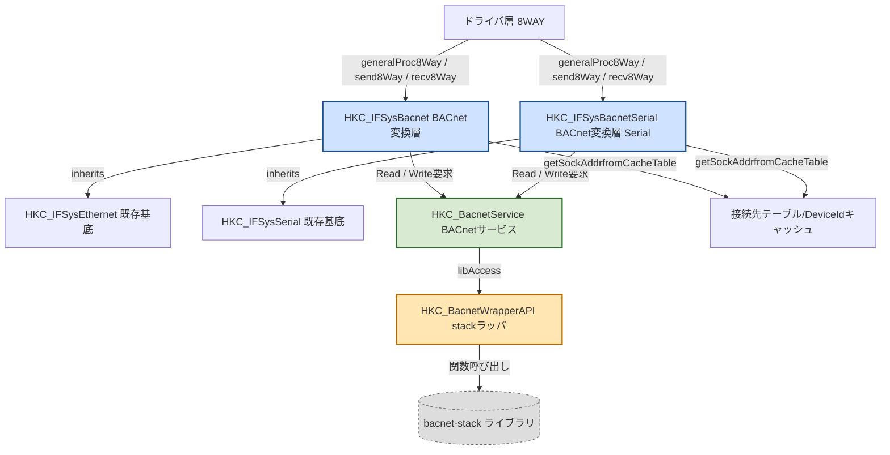
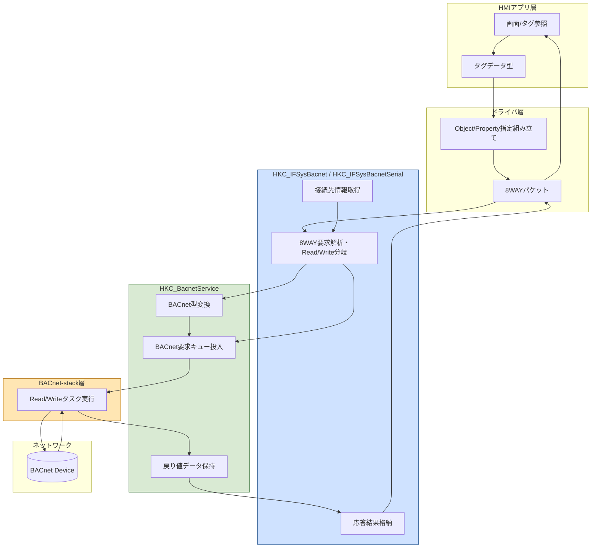
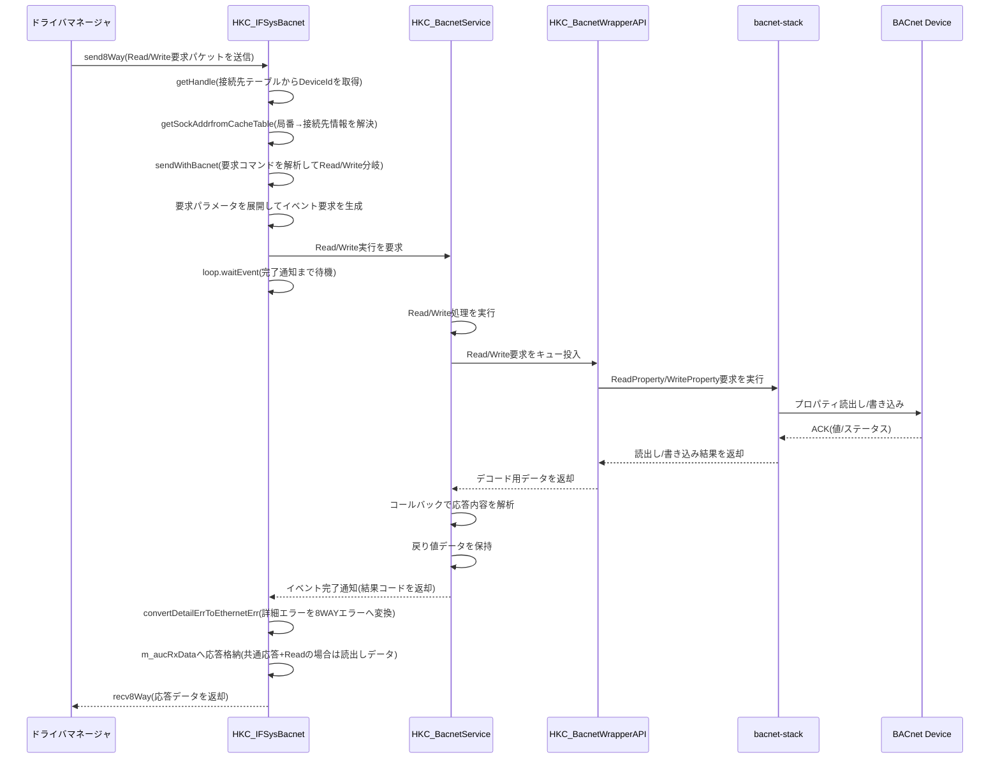
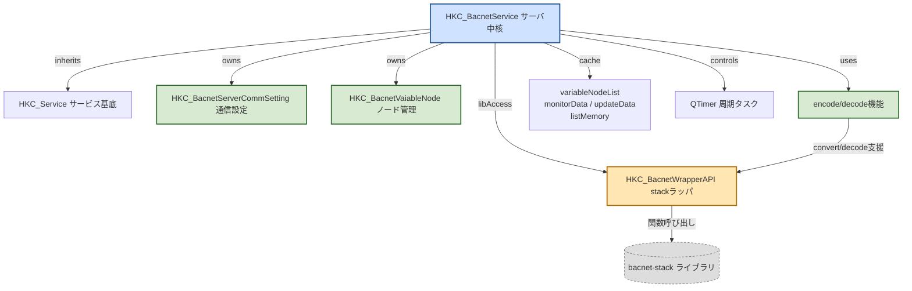
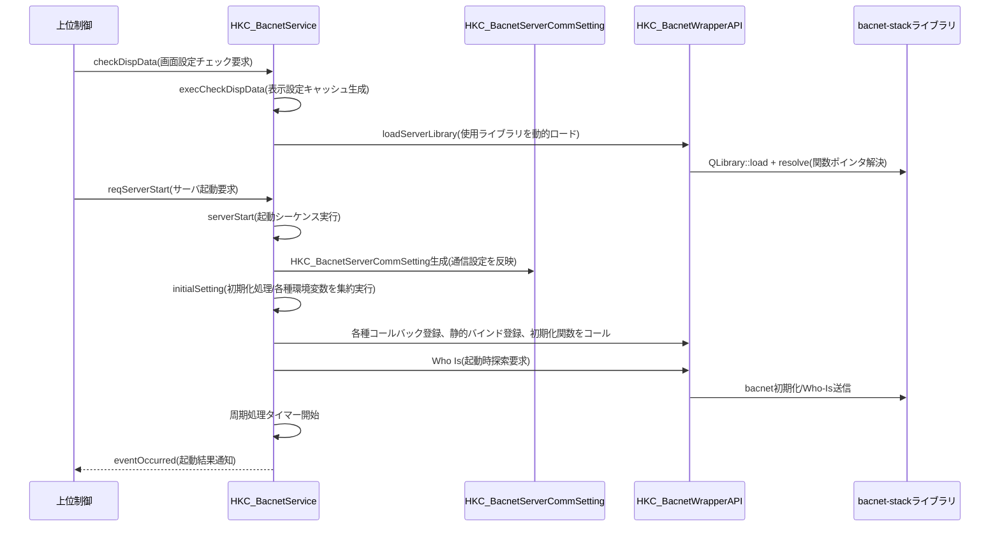
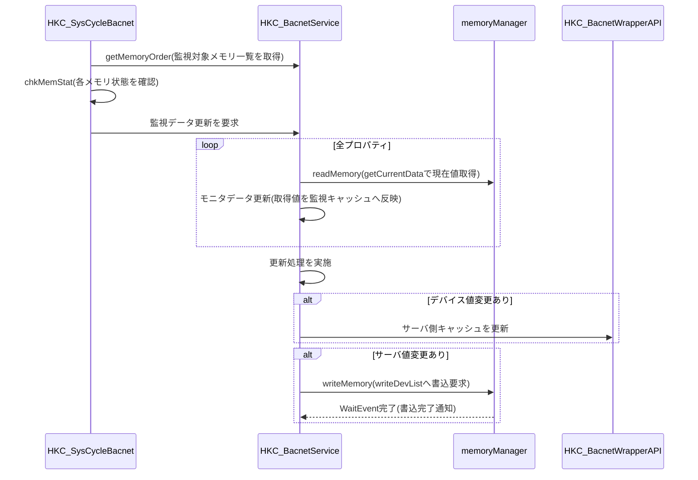
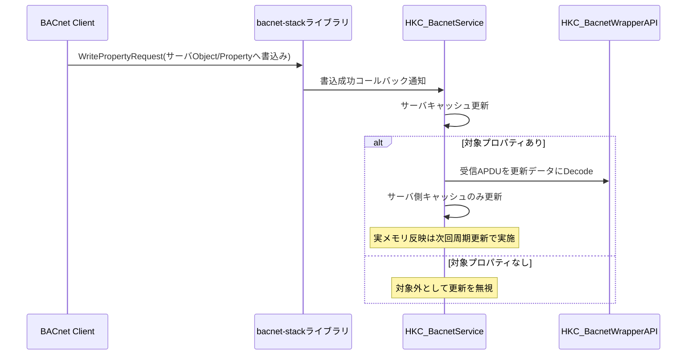
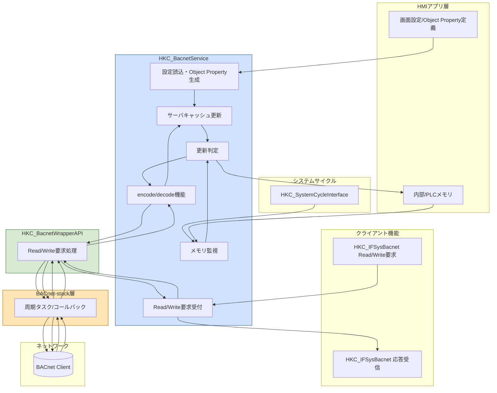

# BACnetクライアント機能

## 目次

- [BACnetクライアント機能](#bacnetクライアント機能)
  - [機能概要](#機能概要)
  - [クラス構成](#クラス構成)
  - [構造図（Mermaid）](#構造図mermaid)
    - [クラス構成図](#クラス構成図)
    - [データフロー図](#データフロー図)
    - [シーケンス図（Read/Write要求）](#シーケンス図readwrite要求)
- [BACnetサーバ機能](#bacnetサーバ機能)
  - [機能概要](#機能概要-1)
  - [クラス構成](#クラス構成-1)
  - [構造図（Mermaid）](#構造図mermaid-1)
    - [クラス構成図](#クラス構成図-1)
    - [シーケンス図（サーバ起動）](#シーケンス図サーバ起動)
    - [シーケンス図（周期更新）](#シーケンス図周期更新)
    - [シーケンス図（外部クライアントによるサーバデータ更新）](#シーケンス図外部クライアントによるサーバデータ更新)
    - [データフロー図](#データフロー図-1)
- [モニタッチで対応する機能一覧](#モニタッチで対応する機能一覧)
  - [Device Profile（Annex L）](#device-profileannex-l)
  - [BIBBs（対応サービス一覧）](#bibbs対応サービス一覧)
  - [Data Link Layer](#data-link-layer)
  - [Device Address Binding](#device-address-binding)
  - [Character Sets](#character-sets)
  - [Networking Options](#networking-options)
  - [Gateway Options](#gateway-options)
- [モニタッチで対応するObject Type一覧](#モニタッチで対応するobject-type一覧)
- [モニタッチで対応するプロパティ一覧](#モニタッチで対応するプロパティ一覧)
  - [共通事項](#共通事項)
    - [使用データ型一覧](#使用データ型一覧)
  - [BIT_STRING ビット定義](#bit_string-ビット定義)
    - [アプリ側キャッシュの割り当て方針](#アプリ側キャッシュの割り当て方針)
    - [BACnetStatusFlags](#bacnetstatusflags)
    - [BACnetServicesSupported](#bacnetservicessupported)
    - [BACnetObjectTypesSupported](#bacnetobjecttypessupported)
  - [Analog Input (AI)](#analog-input-ai)
  - [Analog Output (AO)](#analog-output-ao)
  - [Binary Input (BI)](#binary-input-bi)
  - [Binary Output (BO)](#binary-output-bo)
  - [Device](#device)
  - [Network Port (NP)](#network-port-np)
    - [共通プロパティ（BIP / MSTP 両方）](#共通プロパティbip--mstp-両方)
    - [BACnet/IP 固有プロパティ（Network_Type = BIP）](#bacnetip-固有プロパティnetwork_type--bip)
    - [BACnet/MS/TP 固有プロパティ（Network_Type = MSTP）](#bacnetmstp-固有プロパティnetwork_type--mstp)
- [BACnetライブラリ管理プロパティ 読み取りマクロ](#bacnetライブラリ管理プロパティ-読み取りマクロ)
  - [機能概要](#機能概要-2)
  - [パラメータ](#パラメータ)
  - [動作仕様](#動作仕様)
  - [対象プロパティと出力形式](#対象プロパティと出力形式)
  - [Priority Array の読み取りについて](#priority-array-の読み取りについて)
- [BACnet Priority Write / Relinquish 書き込みマクロ](#bacnet-priority-write--relinquish-書き込みマクロ)
  - [機能概要](#機能概要-3)
  - [パラメータ](#パラメータ-1)
  - [動作仕様](#動作仕様-1)
  - [対応プロパティ](#対応プロパティ)
  - [NULL 書き込み（Relinquish）の注意事項](#null-書き込みrelinquishの注意事項)

## 機能概要

BACnetクライアント機能は、HMI画面側からドライバ経由でBACnet機器へアクセスし、Object/PropertyのRead/Writeを行う機能です。  
ドライバとHMIアプリ間は既存の8WAY通信I/Fでやり取りされ、HKC_IFSysBacnet系クラスが8WAY要求をBACnetサービス呼び出しへ変換します。  
本セクションではクライアントI/F層を対象とし、HKC_BacnetService以降（サービス内部処理、ラッパ、スタック内部）は対象外とします。

| 項目 | 内容 |
|---|---|
| 通信I/F | 8WAY通信I/F（send8Way/recv8Way/generalProc8Way） |
| 対応機能 | ReadProperty / WriteProperty |
| 対応データ型 | [使用データ型一覧](#使用データ型一覧) |
| 接続先解決 | 接続先テーブル情報からDeviceIdを取得して要求先を決定 |
| 呼出先 | HKC_BacnetServiceにReadProperty/WriteProperty要求を依頼 |
| 範囲外 | HKC_BacnetService以降の内部処理（ライブラリ呼び出し、Who-Is、静的バインド管理など）は本セクションの対象外 |


## クラス構成

| 分類 | クラス/構造体 | 役割 | ファイル |
|---|---|---|---|
| 主体（ドライバ-BACnet変換） | HKC_IFSysBacnetEthernet | HKC_IFSysEthernetを継承。8WAY要求を解析し、ReadProperty/WriteProperty要求をHKC_BacnetServiceへ中継。接続先テーブルからDeviceIdを取得し、応答データを8WAY受信バッファへ格納。 | V10/src/com/interface/library/BACnet/HKC_IFSysBacnetEthernet.h<br>V10/src/com/interface/library/BACnet/HKC_IFSysBacnetEthernet.cpp |
| 主体（ドライバ-BACnet変換: Serial拡張予定） | HKC_IFSysBacnetSerial | HKC_IFSysBacnetEthernetと同一の役割・処理構成を想定。相違点は継承元のみで、HKC_IFSysEthernetの代わりにHKC_IFSysSerialを継承する想定。ReadProperty/WriteProperty要求の中継先やサービス層以降の構成は共通。 | V10/src/com/interface/library/BACnet/HKC_IFSysBacnetSerial.h<br>V10/src/com/interface/library/BACnet/HKC_IFSysBacnetSerial.cpp |
| 制御（BACnetサービス） | HKC_BacnetService | reqReadProperty/reqWritePropertyを受け、BACnet処理を実行して戻り値データを保持。クライアントIFからgetReturnDataで参照される。内部でHKC_BacnetWrapperAPIを保持。 | V10/src/sys/service/HKC_BacnetService.h<br>V10/src/sys/service/HKC_BacnetService.cpp |
| 補助（ライブラリラッパ） | HKC_BacnetWrapperAPI | bacnet-stack関連ライブラリのロード/アンロード、関数ポインタ解決、各API呼び出しをラップ。address_add/address_set_device_TTL等の呼び出し窓口。 | V10/src/sys/service/BACnet/HKC_BacnetWrapperAPI.h<br>V10/src/sys/service/BACnet/HKC_BacnetWrapperAPI.cpp |
| 補助（I/F要求応答構造体） | Bacnet_Send_Common<br>Bacnet_Recv_Common<br>Bacnet_Send_ReadProperty<br>Bacnet_Send_WriteProperty | HKC_IFSysBacnetEthernet/HKC_IFSysBacnetSerialの送受信バッファで使用する要求/応答データ形式。 | Grobal/include/DrvLibraryStruct.h |
| 外部基底クラス | HKC_IFSysEthernet | Ethernet 8WAY通信の共通処理を提供。HKC_IFSysBacnetEthernetはこれを継承し、BACnet独自のsend/recv処理を実装。 | V9/src/com/interface/HKC_IFSysEthernet.h<br>V9/src/com/interface/HKC_IFSysEthernet.cpp |
| 外部基底クラス | HKC_IFSysSerial | Serial 8WAY通信の共通処理を提供する想定基底クラス。HKC_IFSysBacnetSerialではこの基底に差し替える。 | V9/src/com/interface/HKC_IFSysSerial.h |

## 構造図（Mermaid）

### クラス構成図



### データフロー図



### シーケンス図（Read/Write要求）



# BACnetサーバ機能

## 機能概要

BACnetサーバ機能は、HMI製品側で`HKC_BacnetService`がBACnetサービスを実行し、外部BACnetクライアントからのRead/Write要求に応答しながら、
HMI内部メモリ（内部/PLCデバイス値）とサーバキャッシュを同期する機能です。
ライブラリ本体にはbacnet-stackを使用し、ライブラリのロードおよびAPI呼び出しは`HKC_BacnetWrapperAPI`でラップされています。

サーバ動作はサービススレッド`HKC_BacnetService`で管理され、システム周期処理`HKC_SysCycleBacnet`から
周期的なメモリ監視（`getMemoryOrder`/`chkMemStat`）とデータ反映が呼び出されます。
外部クライアントからの書き込みはライブラリコールバックを経由して、次回周期処理で実メモリへ反映されます。

| 項目 | 内容 |
|---|---|
| 有効化方法 | 専用の構成ファイルでBACnet関連ソースを組み込み（`V10/work/bacnet.pri`） |
| 使用ライブラリ | bacnet-stack（DLL: `libbacnet-stack.dll`） |
| サーバ初期化 | 環境変数設定、コールバック登録など |
| クライアント要求受付 | Read/Write要求を非同期実行し、結果をイベントで通知 |
| 外部書き込み反映 | コールバック機能を使用してサーバキャッシュ更新 |
| メモリ同期 | サイクルによる周期処理で反映 |
| BACnet対応機能 | [モニタッチで対応する機能一覧](#モニタッチで対応する機能一覧) |
| BACnet対応Object Type | [モニタッチで対応するObject Type一覧](#モニタッチで対応するobject-type一覧) |
| BACnet対応Object Property | [モニタッチで対応するプロパティ一覧](#モニタッチで対応するプロパティ一覧) |


## クラス構成

| 分類 | クラス/構造体 | 役割 | ファイル |
|---|---|---|---|
| 主体（サービス） | HKC_BacnetService | HKC_Serviceを継承するBACnetサービスの中核クラス。サーバ起動/停止、初期設定、Object生成、監視メモリ更新、ReadProperty/WriteProperty要求受付、戻り値保持、サーバキャッシュ更新を担う。内部で通信設定、ノード一覧、監視データ、更新データ、タイマ、ライブラリアクセサを保持する。 | V10/src/sys/service/HKC_BacnetService.h<br>V10/src/sys/service/HKC_BacnetService.cpp |
| 制御（周期） | HKC_SysCycleBacnet | HKC_SystemCycleInterfaceを継承し、システム周期で対象メモリのchkMemStatを実施した後、HKC_BacnetServiceのデータ更新処理を呼び出して監視対象データを更新する。 | V10/src/app/control/syscycle/HKC_SysCycleBacnet.h<br>V10/src/app/control/syscycle/HKC_SysCycleBacnet.cpp |
| 制御（ライブラリ抽象化） | HKC_BacnetWrapperAPI | QObject派生。bacnet-stack系ライブラリの動的ロード、関数ポインタ解決、各種BACnet API呼び出しをラップする。Read/Write要求、Who-Is、静的バインド登録、各種encode/decode補助などの窓口となる。 | V10/src/sys/service/BACnet/HKC_BacnetWrapperAPI.h<br>V10/src/sys/service/BACnet/HKC_BacnetWrapperAPI.cpp |
| 補助（通信設定） | HKC_BacnetServerCommSetting | 通信設定を保持するクラス。IPアドレス、デバイス名、セッションタイムアウト、接続形式、自局DeviceIdなどを保持し、内部でキャッシュ登録を行う。 | V10/src/sys/service/HKC_BacnetService.h<br>V10/src/sys/service/HKC_BacnetService.cpp |
| 補助（ノード） | HKC_BacnetVaiableNode | BACnetのObject/Propertyに対応する内部ノード表現。 | V10/src/sys/service/HKC_BacnetService.h<br>V10/src/sys/service/HKC_BacnetService.cpp |
| 補助（変換ユーティリティ） | HKD_BacnetNodeInfoConvert 名前空間 | BACNET_APPLICATION_DATA_VALUEとQVector<quint8>、メモリ要求、ノードキー情報の相互変換を行う関数群を提供する。書込用Variant生成、読出し値変換、ノードキー生成、メモリオーダー補正などを担う。 | V10/src/sys/service/HKC_BacnetService.h<br>V10/src/sys/service/HKC_BacnetService.cpp |


## 構造図（Mermaid）

### クラス構成図



### シーケンス図（サーバ起動）



### シーケンス図（周期更新）



### シーケンス図（外部クライアントによるサーバデータ更新）



### データフロー図



# モニタッチで対応する機能一覧

## Device Profile（Annex L）

BACnet Standardized Device Profile（ASHRAE 135 Annex L）は、製品の用途・機能レベルを示す分類です。  
対応プロファイルに定められた最低限の BIBB およびオブジェクト型の対応が必須となります。

| Profile | 名称 | 対応 | 備考 |
|---|---|---|---|
| B-XAWS | BACnet Cross-Domain Advanced Operator Workstation | × | |
| B-AWS | BACnet Advanced Operator Workstation | × | |
| B-OWS | BACnet Operator Workstation | T.B.D | HMIとしてのこのプロファイルが候補 |
| B-OD | BACnet Operator Display | T.B.D | 読み取り専用の表示端末プロファイル |
| B-BC | BACnet Building Controller | × | |
| B-AAC | BACnet Advanced Application Controller | × | |
| B-ASC | BACnet Application Specific Controller | × | |
| B-SA | BACnet Smart Actuator | × | |
| B-SS | BACnet Smart Sensor | × | |
| B-RTR | BACnet Router | × | |
| B-GW | BACnet Gateway | × | |
| B-BBMD | BACnet Broadcast Management Device | × | |
| B-SCHUB | BACnet Secure Connect Hub | × | |
| B-GENERAL | BACnet General | T.B.D | 特定プロファイルに該当しない場合の汎用区分 |

## BIBBs（対応サービス一覧）

BIBBs（BACnet Interoperability Building Blocks）は ASHRAE 135 Annex K で定義された相互接続機能の単位です。  
**-A** はサービスを送信するイニシエータ側、**-B** は要求を受信・処理するエグゼキュータ側を示します。  
ただしアラーム通知系（AE-N-\*）は -A がアラーム発生・通知送信側（サーバ相当）、-B が通知受信・処理側（クライアント相当）です。

| カテゴリ | BIBB | BACnetサービス | 概要 | クライアント対応 | サーバ対応 | 備考 |
|---|---|---|---|---|---|---|
| データ共有 | DS-RP-A | ReadProperty | 他デバイスのプロパティ値を読み取る（要求送信） | ○ | — | |
| データ共有 | DS-RP-B | ReadProperty | プロパティ読み取り要求を受信して応答する | — | ○ | |
| データ共有 | DS-RPM-A | ReadPropertyMultiple | 複数プロパティを一括読み取りする（要求送信） | × | — | |
| データ共有 | DS-RPM-B | ReadPropertyMultiple | 複数プロパティ読み取り要求を受信して応答する | — | ○ | |
| データ共有 | DS-WP-A | WriteProperty | 他デバイスのプロパティ値を書き込む（要求送信） | ○ | — | |
| データ共有 | DS-WP-B | WriteProperty | プロパティ書き込み要求を受信して処理する | — | ○ | |
| データ共有 | DS-WPM-A | WritePropertyMultiple | 複数プロパティを一括書き込みする（要求送信） | × | — | |
| データ共有 | DS-WPM-B | WritePropertyMultiple | 複数プロパティ書き込み要求を受信して処理する | — | ○ | |
| データ共有 | DS-COV-A | SubscribeCOV | 他デバイスの値変化通知（COV）を購読する | × | — | |
| データ共有 | DS-COV-B | SubscribeCOV / COVNotification | COV購読を受け付け、値変化時に通知を送信する | — | ○ | `handler_cov_subscribe` ハンドラおよび `handler_cov_task()` が登録済み。`COV_Increment` は AI/AO/BI/BO で実装済み |
| データ共有 | DS-COVP-A | SubscribeCOVProperty | 特定プロパティの変化通知を購読する | × | — | |
| データ共有 | DS-COVP-B | SubscribeCOVProperty / COVNotification | 特定プロパティのCOV購読を受け付け、変化時に通知を送信する | — | × | `h_cov.c` が `Present_Value` の監視のみハードコードされており任意プロパティの監視が未実装（FIXME コメントあり）。ハンドラ登録だけでは対応不可 |
| データ共有 | DS-WG-A | WriteGroup | グループへのプロパティ一括書き込みを送信する | × | — | WPとは別の専用I/Fが必要。Channelオブジェクト未対応のため非対応 |
| データ共有 | DS-WG-B | WriteGroup | グループへの一括書き込み要求を処理する | — | × | ハンドラ登録・Channelオブジェクトともに未実装 |
| アラーム・イベント | AE-N-I-A | ConfirmedEventNotification / UnconfirmedEventNotification | Intrinsic Reporting のアラーム通知を送信する | — | T.B.D | AI/BI等のオブジェクトのアラーム条件に基づく |
| アラーム・イベント | AE-N-I-B | ConfirmedEventNotification / UnconfirmedEventNotification | Intrinsic Reporting のアラーム通知を受信・処理する | T.B.D | — | |
| アラーム・イベント | AE-N-EX-A | ConfirmedEventNotification / UnconfirmedEventNotification | Algorithmic Change Reporting のアラーム通知を送信する | — | T.B.D | EventEnrollmentオブジェクトを使用 |
| アラーム・イベント | AE-N-EX-B | ConfirmedEventNotification / UnconfirmedEventNotification | Algorithmic Change Reporting のアラーム通知を受信・処理する | T.B.D | — | |
| アラーム・イベント | AE-ACK-A | AcknowledgeAlarm | アラームの確認応答要求を送信する | T.B.D | — | |
| アラーム・イベント | AE-ACK-B | AcknowledgeAlarm | アラームの確認応答要求を受信・処理する | — | T.B.D | |
| アラーム・イベント | AE-ASUM-A | GetAlarmSummary | アラームサマリーを取得する（要求送信） | T.B.D | — | 135-2020 では非推奨傾向、AE-ESUM を推奨 |
| アラーム・イベント | AE-ASUM-B | GetAlarmSummary | アラームサマリー要求を受信して応答する | — | T.B.D | |
| アラーム・イベント | AE-ESUM-A | GetEventInformation | イベント情報一覧を取得する（要求送信） | T.B.D | — | |
| アラーム・イベント | AE-ESUM-B | GetEventInformation | イベント情報取得要求を受信して応答する | — | T.B.D | |
| アラーム・イベント | AE-LS-A | LifeSafetyOperation | ライフセーフティ操作要求を送信する | T.B.D | — | |
| アラーム・イベント | AE-LS-B | LifeSafetyOperation | ライフセーフティ操作要求を受信・処理する | — | T.B.D | |
| スケジューリング | SCHED-A | ReadProperty / WriteProperty | Schedule オブジェクトを参照・設定する（要求送信） | T.B.D | — | |
| スケジューリング | SCHED-B | — | Schedule オブジェクトとして動作し、設定時刻に対象プロパティへ値を書き込む | — | T.B.D | Scheduleオブジェクトが必要 |
| トレンド | T-VMT-A | ReadRange / WriteProperty | TrendLog の閲覧・設定を行う（要求送信） | T.B.D | — | |
| トレンド | T-VMT-B | ReadRange / WriteProperty | TrendLog の閲覧・設定要求を受信して応答する | — | T.B.D | TrendLogオブジェクトが必要 |
| トレンド | T-ATR-A | ReadRange | TrendLog データを自動取得する | T.B.D | — | |
| トレンド | T-ATR-B | ReadRange | TrendLog データ取得要求を受信して応答する | — | T.B.D | |
| デバイス・ネットワーク管理 | DM-DDB-A | Who-Is / I-Am | Who-Is を送信してデバイスを検索し、I-Am を受信する | × | — | 静的バインドで指定するため非対応 |
| デバイス・ネットワーク管理 | DM-DDB-B | Who-Is / I-Am | Who-Is を受信し、I-Am で自デバイス情報を応答する | — | ○ | bacnet-stack にて対応 |
| デバイス・ネットワーク管理 | DM-DOB-A | Who-Has / I-Have | Who-Has を送信してオブジェクトを検索し、I-Have を受信する | × | — | 静的バインドで指定するため非対応 |
| デバイス・ネットワーク管理 | DM-DOB-B | Who-Has / I-Have | Who-Has を受信し、I-Have で応答する | — | ○ | bacnet-stack にて対応 |
| デバイス・ネットワーク管理 | DM-DCC-A | DeviceCommunicationControl | 他デバイスの通信を一時停止・再開する（要求送信） | × | — | 専用I/F未実装 |
| デバイス・ネットワーク管理 | DM-DCC-B | DeviceCommunicationControl | 通信制御要求を受信・処理する | — | ○ | bacnet_basic_init()にて自動登録済み。DISABLE受信時はモニタッチ自身のRP/WP送信（クライアント機能）も停止し、停止中の要求はAPDUタイムアウト後にTIMEOUTエラーとなる |
| デバイス・ネットワーク管理 | DM-PT-A | PrivateTransfer | ベンダー固有のPrivateTransfer 要求を送信する | T.B.D | — | |
| デバイス・ネットワーク管理 | DM-PT-B | PrivateTransfer | PrivateTransfer 要求を受信・処理する | — | T.B.D | |
| デバイス・ネットワーク管理 | DM-TM-A | TextMessage | テキストメッセージを送信する | T.B.D | — | 135-2020 では非推奨傾向 |
| デバイス・ネットワーク管理 | DM-TM-B | TextMessage | テキストメッセージを受信・表示する | — | T.B.D | |
| デバイス・ネットワーク管理 | DM-RD-A | ReinitializeDevice | 他デバイスの再初期化要求を送信する | T.B.D | — | |
| デバイス・ネットワーク管理 | DM-RD-B | ReinitializeDevice | 再初期化要求を受信・処理する | — | T.B.D | warm-start / activate-changes 等の処理 |
| デバイス・ネットワーク管理 | DM-TS-A | TimeSynchronization | 時刻同期メッセージを送信する | T.B.D | — | |
| デバイス・ネットワーク管理 | DM-TS-B | TimeSynchronization | 時刻同期メッセージを受信してシステム時刻を更新する | — | T.B.D | |
| デバイス・ネットワーク管理 | DM-UTC-A | UTCTimeSynchronization | UTC時刻同期メッセージを送信する | T.B.D | — | |
| デバイス・ネットワーク管理 | DM-UTC-B | UTCTimeSynchronization | UTC時刻同期メッセージを受信してシステム時刻を更新する | — | T.B.D | |
| デバイス・ネットワーク管理 | DM-NM-A | ネットワーク管理系メッセージ | ルータ・ネットワーク管理メッセージを送信する | × | × | ルータ機能が必要なため対象外 |
| デバイス・ネットワーク管理 | DM-NM-B | ネットワーク管理系メッセージ | ルータ・ネットワーク管理メッセージを処理する | × | × | ルータ機能が必要なため対象外 |
| デバイス・ネットワーク管理 | DM-AUDR-A | AuditNotification | 監査ログ通知を送信する | — | × | 135-2020 新規追加機能。bacnet-stack 未実装 |
| デバイス・ネットワーク管理 | DM-AUDR-B | AuditNotification | 監査ログ通知を受信・記録する | × | — | bacnet-stack 未実装 |

## Data Link Layer

ASHRAE 135 Annex J / Clause 9 に基づくデータリンク層の対応状況です。

| 項目 | 内容 | 対応 | 備考 |
|---|---|---|---|
| BACnet/IP（Annex J） | UDP/IP によるBACnet通信 | ○ | |
| BACnet/IP BBMD機能 | Broadcast Management Device として動作 | × | モニタッチ自身がBBMDとして動作し他デバイスのFD登録を受け付ける機能。別サブネット上のデバイスへのアクセスは静的バインドまたはFD登録（Foreign Device）で対応するため不要 |
| BACnet/IP Foreign Device登録（FD） | BBMDへのForeign Device登録 | ○ | `FD_BBMD_Address` / `FD_Subscription_Lifetime` で設定 |
| BACnet/IP NAT Traversal | NATルータ越えの通信 | × | |
| BACnet/IPv6（Annex U） | IPv6 によるBACnet通信 | × | |
| BACnet/IPv6 BBMD機能 | IPv6環境でのBBMD機能 | × | |
| MS/TP（Clause 9）Master | RS-485 マルチマスタ通信 | ○ | |
| MS/TP（Clause 9）Slave | RS-485 スレーブ通信 | ○ | `dlmstp_slave_mode_enabled_set(true)` でスレーブノードのステートマシンを有効化 |
| ARCNET | ARCNET 通信 | × | |
| Ethernet（ISO 8802-3） | ダイレクトEthernet（Clause 7） | × | |
| LonTalk（ISO/IEC 14908.1） | LonWorks 通信（Clause 11） | × | |
| BACnet Secure Connect（Annex AB） | TLS 1.3 によるセキュア通信 | × | |
| Point-To-Point EIA-232（Clause 10） | シリアルポイント間通信 | × | |
| BACnet/ZigBee（Annex O） | ZigBee 通信 | × | |

**MS/TP 対応データレート：**

| データレート | 対応 |
|---|---|
| 9600 bps | ○ |
| 19200 bps | ○ |
| 38400 bps | ○ |
| 57600 bps | ○ |
| 76800 bps | ○ |
| 115200 bps | ○ |

## Device Address Binding

| 項目 | 対応 | 備考 |
|---|---|---|
| Static Device Binding | ○ | DeviceID とMACアドレス・ネットワーク番号の静的マッピングを保持し、Who-Isによる動的検出を経ずに通信先を解決する。ネットワーク番号を指定することでBACnetルータ経由の相手先も指定可能。MS/TPスレーブや異ネットワーク上の特定デバイスとの双方向通信に必要 |

## Character Sets

| 文字セット | 対応 | 備考 |
|---|---|---|
| ISO 10646 (UTF-8) | ○ | BACnet CharacterString の標準エンコーディング |
| ISO 8859-1 | × | |
| IBM/Microsoft DBCS | × | |
| ISO 10646 (UCS-2) | × | |
| ISO 10646 (UCS-4) | × | |
| JIS X 0208 | × | |

## Networking Options

| 項目 | 対応 | 備考 |
|---|---|---|
| Router（Clause 6） | × | モニタッチ自身が複数のBACnetネットワーク間でパケットを転送するルータとして動作する機能。既存ルータ経由で通信すること自体は可能（Static Device Binding参照） |
| BACnet Tunneling Router over IP（Annex H） | × | モニタッチ自身がトンネルルータとして異なるネットワーク間のパケットを中継・転送する機能。既存ルータ経由で通信するための静的バインド（Device Address Binding）とは別機能 |

## Gateway Options

| 項目 | 対応 | 備考 |
|---|---|---|
| 非BACnet機器／ネットワークへのゲートウェイ機能 | × | モニタッチはBACnetネイティブ機器であり、Modbus等の他プロトコルへの変換機能は持たない |
| 仮想BACnetデバイス群として提示するゲートウェイ機能 | × | ゲートウェイが背後の非BACnet機器を複数の仮想BACnetデバイスとして表現する機能。前項同様、ゲートウェイ機能自体が非対応のため対象外 |

# モニタッチで対応するObject Type一覧

| Object Type | `BACNET_OBJECT_TYPE` 定数 | 略称 | コマンダブル | クライアント機能 | サーバ機能 |
|---|---|---|---|---|---|
| Analog Input | `OBJECT_ANALOG_INPUT` | AI | なし | ○ | ○ |
| Analog Output | `OBJECT_ANALOG_OUTPUT` | AO | あり（Priority Array） | ○ | ○ |
| Binary Input | `OBJECT_BINARY_INPUT` | BI | なし | ○ | ○ |
| Binary Output | `OBJECT_BINARY_OUTPUT` | BO | あり（Priority Array） | ○ | ○ |
| Device | `OBJECT_DEVICE` | — | なし | ○ | ○（必須、1インスタンス） |
| Network Port | `OBJECT_NETWORK_PORT` | NP | なし | ○ | ○（必須、1インスタンス） |

---

# モニタッチで対応するプロパティ一覧

## 共通事項

- 以下の表は ASHRAE 135-2024 の各 Object Type 仕様表に基づき、モニタッチが対応するプロパティの一覧です。
- 「ASHRAE区分」は ASHRAE 135-2024 上の必須/オプショナル区分を示します：「Required」= 必須、「Optional」= 任意。
- 「R」= Read Only、「RW」= Read/Write。
- データ型は bacnet-stack の `BACNET_APPLICATION_DATA_VALUE.tag` に対応する `BACNET_APPLICATION_TAG_*` 定数で示します。
- 「サーバ更新区分」は bacnet-stack サーバ側からのプロパティ更新タイミングを示します。
  - `ライブラリ固定` … bacnet-stack ライブラリ内部で設定・保持する。値はライブラリが自律的に算出・更新するものを含む。アプリ側の `_Set` 呼び出しおよびユーザーメモリの割り付けは不要
  - `初回設定（ユーザー値）` … 起動時に 1 回 `_Set` 関数でユーザー設定値（設定画面等で指定した値）を設定。以降は外部WPによる変更が発生しないため、ユーザーメモリの割り付けは不要
  - `初回設定（内部固定）` … 起動時に 1 回 `_Set` 関数でセット。値の起点はユーザーによる BACnet 専用設定ではなく、アプリコードの定数またはOS・システム設定（ネットワーク設定等）から取得した値による。以降は変更なし
  - `初回設定（WP更新あり）` … 起動時に 1 回 `_Set` 関数で設定。以降は外部WPによる変更が発生する可能性があるため、ユーザーメモリを割り付けて前回値を保持し、変化時に `_Set` で差分更新が必要
  - `毎スキャン書込` … アプリが周期処理でユーザー割付メモリ（PLCデバイス値など）を前回値と比較し、変化があった場合に `_Set` 関数でライブラリへ書き込む。ライブラリ内部では自動更新しない。RW プロパティの場合は外部 BACnet クライアントの WP によっても値が変化する
  - `アプリ内部更新` … アプリが OS やシステム内部状態（ネットワーク状態・DHCP リース情報等）を参照して自律的に判定し、変化があった場合に `_Set` 関数でライブラリへ書き込む。ユーザーメモリの割り付けは不要。ライブラリ内部では自動更新しない
  - `毎スキャン監視` … ライブラリが内部アルゴリズムにより自律的に値を更新する。アプリからの `_Set` によるライブラリへの書き込みは不可。アプリは周期処理で getter により現在値を取得し、ユーザー割付メモリへ書き込んで反映し続ける
  - `ライブラリ管理` … bacnet-stack ライブラリが自動管理する。要素数が不定または動的増減するプロパティ（`Object_List`、`Device_Address_Binding` 等）はバッファ超過・領域破壊の危険があるためアプリ側からの `_Set` およびユーザーメモリへの値保持は不可。`Priority_Array` については要素数は16固定だが、各要素が `NULL`（リリンキッシュ済み）または実値の選択型であり、リリンキッシュ状態をユーザーメモリで表現する適切な番兵値が存在しないため同様にユーザーメモリへの値保持は行わない。読み取りが必要な場合は専用マクロを使用する（詳細は[BACnetライブラリ管理プロパティ 読み取りマクロ](#bacnetライブラリ管理プロパティ-読み取りマクロ)を参照）
- `ライブラリ管理` プロパティをアプリ側から読み取る場合は、以下のパラメータを持つ**専用マクロ**を新規作成することで対応する。詳細は[BACnetライブラリ管理プロパティ 読み取りマクロ](#bacnetライブラリ管理プロパティ-読み取りマクロ)を参照。
- AO / BO の `Present_Value` 書き込みには **WriteProperty Priority** が必要です。Priority はインスタンス単位で個別に設定可能としますが、設定値は固定となり動作中の動的変更は行いません。
  - Priority 範囲: 1（最優先・Manual-Life Safety）〜 16（最低優先度）
  - 推奨: HMI が唯一の制御源の場合は Priority 1、外部クライアントとの共存が必要な場合は Priority 8 以下

### 使用データ型一覧

以下の表は、対応プロパティで使用される `BACNET_APPLICATION_TAG_*` 定数と、キャッシュとして確保すべき 1 要素あたりのバイト数をまとめたものです。

| `BACNET_APPLICATION_TAG` 定数 | BACnetデータ型 | C 型（bacnet-stack） | 1要素のキャッシュサイズ | 備考 |
|---|---|---|---|---|
| `BACNET_APPLICATION_TAG_BOOLEAN` | BOOLEAN | `uint8_t` | 1 バイト | 0 = FALSE、1 = TRUE |
| `BACNET_APPLICATION_TAG_UNSIGNED_INT` | Unsigned | `BACNET_UNSIGNED_INTEGER`（`uint64_t` / `uint32_t`） | 8 バイト※ | ※`UINT64_MAX` が定義される環境（通常の 64 bit ビルド）では `uint64_t` = 8 バイト。`UINT64_MAX` 非対応環境では `uint32_t` = 4 バイト |
| `BACNET_APPLICATION_TAG_REAL` | REAL | `float` | 4 バイト | IEEE 754 単精度浮動小数点 |
| `BACNET_APPLICATION_TAG_ENUMERATED` | ENUMERATED | `uint32_t` | 4 バイト | |
| `BACNET_APPLICATION_TAG_BIT_STRING` | BIT STRING | `BACNET_BIT_STRING` | 可変長（プロパティ依存） | キャッシュバイト数はユーザー指定（2 バイト単位）。詳細は[BIT_STRING ビット定義](#bit_string-ビット定義)を参照 |
| `BACNET_APPLICATION_TAG_CHARACTER_STRING` | CharacterString | `BACNET_CHARACTER_STRING` | 可変長（プロパティ依存） | キャッシュバイト数はユーザー指定（2 バイト単位） |
| `BACNET_APPLICATION_TAG_OCTET_STRING` | OCTET STRING | `BACNET_OCTET_STRING` | 可変長（プロパティ依存） | キャッシュバイト数はユーザー指定（2 バイト単位） |
| `BACNET_APPLICATION_TAG_OBJECT_ID` | BACnetObjectIdentifier | `BACNET_OBJECT_ID`（構造体） | **4 バイト** | C 構造体は 8 バイトだが、BACnet ワイヤフォーマットに変換した **32 bit 値**としてキャッシュする。`BACNET_ID_VALUE` / `BACNET_TYPE` / `BACNET_INSTANCE` マクロで変換。ビットレイアウトは下表参照 |
| `BACNET_APPLICATION_TAG_NULL` | NULL | — | 0 バイト（値なし） | Priority_Array のリリンキッシュスロット専用。マクロ出力形式は[NULL（リリンキッシュ）スロットの出力形式](#nullリリンキッシュスロットの出力形式)を参照 |

#### BACNET_APPLICATION_TAG_OBJECT_ID のビットレイアウト（32 bit）

```
bit 31                 bit 22  bit 21                      bit 0
┌─────────────────────────────┬──────────────────────────────────┐
│   Object Type  (10 bit)     │      Instance Number  (22 bit)   │
│   BACNET_MAX_OBJECT = 0x3FF │  BACNET_MAX_INSTANCE = 0x3FFFFF  │
└─────────────────────────────┴──────────────────────────────────┘
```

| フィールド | ビット位置 | ビット幅 | マスク値 | 対応マクロ |
|---|---|---|---|---|
| Object Type | bit 31 〜 bit 22 | 10 bit | `0x3FF` | `BACNET_TYPE(id32)` = `(id32 >> 22) & 0x3FF` |
| Instance Number | bit 21 〜 bit 0 | 22 bit | `0x3FFFFF` | `BACNET_INSTANCE(id32)` = `id32 & 0x3FFFFF` |

- 構造体 → 32 bit へのパック: `BACNET_ID_VALUE(instance, type)` = `(type & 0x3FF) << 22 | (instance & 0x3FFFFF)`
- Object Type の値は `BACNET_OBJECT_TYPE` 列挙型（`OBJECT_ANALOG_INPUT` = 0、`OBJECT_DEVICE` = 8 など）と対応する。

---

## BIT_STRING ビット定義

ASHRAE 135-2024 Chapter 21 "Enumerated Values and Bit String Values" に基づく、各 BIT_STRING プロパティのビット位置と説明。  
bacnet-stack の `bacenum.h` はこれらのビット番号を直接定数値として定義しており、本表はそれに準拠する。

### アプリ側キャッシュの割り当て方針

BIT_STRING プロパティのキャッシュバイト数はユーザーが設定で指定する。

| 区分 | 内容 |
|---|---|
| キャッシュサイズ | ユーザーが対象プロパティごとにバイト数を指定する。モニタッチの基準がワード単位のため、**2 バイト単位**で指定する |
| リード時の動作 | 指定バイト数の範囲内に含まれるビットのみアプリキャッシュへ反映する。指定バイト数を超えるビットは無視する |
| ライト | 対象外（BIT_STRING プロパティへの書き込みは行わない） |
| サーバ機能 | クライアント機能と同一の方針とする |

> `Protocol_Services_Supported`（50 bit）および `Protocol_Object_Types_Supported`（64 bit）は bacnet-stack のバージョンアップにより  
> ビット数が増加する可能性がある。キャッシュバイト数を小さく設定した場合、新規追加ビットは反映されないが動作上の問題は生じない。  
> ビット定義の最新情報は使用する bacnet-stack バージョンの `bacenum.h` を参照すること。

---

### BACnetStatusFlags

`Status_Flags`（AI / AO / BI / BO / NP 共通）のビット定義。4 ビット固定。

| Bit 番号 | `bacenum.h` 定数 | 説明 |
|---|---|---|
| 0 | `STATUS_FLAG_IN_ALARM` | `Event_State` が `NORMAL` 以外のとき `1`（アラーム状態） |
| 1 | `STATUS_FLAG_FAULT` | `Reliability` が `RELIABLE` 以外のとき `1`（信頼性異常） |
| 2 | `STATUS_FLAG_OVERRIDDEN` | ローカルオーバーライド中のとき `1` |
| 3 | `STATUS_FLAG_OUT_OF_SERVICE` | `Out_Of_Service = TRUE` のとき `1` |

> NP（Network Port）オブジェクトは `Event_State` プロパティを持たないため、Bit 0（IN_ALARM）は常に `0` となる。

---

### BACnetServicesSupported

`Protocol_Services_Supported`（Device）のビット定義。bacnet-stack V1.4.2 時点で 50 ビット。ASHRAE 135 の改訂により増加する可能性がある。

| Bit 番号 | `bacenum.h` 定数 | BACnet サービス名 | 区分 |
|---|---|---|---|
| 0 | `SERVICE_SUPPORTED_ACKNOWLEDGE_ALARM` | AcknowledgeAlarm | Confirmed |
| 1 | `SERVICE_SUPPORTED_CONFIRMED_COV_NOTIFICATION` | ConfirmedCOVNotification | Confirmed |
| 2 | `SERVICE_SUPPORTED_CONFIRMED_EVENT_NOTIFICATION` | ConfirmedEventNotification | Confirmed |
| 3 | `SERVICE_SUPPORTED_GET_ALARM_SUMMARY` | GetAlarmSummary | Confirmed |
| 4 | `SERVICE_SUPPORTED_GET_ENROLLMENT_SUMMARY` | GetEnrollmentSummary | Confirmed |
| 5 | `SERVICE_SUPPORTED_SUBSCRIBE_COV` | SubscribeCOV | Confirmed |
| 6 | `SERVICE_SUPPORTED_ATOMIC_READ_FILE` | AtomicReadFile | Confirmed |
| 7 | `SERVICE_SUPPORTED_ATOMIC_WRITE_FILE` | AtomicWriteFile | Confirmed |
| 8 | `SERVICE_SUPPORTED_ADD_LIST_ELEMENT` | AddListElement | Confirmed |
| 9 | `SERVICE_SUPPORTED_REMOVE_LIST_ELEMENT` | RemoveListElement | Confirmed |
| 10 | `SERVICE_SUPPORTED_CREATE_OBJECT` | CreateObject | Confirmed |
| 11 | `SERVICE_SUPPORTED_DELETE_OBJECT` | DeleteObject | Confirmed |
| 12 | `SERVICE_SUPPORTED_READ_PROPERTY` | ReadProperty | Confirmed |
| 13 | `SERVICE_SUPPORTED_READ_PROP_CONDITIONAL` | ReadPropertyConditional | Confirmed（廃止） |
| 14 | `SERVICE_SUPPORTED_READ_PROP_MULTIPLE` | ReadPropertyMultiple | Confirmed |
| 15 | `SERVICE_SUPPORTED_WRITE_PROPERTY` | WriteProperty | Confirmed |
| 16 | `SERVICE_SUPPORTED_WRITE_PROP_MULTIPLE` | WritePropertyMultiple | Confirmed |
| 17 | `SERVICE_SUPPORTED_DEVICE_COMMUNICATION_CONTROL` | DeviceCommunicationControl | Confirmed |
| 18 | `SERVICE_SUPPORTED_PRIVATE_TRANSFER` | ConfirmedPrivateTransfer | Confirmed |
| 19 | `SERVICE_SUPPORTED_TEXT_MESSAGE` | ConfirmedTextMessage | Confirmed |
| 20 | `SERVICE_SUPPORTED_REINITIALIZE_DEVICE` | ReinitializeDevice | Confirmed |
| 21 | `SERVICE_SUPPORTED_VT_OPEN` | VT-Open | Confirmed（廃止） |
| 22 | `SERVICE_SUPPORTED_VT_CLOSE` | VT-Close | Confirmed（廃止） |
| 23 | `SERVICE_SUPPORTED_VT_DATA` | VT-Data | Confirmed（廃止） |
| 24 | `SERVICE_SUPPORTED_AUTHENTICATE` | Authenticate | Confirmed（廃止） |
| 25 | `SERVICE_SUPPORTED_REQUEST_KEY` | RequestKey | Confirmed（廃止） |
| 26 | `SERVICE_SUPPORTED_I_AM` | I-Am | Unconfirmed |
| 27 | `SERVICE_SUPPORTED_I_HAVE` | I-Have | Unconfirmed |
| 28 | `SERVICE_SUPPORTED_UNCONFIRMED_COV_NOTIFICATION` | UnconfirmedCOVNotification | Unconfirmed |
| 29 | `SERVICE_SUPPORTED_UNCONFIRMED_EVENT_NOTIFICATION` | UnconfirmedEventNotification | Unconfirmed |
| 30 | `SERVICE_SUPPORTED_UNCONFIRMED_PRIVATE_TRANSFER` | UnconfirmedPrivateTransfer | Unconfirmed |
| 31 | `SERVICE_SUPPORTED_UNCONFIRMED_TEXT_MESSAGE` | UnconfirmedTextMessage | Unconfirmed |
| 32 | `SERVICE_SUPPORTED_TIME_SYNCHRONIZATION` | TimeSynchronization | Unconfirmed |
| 33 | `SERVICE_SUPPORTED_WHO_HAS` | Who-Has | Unconfirmed |
| 34 | `SERVICE_SUPPORTED_WHO_IS` | Who-Is | Unconfirmed |
| 35 | `SERVICE_SUPPORTED_READ_RANGE` | ReadRange | Confirmed |
| 36 | `SERVICE_SUPPORTED_UTC_TIME_SYNCHRONIZATION` | UTCTimeSynchronization | Unconfirmed |
| 37 | `SERVICE_SUPPORTED_LIFE_SAFETY_OPERATION` | LifeSafetyOperation | Confirmed |
| 38 | `SERVICE_SUPPORTED_SUBSCRIBE_COV_PROPERTY` | SubscribeCOVProperty | Confirmed |
| 39 | `SERVICE_SUPPORTED_GET_EVENT_INFORMATION` | GetEventInformation | Confirmed |
| 40 | `SERVICE_SUPPORTED_WRITE_GROUP` | WriteGroup | Unconfirmed |
| 41 | `SERVICE_SUPPORTED_SUBSCRIBE_COV_PROPERTY_MULTIPLE` | SubscribeCOVPropertyMultiple | Confirmed |
| 42 | `SERVICE_SUPPORTED_CONFIRMED_COV_NOTIFICATION_MULTIPLE` | ConfirmedCOVNotificationMultiple | Confirmed |
| 43 | `SERVICE_SUPPORTED_UNCONFIRMED_COV_NOTIFICATION_MULTIPLE` | UnconfirmedCOVNotificationMultiple | Unconfirmed |
| 44 | `SERVICE_SUPPORTED_CONFIRMED_AUDIT_NOTIFICATION` | ConfirmedAuditNotification | Confirmed |
| 45 | `SERVICE_SUPPORTED_AUDIT_LOG_QUERY` | AuditLogQuery | Confirmed |
| 46 | `SERVICE_SUPPORTED_UNCONFIRMED_AUDIT_NOTIFICATION` | UnconfirmedAuditNotification | Unconfirmed |
| 47 | `SERVICE_SUPPORTED_WHO_AM_I` | Who-Am-I | Unconfirmed |
| 48 | `SERVICE_SUPPORTED_YOU_ARE` | You-Are | Unconfirmed |
| 49 | `SERVICE_SUPPORTED_AUTH_REQUEST` | Auth-Request | Confirmed |

---

### BACnetObjectTypesSupported

`Protocol_Object_Types_Supported`（Device）のビット定義。bacnet-stack V1.4.2 時点で 64 ビット（bit0〜63）。ASHRAE 135 の改訂により増加する可能性がある。ビット番号は `BACNET_OBJECT_TYPE` 列挙値と一致する。

| Bit 番号 | `bacenum.h` 定数 | Object Type 名 |
|---|---|---|
| 0 | `OBJECT_ANALOG_INPUT` | Analog Input |
| 1 | `OBJECT_ANALOG_OUTPUT` | Analog Output |
| 2 | `OBJECT_ANALOG_VALUE` | Analog Value |
| 3 | `OBJECT_BINARY_INPUT` | Binary Input |
| 4 | `OBJECT_BINARY_OUTPUT` | Binary Output |
| 5 | `OBJECT_BINARY_VALUE` | Binary Value |
| 6 | `OBJECT_CALENDAR` | Calendar |
| 7 | `OBJECT_COMMAND` | Command |
| 8 | `OBJECT_DEVICE` | Device |
| 9 | `OBJECT_EVENT_ENROLLMENT` | Event Enrollment |
| 10 | `OBJECT_FILE` | File |
| 11 | `OBJECT_GROUP` | Group |
| 12 | `OBJECT_LOOP` | Loop |
| 13 | `OBJECT_MULTI_STATE_INPUT` | Multi-state Input |
| 14 | `OBJECT_MULTI_STATE_OUTPUT` | Multi-state Output |
| 15 | `OBJECT_NOTIFICATION_CLASS` | Notification Class |
| 16 | `OBJECT_PROGRAM` | Program |
| 17 | `OBJECT_SCHEDULE` | Schedule |
| 18 | `OBJECT_AVERAGING` | Averaging |
| 19 | `OBJECT_MULTI_STATE_VALUE` | Multi-state Value |
| 20 | `OBJECT_TRENDLOG` | Trend Log |
| 21 | `OBJECT_LIFE_SAFETY_POINT` | Life Safety Point |
| 22 | `OBJECT_LIFE_SAFETY_ZONE` | Life Safety Zone |
| 23 | `OBJECT_ACCUMULATOR` | Accumulator |
| 24 | `OBJECT_PULSE_CONVERTER` | Pulse Converter |
| 25 | `OBJECT_EVENT_LOG` | Event Log |
| 26 | `OBJECT_GLOBAL_GROUP` | Global Group |
| 27 | `OBJECT_TREND_LOG_MULTIPLE` | Trend Log Multiple |
| 28 | `OBJECT_LOAD_CONTROL` | Load Control |
| 29 | `OBJECT_STRUCTURED_VIEW` | Structured View |
| 30 | `OBJECT_ACCESS_DOOR` | Access Door |
| 31 | `OBJECT_TIMER` | Timer |
| 32 | `OBJECT_ACCESS_CREDENTIAL` | Access Credential |
| 33 | `OBJECT_ACCESS_POINT` | Access Point |
| 34 | `OBJECT_ACCESS_RIGHTS` | Access Rights |
| 35 | `OBJECT_ACCESS_USER` | Access User |
| 36 | `OBJECT_ACCESS_ZONE` | Access Zone |
| 37 | `OBJECT_CREDENTIAL_DATA_INPUT` | Credential Data Input |
| 38 | `OBJECT_BITSTRING_VALUE` | Bitstring Value |
| 39 | `OBJECT_CHARACTERSTRING_VALUE` | CharacterString Value |
| 40 | `OBJECT_DATE_PATTERN_VALUE` | Date Pattern Value |
| 41 | `OBJECT_DATE_VALUE` | Date Value |
| 42 | `OBJECT_DATETIME_PATTERN_VALUE` | Datetime Pattern Value |
| 43 | `OBJECT_DATETIME_VALUE` | Datetime Value |
| 44 | `OBJECT_INTEGER_VALUE` | Integer Value |
| 45 | `OBJECT_LARGE_ANALOG_VALUE` | Large Analog Value |
| 46 | `OBJECT_OCTETSTRING_VALUE` | OctetString Value |
| 47 | `OBJECT_POSITIVE_INTEGER_VALUE` | Positive Integer Value |
| 48 | `OBJECT_TIME_PATTERN_VALUE` | Time Pattern Value |
| 49 | `OBJECT_TIME_VALUE` | Time Value |
| 50 | `OBJECT_NOTIFICATION_FORWARDER` | Notification Forwarder |
| 51 | `OBJECT_ALERT_ENROLLMENT` | Alert Enrollment |
| 52 | `OBJECT_CHANNEL` | Channel |
| 53 | `OBJECT_LIGHTING_OUTPUT` | Lighting Output |
| 54 | `OBJECT_BINARY_LIGHTING_OUTPUT` | Binary Lighting Output |
| 55 | `OBJECT_NETWORK_PORT` | Network Port |
| 56 | `OBJECT_ELEVATOR_GROUP` | Elevator Group |
| 57 | `OBJECT_ESCALATOR` | Escalator |
| 58 | `OBJECT_LIFT` | Lift |
| 59 | `OBJECT_STAGING` | Staging |
| 60 | `OBJECT_AUDIT_LOG` | Audit Log |
| 61 | `OBJECT_AUDIT_REPORTER` | Audit Reporter |
| 62 | `OBJECT_COLOR` | Color |
| 63 | `OBJECT_COLOR_TEMPERATURE` | Color Temperature |

---

## Analog Input (AI)

ASHRAE 135-2024 Table 12-2 に基づくモニタッチ対応プロパティ。

| プロパティ名 | Property Identifier | ASHRAE区分 | アクセス | BACnetデータ型 | `BACNET_APPLICATION_TAG` | サーバ更新区分 |
|---|---|---|---|---|---|---|
| Object_Identifier | 75 | Required | R | BACnetObjectIdentifier | `BACNET_APPLICATION_TAG_OBJECT_ID` | ライブラリ固定 |
| Object_Name | 77 | Required | R | CharacterString | `BACNET_APPLICATION_TAG_CHARACTER_STRING` | 初回設定（ユーザー値） |
| Object_Type | 79 | Required | R | BACnetObjectType (ENUMERATED) | `BACNET_APPLICATION_TAG_ENUMERATED` | ライブラリ固定 |
| Present_Value | 85 | Required | R | REAL | `BACNET_APPLICATION_TAG_REAL` | 毎スキャン書込 |
| Description | 28 | Optional | R | CharacterString | `BACNET_APPLICATION_TAG_CHARACTER_STRING` | 初回設定（ユーザー値） |
| Status_Flags | 111 | Required | R | BACnetStatusFlags (BIT STRING) | `BACNET_APPLICATION_TAG_BIT_STRING` | 毎スキャン監視 |
| Event_State | 36 | Required | R | BACnetEventState (ENUMERATED) | `BACNET_APPLICATION_TAG_ENUMERATED` | 毎スキャン監視 |
| Reliability | 103 | Optional | R | BACnetReliability (ENUMERATED) | `BACNET_APPLICATION_TAG_ENUMERATED` | アプリ内部更新 |
| Out_Of_Service | 81 | Required | RW | BOOLEAN | `BACNET_APPLICATION_TAG_BOOLEAN` | 毎スキャン書込 |
| Units | 117 | Required | RW | BACnetEngineeringUnits (ENUMERATED) | `BACNET_APPLICATION_TAG_ENUMERATED` | 初回設定（WP更新あり） |
| COV_Increment | 22 | Optional | RW | REAL | `BACNET_APPLICATION_TAG_REAL` | 初回設定（WP更新あり） |
| Property_List | 371 | Required | R | BACnetARRAY[N] of BACnetPropertyIdentifier (ENUMERATED) | `BACNET_APPLICATION_TAG_ENUMERATED` | ライブラリ固定 |

> `Present_Value` は `Out_Of_Service = TRUE` の場合のみ書き込み可。

> `Status_Flags` の各ビット定義は [BACnetStatusFlags](#bacnetstatusflags) を参照。

---

## Analog Output (AO)

ASHRAE 135-2024 Table 12-4 に基づくモニタッチ対応プロパティ。

| プロパティ名 | Property Identifier | ASHRAE区分 | アクセス | BACnetデータ型 | `BACNET_APPLICATION_TAG` | サーバ更新区分 |
|---|---|---|---|---|---|---|
| Object_Identifier | 75 | Required | R | BACnetObjectIdentifier | `BACNET_APPLICATION_TAG_OBJECT_ID` | ライブラリ固定 |
| Object_Name | 77 | Required | R | CharacterString | `BACNET_APPLICATION_TAG_CHARACTER_STRING` | 初回設定（ユーザー値） |
| Object_Type | 79 | Required | R | BACnetObjectType (ENUMERATED) | `BACNET_APPLICATION_TAG_ENUMERATED` | ライブラリ固定 |
| Present_Value | 85 | Required | RW | REAL | `BACNET_APPLICATION_TAG_REAL` | 毎スキャン書込 |
| Description | 28 | Optional | R | CharacterString | `BACNET_APPLICATION_TAG_CHARACTER_STRING` | 初回設定（ユーザー値） |
| Status_Flags | 111 | Required | R | BACnetStatusFlags (BIT STRING) | `BACNET_APPLICATION_TAG_BIT_STRING` | 毎スキャン監視 |
| Event_State | 36 | Required | R | BACnetEventState (ENUMERATED) | `BACNET_APPLICATION_TAG_ENUMERATED` | 毎スキャン監視 |
| Reliability | 103 | Optional | R | BACnetReliability (ENUMERATED) | `BACNET_APPLICATION_TAG_ENUMERATED` | アプリ内部更新 |
| Out_Of_Service | 81 | Required | RW | BOOLEAN | `BACNET_APPLICATION_TAG_BOOLEAN` | 毎スキャン書込 |
| Units | 117 | Required | RW | BACnetEngineeringUnits (ENUMERATED) | `BACNET_APPLICATION_TAG_ENUMERATED` | 初回設定（WP更新あり） |
| Min_Pres_Value | 69 | Optional | RW | REAL | `BACNET_APPLICATION_TAG_REAL` | 初回設定（WP更新あり） |
| Max_Pres_Value | 65 | Optional | RW | REAL | `BACNET_APPLICATION_TAG_REAL` | 初回設定（WP更新あり） |
| COV_Increment | 22 | Optional | RW | REAL | `BACNET_APPLICATION_TAG_REAL` | 初回設定（WP更新あり） |
| Priority_Array | 87 | Required | R | BACnetPriorityArray (16要素配列) | `BACNET_APPLICATION_TAG_NULL` / `BACNET_APPLICATION_TAG_REAL` | ライブラリ管理 |
| Relinquish_Default | 104 | Required | R | REAL | `BACNET_APPLICATION_TAG_REAL` | 初回設定（ユーザー値） |
| Current_Command_Priority | 431 | Required | R | BACnetOptionalUnsigned (NULL(0で表現) または Unsigned 1〜16) | `BACNET_APPLICATION_TAG_UNSIGNED_INT` | 毎スキャン監視 |
| Property_List | 371 | Required | R | BACnetARRAY[N] of BACnetPropertyIdentifier (ENUMERATED) | `BACNET_APPLICATION_TAG_ENUMERATED` | ライブラリ固定 |

> **Present_Value 書き込み Priority 設計方針**
> - Priority はインスタンス単位で個別に設定可能とする。設定値は固定となり、動的変更は行わない
> - `priority` パラメータはWP時に使用する

> `Status_Flags` の各ビット定義は [BACnetStatusFlags](#bacnetstatusflags) を参照。

---

## Binary Input (BI)

ASHRAE 135-2024 Table 12-6 に基づくモニタッチ対応プロパティ。

| プロパティ名 | Property Identifier | ASHRAE区分 | アクセス | BACnetデータ型 | `BACNET_APPLICATION_TAG` | サーバ更新区分 |
|---|---|---|---|---|---|---|
| Object_Identifier | 75 | Required | R | BACnetObjectIdentifier | `BACNET_APPLICATION_TAG_OBJECT_ID` | ライブラリ固定 |
| Object_Name | 77 | Required | R | CharacterString | `BACNET_APPLICATION_TAG_CHARACTER_STRING` | 初回設定（ユーザー値） |
| Object_Type | 79 | Required | R | BACnetObjectType (ENUMERATED) | `BACNET_APPLICATION_TAG_ENUMERATED` | ライブラリ固定 |
| Present_Value | 85 | Required | R | BACnetBinaryPV (ENUMERATED: INACTIVE=0 / ACTIVE=1) | `BACNET_APPLICATION_TAG_ENUMERATED` | 毎スキャン書込 |
| Description | 28 | Optional | R | CharacterString | `BACNET_APPLICATION_TAG_CHARACTER_STRING` | 初回設定（ユーザー値） |
| Status_Flags | 111 | Required | R | BACnetStatusFlags (BIT STRING) | `BACNET_APPLICATION_TAG_BIT_STRING` | 毎スキャン監視 |
| Event_State | 36 | Required | R | BACnetEventState (ENUMERATED) | `BACNET_APPLICATION_TAG_ENUMERATED` | 毎スキャン監視 |
| Reliability | 103 | Optional | R | BACnetReliability (ENUMERATED) | `BACNET_APPLICATION_TAG_ENUMERATED` | アプリ内部更新 |
| Out_Of_Service | 81 | Required | RW | BOOLEAN | `BACNET_APPLICATION_TAG_BOOLEAN` | 毎スキャン書込 |
| Polarity | 90 | Required | RW | BACnetPolarity (ENUMERATED: NORMAL=0 / REVERSE=1) | `BACNET_APPLICATION_TAG_ENUMERATED` | 初回設定（WP更新あり） |
| Active_Text | 4 | Optional | R | CharacterString | `BACNET_APPLICATION_TAG_CHARACTER_STRING` | 初回設定（ユーザー値） |
| Inactive_Text | 46 | Optional | R | CharacterString | `BACNET_APPLICATION_TAG_CHARACTER_STRING` | 初回設定（ユーザー値） |
| Property_List | 371 | Required | R | BACnetARRAY[N] of BACnetPropertyIdentifier (ENUMERATED) | `BACNET_APPLICATION_TAG_ENUMERATED` | ライブラリ固定 |

> `Present_Value` は `Out_Of_Service = TRUE` の場合のみ書き込み可。

> `Status_Flags` の各ビット定義は [BACnetStatusFlags](#bacnetstatusflags) を参照。

---

## Binary Output (BO)

ASHRAE 135-2024 Table 12-8 に基づくモニタッチ対応プロパティ。

| プロパティ名 | Property Identifier | ASHRAE区分 | アクセス | BACnetデータ型 | `BACNET_APPLICATION_TAG` | サーバ更新区分 |
|---|---|---|---|---|---|---|
| Object_Identifier | 75 | Required | R | BACnetObjectIdentifier | `BACNET_APPLICATION_TAG_OBJECT_ID` | ライブラリ固定 |
| Object_Name | 77 | Required | R | CharacterString | `BACNET_APPLICATION_TAG_CHARACTER_STRING` | 初回設定（ユーザー値） |
| Object_Type | 79 | Required | R | BACnetObjectType (ENUMERATED) | `BACNET_APPLICATION_TAG_ENUMERATED` | ライブラリ固定 |
| Present_Value | 85 | Required | RW | BACnetBinaryPV (ENUMERATED: INACTIVE=0 / ACTIVE=1) | `BACNET_APPLICATION_TAG_ENUMERATED` | 毎スキャン書込 |
| Description | 28 | Optional | R | CharacterString | `BACNET_APPLICATION_TAG_CHARACTER_STRING` | 初回設定（ユーザー値） |
| Status_Flags | 111 | Required | R | BACnetStatusFlags (BIT STRING) | `BACNET_APPLICATION_TAG_BIT_STRING` | 毎スキャン監視 |
| Event_State | 36 | Required | R | BACnetEventState (ENUMERATED) | `BACNET_APPLICATION_TAG_ENUMERATED` | 毎スキャン監視 |
| Reliability | 103 | Optional | R | BACnetReliability (ENUMERATED) | `BACNET_APPLICATION_TAG_ENUMERATED` | アプリ内部更新 |
| Out_Of_Service | 81 | Required | RW | BOOLEAN | `BACNET_APPLICATION_TAG_BOOLEAN` | 毎スキャン書込 |
| Polarity | 90 | Required | RW | BACnetPolarity (ENUMERATED: NORMAL=0 / REVERSE=1) | `BACNET_APPLICATION_TAG_ENUMERATED` | 初回設定（WP更新あり） |
| Active_Text | 4 | Optional | R | CharacterString | `BACNET_APPLICATION_TAG_CHARACTER_STRING` | 初回設定（ユーザー値） |
| Inactive_Text | 46 | Optional | R | CharacterString | `BACNET_APPLICATION_TAG_CHARACTER_STRING` | 初回設定（ユーザー値） |
| Priority_Array | 87 | Required | R | BACnetPriorityArray (16要素配列) | `BACNET_APPLICATION_TAG_NULL` / `BACNET_APPLICATION_TAG_ENUMERATED` | ライブラリ管理 |
| Relinquish_Default | 104 | Required | RW | BACnetBinaryPV (ENUMERATED) | `BACNET_APPLICATION_TAG_ENUMERATED` | 初回設定（WP更新あり） |
| Current_Command_Priority | 431 | Required | R | BACnetOptionalUnsigned (NULL(0で表現) または Unsigned 1〜16) | `BACNET_APPLICATION_TAG_UNSIGNED_INT` | 毎スキャン監視 |
| Property_List | 371 | Required | R | BACnetARRAY[N] of BACnetPropertyIdentifier (ENUMERATED) | `BACNET_APPLICATION_TAG_ENUMERATED` | ライブラリ固定 |

> **Present_Value 書き込み Priority 設計方針**
> - Priority はインスタンス単位で個別に設定可能とする。設定値は固定となり、動的変更は行わない
> - `priority` パラメータはWP時に使用する

> `Status_Flags` の各ビット定義は [BACnetStatusFlags](#bacnetstatusflags) を参照。

---

## Device

ASHRAE 135-2024 Table 12-11 に基づくモニタッチ対応プロパティ。

| プロパティ名 | Property Identifier | ASHRAE区分 | アクセス | BACnetデータ型 | `BACNET_APPLICATION_TAG` | サーバ更新区分 |
|---|---|---|---|---|---|---|
| Object_Identifier | 75 | Required | R | BACnetObjectIdentifier | `BACNET_APPLICATION_TAG_OBJECT_ID` | ライブラリ固定 |
| Object_Name | 77 | Required | RW | CharacterString | `BACNET_APPLICATION_TAG_CHARACTER_STRING` | 初回設定（WP更新あり） |
| Object_Type | 79 | Required | R | BACnetObjectType (ENUMERATED) | `BACNET_APPLICATION_TAG_ENUMERATED` | ライブラリ固定 |
| System_Status | 112 | Required | R | BACnetDeviceStatus (ENUMERATED) | `BACNET_APPLICATION_TAG_ENUMERATED` | 毎スキャン書込 |
| Vendor_Name | 121 | Required | R | CharacterString | `BACNET_APPLICATION_TAG_CHARACTER_STRING` | 初回設定（内部固定） |
| Vendor_Identifier | 120 | Required | R | Unsigned16 | `BACNET_APPLICATION_TAG_UNSIGNED_INT` | 初回設定（内部固定） |
| Model_Name | 70 | Required | R | CharacterString | `BACNET_APPLICATION_TAG_CHARACTER_STRING` | 初回設定（内部固定） |
| Firmware_Revision | 44 | Required | R | CharacterString | `BACNET_APPLICATION_TAG_CHARACTER_STRING` | 初回設定（内部固定） |
| Application_Software_Version | 12 | Required | R | CharacterString | `BACNET_APPLICATION_TAG_CHARACTER_STRING` | 初回設定（内部固定） |
| Protocol_Version | 98 | Required | R | Unsigned | `BACNET_APPLICATION_TAG_UNSIGNED_INT` | ライブラリ固定 |
| Protocol_Revision | 139 | Required | R | Unsigned | `BACNET_APPLICATION_TAG_UNSIGNED_INT` | ライブラリ固定 |
| Protocol_Services_Supported | 97 | Required | R | BACnetServicesSupported (BIT STRING) | `BACNET_APPLICATION_TAG_BIT_STRING` | ライブラリ固定 |
| Protocol_Object_Types_Supported | 96 | Required | R | BACnetObjectTypesSupported (BIT STRING) | `BACNET_APPLICATION_TAG_BIT_STRING` | ライブラリ固定 |
| Object_List | 76 | Required | R | BACnetObjectIdentifier の配列 | `BACNET_APPLICATION_TAG_OBJECT_ID` | ライブラリ管理 |
| Max_APDU_Length_Accepted | 62 | Required | R | Unsigned | `BACNET_APPLICATION_TAG_UNSIGNED_INT` | ライブラリ固定 |
| Segmentation_Supported | 107 | Required | R | BACnetSegmentation (ENUMERATED) | `BACNET_APPLICATION_TAG_ENUMERATED` | ライブラリ固定 |
| APDU_Timeout | 11 | Required | RW | Unsigned | `BACNET_APPLICATION_TAG_UNSIGNED_INT` | 初回設定（WP更新あり） |
| Number_Of_APDU_Retries | 73 | Required | RW | Unsigned | `BACNET_APPLICATION_TAG_UNSIGNED_INT` | 初回設定（WP更新あり） |
| Device_Address_Binding | 30 | Required | R | BACnetAddressBinding のリスト | — | ライブラリ管理 |
| Database_Revision | 155 | Required | R | Unsigned | `BACNET_APPLICATION_TAG_UNSIGNED_INT` | 毎スキャン監視 |
| Property_List | 371 | Required | R | BACnetARRAY[N] of BACnetPropertyIdentifier (ENUMERATED) | `BACNET_APPLICATION_TAG_ENUMERATED` | ライブラリ固定 |

> `Protocol_Services_Supported` の各ビット定義は [BACnetServicesSupported](#bacnetservicessupported) を参照。

> `Protocol_Object_Types_Supported` の各ビット定義は [BACnetObjectTypesSupported](#bacnetobjecttypessupported) を参照。

---

## ASHRAE 135 との差異一覧

以下のプロパティは ASHRAE 135-2024 のアクセス定義とモニタッチ実装が異なる。

| Object | プロパティ名 | Property ID | ASHRAE 135 アクセス | モニタッチ実装 | 源ファイル |
|---|---|---|---|---|---|
| AI | Description | 28 | W | `WRITE_ACCESS_DENIED` | `ai.c` |
| AO | Description | 28 | W | `WRITE_ACCESS_DENIED` | `ao.c` |
| AO | Relinquish_Default | 104 | W | `WRITE_ACCESS_DENIED` | `ao.c` |
| BI | Description | 28 | W | `WRITE_ACCESS_DENIED` | `bi.c` |
| BI | Active_Text | 4 | W | `WRITE_ACCESS_DENIED` | `bi.c` |
| BI | Inactive_Text | 46 | W | `WRITE_ACCESS_DENIED` | `bi.c` |
| BO | Description | 28 | W | `WRITE_ACCESS_DENIED` | `bo.c` |
| BO | Active_Text | 4 | W | `WRITE_ACCESS_DENIED` | `bo.c` |
| BO | Inactive_Text | 46 | W | `WRITE_ACCESS_DENIED` | `bo.c` |
| Device | System_Status | 112 | W（省略可能） | R（bacnet-stack はWP受付可、モニタッチとして変更不可設計） | `device.c` |
| Device | Model_Name | 70 | W | R（bacnet-stack はWP受付可、モニタッチとして変更不可設計） | `device.c` |
| NP (BIP) | BACnet_IP_Mode | 408 | W | `WRITE_ACCESS_DENIED` | `netport.c` |
| NP (BIP) | BACnet_IP_UDP_Port | 412 | W | `WRITE_ACCESS_DENIED` | `netport.c` |
| NP (BIP) | Network_Number | 425 | W | `WRITE_ACCESS_DENIED` | `netport.c` |
| NP (BIP) | IP_Address | 400 | W（DHCP無効時） | `WRITE_ACCESS_DENIED` | `netport.c` |
| NP (BIP) | IP_Subnet_Mask | 411 | W（DHCP無効時） | `WRITE_ACCESS_DENIED` | `netport.c` |
| NP (BIP) | IP_Default_Gateway | 401 | W（DHCP無効時） | `WRITE_ACCESS_DENIED` | `netport.c` |
| NP (BIP) | IP_DNS_Server | 406 | W（DHCP無効時） | `WRITE_ACCESS_DENIED` | `netport.c` |

> AI/AO/BI/BO・NP の `WRITE_ACCESS_DENIED` は `Write_Property` 内に対応 `case` がないことによる。  
> Device の `System_Status`・`Model_Name` は bacnet-stack がWPを受け付けるが、モニタッチとして外部からの変更を不可とする設計方針による。  
> NP (BIP) の `IP_Address` 等は ASHRAE 135 で DHCP 無効時に W と定義されるが、WP 実装の義務は規定されていない（実装オプション）。

---

## Network Port (NP)

ASHRAE 135-2024 Table 12-56 に基づくモニタッチ対応プロパティ。  
`Network_Type` の値によって有効なプロパティが異なる。モニタッチでは以下の2種類に対応する。

| 通信方式 | `Network_Type` 値 | `PORT_TYPE_*` 定数 | 略称 |
|---|---|---|---|
| BACnet/IP (IPv4) | 5 | `PORT_TYPE_BIP` | BIP |
| BACnet/MS/TP | 2 | `PORT_TYPE_MSTP` | MSTP |

### 共通プロパティ（BIP / MSTP 両方）

ASHRAE 135-2024 Table 12-71 に基づく全 Network_Type 共通プロパティ。

| プロパティ名 | Property Identifier | ASHRAE区分 | アクセス | BACnetデータ型 | `BACNET_APPLICATION_TAG` | サーバ更新区分 |
|---|---|---|---|---|---|---|
| Object_Identifier | 75 | Required | R | BACnetObjectIdentifier | `BACNET_APPLICATION_TAG_OBJECT_ID` | ライブラリ固定 |
| Object_Name | 77 | Required | R | CharacterString | `BACNET_APPLICATION_TAG_CHARACTER_STRING` | 初回設定（ユーザー値） |
| Object_Type | 79 | Required | R | BACnetObjectType (ENUMERATED) | `BACNET_APPLICATION_TAG_ENUMERATED` | ライブラリ固定 |
| Description | 28 | Optional | R | CharacterString | `BACNET_APPLICATION_TAG_CHARACTER_STRING` | 初回設定（ユーザー値） |
| Status_Flags | 111 | Required | R | BACnetStatusFlags (BIT STRING) | `BACNET_APPLICATION_TAG_BIT_STRING` | 毎スキャン監視 |
| Reliability | 103 | Required | R | BACnetReliability (ENUMERATED) | `BACNET_APPLICATION_TAG_ENUMERATED` | アプリ内部更新 |
| Out_Of_Service | 81 | Required | R | BOOLEAN | `BACNET_APPLICATION_TAG_BOOLEAN` | 初回設定（内部固定） |
| Network_Type | 427 | Required | R | BACnetNetworkType (ENUMERATED) | `BACNET_APPLICATION_TAG_ENUMERATED` | 初回設定（内部固定） |
| Protocol_Level | 482 | Required | R | BACnetProtocolLevel (ENUMERATED) | `BACNET_APPLICATION_TAG_ENUMERATED` | ライブラリ固定 |
| Changes_Pending | 416 | Required | R | BOOLEAN | `BACNET_APPLICATION_TAG_BOOLEAN` | 毎スキャン監視 |
| Property_List | 371 | Required | R | BACnetARRAY[N] of BACnetPropertyIdentifier | `BACNET_APPLICATION_TAG_ENUMERATED` | ライブラリ固定 |

> `Status_Flags` の各ビット定義は [BACnetStatusFlags](#bacnetstatusflags) を参照。

> **`Changes_Pending` の処理フロー**
>
> `Changes_Pending` が `true` になるのは、WP を受け付けるプロパティへの書き込みが成功した場合のみである。  
> WP を受け付けるプロパティは以下の通り（それ以外のプロパティへの WP は bacnet-stack ライブラリ内の `Network_Port_Write_Property()` の `default` ケースで `WRITE_ACCESS_DENIED` を返して拒否されるため、アプリ側の処理を経ずに `Changes_Pending` は変化しない）。
>
> | 通信方式 | WP を受け付けるプロパティ |
> |---|---|
> | BIP | `BBMD_Accept_FD_Registrations`、`BBMD_Broadcast_Distribution_Table`、`BBMD_Foreign_Device_Table`、`FD_BBMD_Address`、`FD_Subscription_Lifetime` |
> | MSTP | `MAC_Address`、`Link_Speed`、`Max_Master`（`Max_Manager`）、`Max_Info_Frames` |
>
> コールバックでは、どのプロパティが変更されたかは `Changes_Pending` 単独では判別できないため、関連する全プロパティの現在値を getter で取得して通信スタックへ一括再適用する設計とする。  
> `Changes_Pending` が `false` に戻るのは `Network_Port_Changes_Activate()` 呼び出し後（または `Network_Port_Changes_Pending_Discard()` による破棄時）である。
>
> 1. **起動時（1回）**: `Network_Port_Changes_Pending_Activate_Callback_Set()` でコールバック関数を登録する。コールバック内には、NP プロパティの新値を getter で読み取り、実際の通信スタック（IP スタック・シリアルドライバ等）へ反映する処理をアプリ側で実装する
> 2. **毎スキャン**: getter で `Changes_Pending` を監視し、`true` になったら `Network_Port_Changes_Activate()` を呼び出してコールバックを実行させる

---

### BACnet/IP 固有プロパティ（Network_Type = BIP）

ASHRAE 135-2024 Table 12-71.4 の順序に基づく。

| プロパティ名 | Property Identifier | ASHRAE区分 | アクセス | BACnetデータ型 | `BACNET_APPLICATION_TAG` | サーバ更新区分 |
|---|---|---|---|---|---|---|
| Network_Number | 425 | Optional（PR≥24） | R | Unsigned16 | `BACNET_APPLICATION_TAG_UNSIGNED_INT` | 初回設定（ユーザー値） |
| Network_Number_Quality | 426 | Optional（PR≥24） | R | BACnetNetworkNumberQuality (ENUMERATED) | `BACNET_APPLICATION_TAG_ENUMERATED` | 初回設定（内部固定） |
| APDU_Length | 399 | Optional（PR≥24） | R | Unsigned | `BACNET_APPLICATION_TAG_UNSIGNED_INT` | ライブラリ固定 |
| MAC_Address | 423 | Optional | R | OCTET STRING（6バイト: IPv4アドレス4バイト + UDPポート2バイト） | `BACNET_APPLICATION_TAG_OCTET_STRING` | 初回設定（内部固定） |
| BACnet_IP_Mode | 408 | Required | R | BACnetIPMode (ENUMERATED: NORMAL=0 / FOREIGN=1 / BBMD=2) | `BACNET_APPLICATION_TAG_ENUMERATED` | 初回設定（ユーザー値） |
| BACnet_IP_UDP_Port | 412 | Required | R | Unsigned16（デフォルト 0xBAC0 = 47808） | `BACNET_APPLICATION_TAG_UNSIGNED_INT` | 初回設定（ユーザー値） |
| BBMD_Broadcast_Distribution_Table | 414 | Required（BBMD時） | RW | BACnetBDTEntry のリスト | — | ライブラリ管理 |
| BBMD_Accept_FD_Registrations | 413 | Required（BBMD時） | RW | BOOLEAN | `BACNET_APPLICATION_TAG_BOOLEAN` | 初回設定（WP更新あり） |
| BBMD_Foreign_Device_Table | 415 | Required（BBMD時） | R | BACnetFDTEntry のリスト | — | ライブラリ管理 |
| FD_BBMD_Address | 418 | Required（FOREIGN時） | RW | BACnetHostNPort | — | 初回設定（WP更新あり） |
| FD_Subscription_Lifetime | 419 | Required（FOREIGN時） | RW | Unsigned16（秒） | `BACNET_APPLICATION_TAG_UNSIGNED_INT` | 初回設定（WP更新あり） |
| IP_Address | 400 | Required | R | OCTET STRING（4バイト IPv4） | `BACNET_APPLICATION_TAG_OCTET_STRING` | 初回設定（内部固定） |
| IP_Subnet_Mask | 411 | Required | R | OCTET STRING（4バイト） | `BACNET_APPLICATION_TAG_OCTET_STRING` | 初回設定（内部固定） |
| IP_Default_Gateway | 401 | Required | R | OCTET STRING（4バイト IPv4） | `BACNET_APPLICATION_TAG_OCTET_STRING` | 初回設定（内部固定） |
| IP_DNS_Server | 406 | Required | R | OCTET STRING のリスト（各4バイト） | `BACNET_APPLICATION_TAG_OCTET_STRING` | 初回設定（内部固定） |
| IP_DHCP_Enable | 402 | Required（DHCP対応時） | R | BOOLEAN | `BACNET_APPLICATION_TAG_BOOLEAN` | 初回設定（内部固定） |
| IP_DHCP_Lease_Time | 403 | Required（DHCP対応時） | R | Unsigned | `BACNET_APPLICATION_TAG_UNSIGNED_INT` | アプリ内部更新 |
| IP_DHCP_Lease_Time_Remaining | 404 | Required（DHCP対応時） | R | Unsigned | `BACNET_APPLICATION_TAG_UNSIGNED_INT` | ライブラリ固定 |
| IP_DHCP_Server | 405 | Required（DHCP対応時） | R | OCTET STRING（4バイト） | `BACNET_APPLICATION_TAG_OCTET_STRING` | アプリ内部更新 |
| Link_Speed | 420 | Optional（PR≥24） | R | REAL（bps） | `BACNET_APPLICATION_TAG_REAL` | ライブラリ固定 |

> BIP の場合、`Link_Speed` は bacnet-stack が常に 0.0 を返す。アプリによる Setter 呼び出しも WP も不要（ライブラリ固定）。

> ASHRAE 135-2024 では `IP_Address` / `IP_Subnet_Mask` / `IP_Default_Gateway` / `IP_DNS_Server` / `IP_DHCP_Enable` は DHCP 状態によって RW となる場合がある（Clause 12.56.26〜12.56.31）。ただし、WP を実装する義務は規定されておらず、現在の bacnet-stack 実装はこれらプロパティへの WP を常に `WRITE_ACCESS_DENIED` で拒否している。同様に `BACnet_IP_Mode`・`BACnet_IP_UDP_Port`・`Network_Number` も switch の `default` ケースで `WRITE_ACCESS_DENIED` となる。  
>
> **DHCP対応時の実装要件（`BACNET_NETWORK_PORT_IP_DHCP_ENABLED=ON`）**  
> モニタッチの LAN ポートは DHCP 動的割当に対応しているため、`BACNET_NETWORK_PORT_IP_DHCP_ENABLED=ON` をビルドオプションに追加する必要がある。  
> 各プロパティの設定値は OS（`GetAdaptersInfo()` 等）から取得し、初期化時に以下の Setter で設定する必要がある。  
>
> | プロパティ | Setter 関数 | 設定値の取得元 |
> |---|---|---|
> | `IP_DHCP_Enable` | `Network_Port_IP_DHCP_Enable_Set()` | NIC の DHCP 有効フラグ |
> | `IP_DHCP_Lease_Time` | `Network_Port_IP_DHCP_Lease_Time_Set()` | DHCP リース時間（秒） |
> | `IP_DHCP_Lease_Time_Remaining` | Setter 不要（ライブラリが自動計算） | — |
> | `IP_DHCP_Server` | `Network_Port_IP_DHCP_Server_Set()` | DHCP サーバ IP アドレス |
>
> **BBMD 関連プロパティ（`BBMD_Broadcast_Distribution_Table` / `BBMD_Accept_FD_Registrations` / `BBMD_Foreign_Device_Table`）**  
> モニタッチはルーターとして動作しない見込みのため BBMD 機能は非対応とする。`BACnet_IP_Mode` は `NORMAL` または `FOREIGN` のみサポート。  
>
> **FD 関連プロパティ（`FD_BBMD_Address` / `FD_Subscription_Lifetime`）**  
> モニタッチが異なるサブネット上の BACnet 機器と通信する場合、`BACnet_IP_Mode = FOREIGN` を設定し Foreign Device として動作させる。  
> この場合、`FD_BBMD_Address`（中継 BBMD の IP アドレス + UDP ポート）と `FD_Subscription_Lifetime`（登録有効期限、秒）の設定が必要となる。  
>
> **WP による FD 設定の外部更新と反映**  
> `FD_BBMD_Address` および `FD_Subscription_Lifetime` は外部からの WP で更新可能（`BACnet_IP_Mode = FOREIGN` 時のみ）。  
> WP 受信時に `Changes_Pending = true` がセットされ、その後 `ReinitializeDevice`（`activate-changes` または `warm-start`）を受信したタイミングで実際の BBMD への再登録が実行される。  
>
> **`FD_BBMD_Address` のアドレス形式制限**  
> `FD_BBMD_Address` は BACnet 仕様上 `BACnetHostNPort` 型であり、**IPアドレス形式とホスト名形式の両方**を書き込むことが可能である。  
> ただし、本実装では **IPアドレス形式のみ対応**する。ホスト名形式で WP した場合、値は NP オブジェクト内に保持されるが、`activate-changes` 受信時の BBMD 再登録は実行されない（無視される）。  
> 外部機器から `FD_BBMD_Address` を WP する際は必ず IPv4 アドレス形式（4バイト OCTET STRING + ポート番号）で指定すること。  
>
> **FD 登録の再送（自動更新）**  
> `FD_Subscription_Lifetime` で指定した有効期限内に再登録しないと BBMD 上の登録が削除される。  
> 再登録は周期タスクにて実施し、自動更新する。

---

### BACnet/MS/TP 固有プロパティ（Network_Type = MSTP）

ASHRAE 135-2024 Table 12-71.6 の順序に基づく。

| プロパティ名 | Property Identifier | ASHRAE区分 | アクセス | BACnetデータ型 | `BACNET_APPLICATION_TAG` | サーバ更新区分 |
|---|---|---|---|---|---|---|
| Network_Number | 425 | Optional（PR≥24） | R | Unsigned16 | `BACNET_APPLICATION_TAG_UNSIGNED_INT` | 初回設定（ユーザー値） |
| Network_Number_Quality | 426 | Optional（PR≥24） | R | BACnetNetworkNumberQuality (ENUMERATED) | `BACNET_APPLICATION_TAG_ENUMERATED` | 初回設定（内部固定） |
| APDU_Length | 399 | Optional（PR≥24） | R | Unsigned | `BACNET_APPLICATION_TAG_UNSIGNED_INT` | ライブラリ固定 |
| MAC_Address | 423 | Optional | RW | OCTET STRING（1バイト: ステーションアドレス） | `BACNET_APPLICATION_TAG_OCTET_STRING` | 初回設定（WP更新あり） |
| Link_Speed | 420 | Optional（PR≥24） | RW | REAL（bps） | `BACNET_APPLICATION_TAG_REAL` | 初回設定（WP更新あり） |
| Link_Speeds | 421 | Optional（PR≥24） | R | BACnetARRAY[N] of REAL（bps） | `BACNET_APPLICATION_TAG_REAL` | ライブラリ固定 |
| Max_Manager | 64 | Optional ※3 | RW | Unsigned（0〜127） | `BACNET_APPLICATION_TAG_UNSIGNED_INT` | 初回設定（WP更新あり） |
| Max_Info_Frames | 63 | Optional ※3 | RW | Unsigned | `BACNET_APPLICATION_TAG_UNSIGNED_INT` | 初回設定（WP更新あり） |

> ※3 MSTP マネージャノードの場合のみ Required（ASHRAE 135-2024 Clause 12.56.55 / 12.56.56）。モニタッチは常にマネージャノードとして動作するため実装必須。  
> MS/TP のステーションアドレス（0〜127）は `MAC_Address`（1バイト OCTET STRING）として表現される。  
> `Link_Speed` は有効なボーレート値（9600 / 19200 / 38400 / 57600 / 76800 / 115200 bps）の WP を受け付けるが、**実際のシリアル通信速度は変化しない**。  
> `Link_Speeds` は bacnet-stack がサポートするボーレートの一覧を固定配列（`{ 9600, 19200, 38400, 57600, 76800, 115200 }`）として返す。

---

# BACnetライブラリ管理プロパティ 読み取りマクロ

## 機能概要

`ライブラリ管理` に区分されたプロパティ（`Object_List`、`Device_Address_Binding`、`Priority_Array` 等）を専用に読み取るマクロ。

これらは bacnet-stack ライブラリが内部で自動管理するため、アプリ側でのキャッシュ保持ができない。読み取りが必要な場合は本マクロを使用する。

`ライブラリ管理` 以外の通常プロパティの読み取りは、通常のクライアント読み取り機能（8WAY通信経由）を使用する。

本マクロはプロセス内の bacnet-stack 内部関数を直接呼び出すため、ネットワーク通信・APDU は関係しない。

> [!WARNING]
> **本マクロは「自デバイスのBACnetサーバ」が保持するプロパティを内部から直接参照するものです。**  
> リモートBACnet機器からのネットワーク越しの ReadProperty とは**別の機能**となります。  

---

## パラメータ

| パラメータ名 | 方向 | 型 | 説明 |
|---|---|---|---|
| Object Type | 入力 | BACNET_OBJECT_TYPE | 対象オブジェクト種別（例：`OBJECT_DEVICE`） |
| Object Instance | 入力 | uint32_t | 対象インスタンス番号 |
| Object Property | 入力 | BACNET_PROPERTY_ID | 対象プロパティID（例：`PROP_OBJECT_LIST`） |
| Array Index | 入力 | uint32_t | 配列プロパティのインデックス（非配列の場合は `BACNET_ARRAY_ALL`）。`PROP_PRIORITY_ARRAY` を個別スロット取得する場合は 1〜16 を指定 |
| 最大出力バイト数 | 入力 | uint16_t | 出力先に書き込み可能な最大バイト数（16bit単位） |
| 出力先メモリアドレス | 入力/出力 | 内部/PLCメモリ情報 | 読み取り結果を書き込む出力先メモリ |
| 実際の出力バイト数 | 出力 | uint16_t | 取得したデータのバイト数を格納する（エラー時も同様） |

---

## 動作仕様

1. 指定された Object Type / Instance / Property / Array Index に対応する bacnet-stack 内部関数を呼び出し、データを取得する
2. 取得したデータのバイト数が最大出力バイト数以内であれば、出力先メモリに書き込み、実際の出力バイト数を返す
3. 取得したバイト数が最大出力バイト数を超えた場合は**エラー**とし、出力先への書き込みは行わない（実際の出力バイト数 = 必要なバイト数）
4. 対応プロパティ以外が指定された場合は**エラー**とする

---

## 対象プロパティと出力形式

| Object Type | Property | 出力データ形式 | 備考 |
|---|---|---|---|
| Device | `PROP_OBJECT_LIST` | `BACNET_OBJECT_ID` 構造体の配列（各8バイト: type=4B + instance=4B） | 件数は `Device_Object_List_Count()` で取得可 |
| Device | `PROP_DEVICE_ADDRESS_BINDING` | `BACNET_ADDRESS_BINDING` 構造体のリスト | 件数は実行時まで不定 |
| AO/BO/AV/BV 等 | `PROP_PRIORITY_ARRAY` | Priority スロット値の配列（Array Index 指定で個別スロット取得も可） | 詳細は下記参照 |

> 出力データの形式はプロパティによって異なる。ユーザーは最大出力バイト数に十分な領域を確保した上で本マクロを呼び出すこと。

---

## Priority Array の読み取りについて

`PROP_PRIORITY_ARRAY` はコマンダブルプロパティ（AO / BO / AV / BV 等）が持つ配列プロパティで、Array Index によって取得範囲を制御できる。

| Array Index 指定 | 取得内容 |
|---|---|
| `BACNET_ARRAY_ALL`（`~0`） | 全16スロット分のデータをまとめて取得 |
| `1〜16` | 指定した Priority スロット1件のみ取得 |

書き込みマクロの Priority / Array Index との対応は以下の通り：

| 操作 | 読み取りマクロ Array Index | 書き込みマクロ Priority | 書き込みマクロ Array Index |
|---|---|---|---|
| Priority Array の全スロット読み取り | `BACNET_ARRAY_ALL` | — | — |
| Priority Array の特定スロット読み取り | 1〜16 | — | — |
| Priority Write（値書き込み） | — | 1〜16 | `BACNET_ARRAY_ALL` または対象スロット |
| Relinquish（NULL 書き込み） | — | 1〜16（解放するスロット） | `BACNET_ARRAY_ALL` または対象スロット |

### NULL（リリンキッシュ）スロットの出力形式

Priority Array の各スロットは BACnet 仕様上 `NULL` または実値の選択型である。 `NULL` を表現するため、各スロットの出力を以下の固定レイアウトとする。

**1スロットあたりの出力レイアウト**

| バイトオフセット | サイズ | 内容 |
|---|---|---|
| +0 | 1バイト | リリンキッシュフラグ（`1` = リリンキッシュ済み、`0` = 有効値あり） |
| +1〜 | データ型のバイト数 | Priority Array の値（リリンキッシュ時は `0` 固定） |

**Object Type 別の1スロットサイズ**

| Object Type | 有効値のデータ型 | 値部のバイト数 | 1スロット合計バイト数 |
|---|---|---|---|
| AO | REAL | 4バイト | 5バイト（フラグ1 + 値4） |
| BO | ENUMERATED（INACTIVE=0 / ACTIVE=1） | 4バイト | 5バイト（フラグ1 + 値4） |

**出力例（AO、Priority 3 がリリンキッシュ済み / Priority 8 に 50.0 が書き込まれている場合）**

```
Priority 3: [01] [00 00 00 00]   ← リリンキッシュ済み（フラグ=1、値=0固定）
Priority 8: [00] [42 48 00 00]   ← 有効値 50.0f（フラグ=0、値=IEEE 754）
```

`BACNET_ARRAY_ALL` 指定で全16スロットを一括取得した場合、出力は Priority 1〜16 の順に各スロット（5バイト）が連続して並ぶ（合計 16 × 5 = 80バイト）。

---

# BACnet Priority Write / Relinquish 書き込みマクロ

## 機能概要

bacnet-stack 内部関数を直接呼び出し、コマンダブルプロパティへの Priority Write および Relinquish（NULL 書き込み）を実施する専用マクロ。

対象は **AO / BO の `Present_Value`** に限定する。これらのプロパティは Priority Array を持つコマンダブルプロパティであり、bacnet-stack 内部の setter に Priority を渡す必要があるため、通常の 8WAY ライト経路とは別のアプローチが必要である。

本マクロはプロセス内の bacnet-stack 内部関数を直接呼び出すため、ネットワーク通信・APDU は関係しない。

> [!WARNING]
> **本マクロは「自デバイスのBACnetサーバ」が保持するプロパティを内部から直接書き換えるものです。**  
> リモートBACnet機器からのネットワーク越しの WriteProperty とは**別の機能**となります。  

---

## パラメータ

| パラメータ名 | 方向 | 型 | 説明 |
|---|---|---|---|
| Object Type | 入力 | BACNET_OBJECT_TYPE | 対象オブジェクト種別（例：`OBJECT_ANALOG_OUTPUT`） |
| Object Instance | 入力 | uint32_t | 対象インスタンス番号 |
| Object Property | 入力 | BACNET_PROPERTY_ID | 対象プロパティID（例：`PROP_PRESENT_VALUE`） |
| Array Index | 入力 | uint32_t | 配列プロパティのインデックス（非配列の場合は `BACNET_ARRAY_ALL`） |
| Priority | 入力 | uint8_t | Priority Array への書き込み優先度（1〜16）。Priority Write 不要の場合は `0` を指定 |
| NULL 書き込みフラグ | 入力 | bool | `true` のとき NULL（Relinquish）書き込みを行う。`true` の場合、書き込み値は無視される |
| 書き込み値 | 入力 | 内部/PLCメモリ情報 | 書き込むデータを格納したメモリ。NULL 書き込みフラグが `true` の場合は参照されない |
| 書き込みバイト数 | 入力 | uint16_t | 書き込み値のバイト数。NULL 書き込みフラグが `true` の場合は参照されない |

---

## 動作仕様

1. **対応プロパティチェック**：対応プロパティ以外が指定された場合は**エラー**とし、内部キャッシュの更新は行わない
2. NULL 書き込みフラグが `true` の場合は、Priority に `BACNET_APPLICATION_TAG_NULL` を書き込む（Relinquish 操作）。書き込み値・書き込みバイト数は無視する
3. NULL 書き込みフラグが `false` の場合は、書き込み値を指定されたプロパティへ書き込む
4. Priority に `1～16` が指定された場合は Priority Write として扱い、対応する Priority Array スロットへ値または NULL を書き込む
5. Priority に `0` が指定された場合は Priority 指定なし（非コマンダブルプロパティへの通常書き込み）として扱う

---

## 対応プロパティ

| Object Type | Property | 主な用途 |
|---|---|---|
| AO (`OBJECT_ANALOG_OUTPUT`) | `PROP_PRESENT_VALUE` | Priority Write / Relinquish |
| BO (`OBJECT_BINARY_OUTPUT`) | `PROP_PRESENT_VALUE` | Priority Write / Relinquish |

> 上記以外の Object Type / Property の組み合わせが指定された場合はエラーを返す。

---

## NULL 書き込み（Relinquish）の注意事項

- NULL 書き込みはコマンダブルプロパティ（AO / BO / AV / BV 等の `Present_Value`）に対してのみ有効
- NULL を書き込むと、指定した Priority スロットの占有が解放され、より低い Priority の値が有効になる（または `Relinquish_Default` に戻る）
- 非コマンダブルプロパティに対して NULL を書き込んだ場合はエラーが返ることがある（機器依存）

