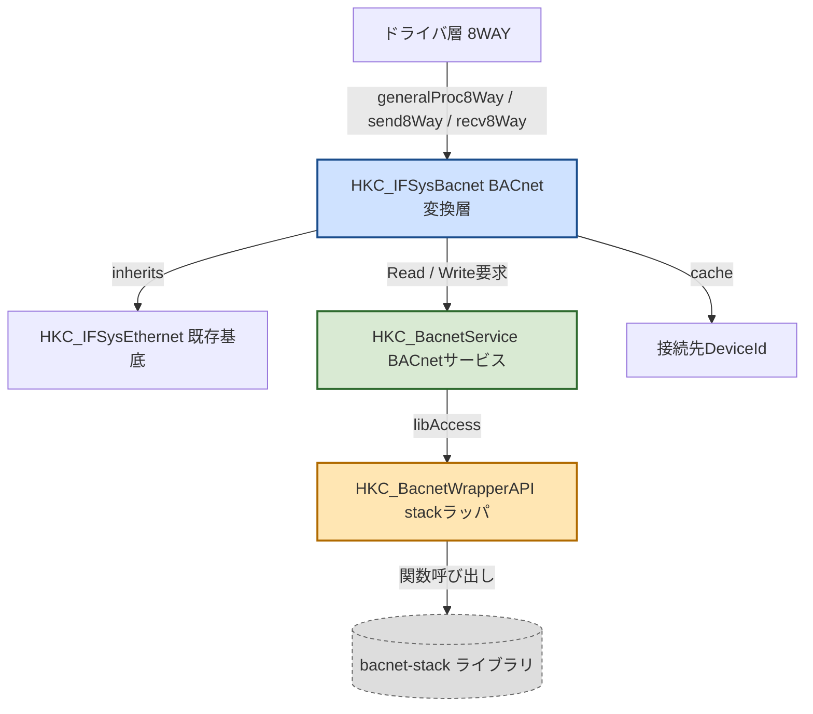
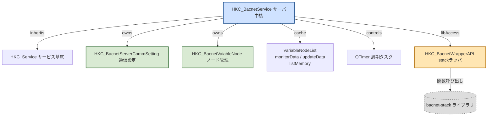
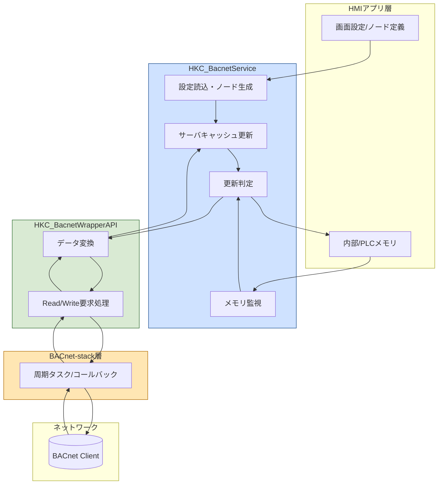

# BACnetクライアント機能

## 構造図（Mermaid）

### クラス構成図

```mermaid
graph TD
    Driver[ドライバ層 8WAY]
    IFEth[HKC_IFSysEthernet 既存基底]
    IFBacnet[HKC_IFSysBacnet BACnet変換層]
    Svc[HKC_BacnetService BACnetサービス]
    Wrapper[HKC_BacnetWrapperAPI stackラッパ]
    StackLib[(bacnet-stack ライブラリ)]
    Cache[接続先DeviceId]

    Driver -->|generalProc8Way / send8Way / recv8Way| IFBacnet
    IFBacnet -->|inherits| IFEth
    IFBacnet -->|Read / Write要求| Svc
    IFBacnet -->|cache| Cache
    Svc -->|libAccess| Wrapper
    Wrapper -->|関数呼び出し| StackLib

    style IFBacnet fill:#cfe2ff,stroke:#1a4d8c,stroke-width:2px
    style Svc fill:#d9ead3,stroke:#2f6b2f,stroke-width:2px
    style Wrapper fill:#ffe6b3,stroke:#b06a00,stroke-width:2px
    style StackLib fill:#dddddd,stroke:#666,stroke-dasharray:4 3
```

### データフロー図

```mermaid
graph TD
    subgraph App[HMIアプリ層]
      UI[画面/タグ参照]
      Tag[タグデータ型]
    end
    subgraph Drv[ドライバ層]
      Pkt[8WAYパケット]
      Obj[Object/Property指定組み立て]
    end
    subgraph IF[HKC_IFSysBacnet]
      Req[8WAY要求解析・Read/Write分岐]
      Hand[接続先情報取得]
      Resp[応答結果格納]
    end
    subgraph Svc[HKC_BacnetService]
      Conv[BACnet型変換]
      APDU[BACnet要求キュー投入]
      Ret[戻り値データ保持]
    end
    subgraph Stack[BACnet-stack層]
      Task[Read/Writeタスク実行]
    end
    subgraph Net[ネットワーク]
      Dev[(BACnet Device)]
    end

    UI --> Tag --> Obj --> Pkt --> Req
    Hand --> Req
    Req --> APDU
    Req --> Conv
    Conv --> APDU --> Task --> Dev
    Dev --> Task --> Ret --> Resp --> Pkt --> UI

    style IF fill:#cfe2ff,stroke:#1a4d8c
    style Svc fill:#d9ead3,stroke:#2f6b2f
    style Stack fill:#ffe6b3,stroke:#b06a00
```

# BACnetサーバ機能

## 構造図（Mermaid）

### クラス構成図

```mermaid
graph TD
    Base[HKC_Service サービス基底]
    Svc[HKC_BacnetService サーバ中核]
    Comm[HKC_BacnetServerCommSetting 通信設定]
    Node[HKC_BacnetVaiableNode ノード管理]
    Cache[variableNodeList<br/>monitorData / updateData<br/>listMemory]
    Timer[QTimer 周期タスク]
    Wrapper[HKC_BacnetWrapperAPI stackラッパ]
    StackLib[(bacnet-stack ライブラリ)]

    Svc -->|inherits| Base
    Svc -->|owns| Comm
    Svc -->|owns| Node
    Svc -->|cache| Cache
    Svc -->|controls| Timer
    Svc -->|libAccess| Wrapper
    Wrapper -->|関数呼び出し| StackLib

    style Svc fill:#cfe2ff,stroke:#1a4d8c,stroke-width:2px
    style Comm fill:#d9ead3,stroke:#2f6b2f,stroke-width:2px
    style Node fill:#d9ead3,stroke:#2f6b2f,stroke-width:2px
    style Wrapper fill:#ffe6b3,stroke:#b06a00,stroke-width:2px
    style StackLib fill:#dddddd,stroke:#666,stroke-dasharray:4 3
```

### データフロー図

```mermaid
graph TD
    subgraph App[HMIアプリ層]
      UI[画面設定/ノード定義]
      Mem[内部/PLCメモリ]
    end
    subgraph Svc[HKC_BacnetService]
      Init[設定読込・ノード生成]
      Mon[メモリ監視]
      Upd[更新判定]
      Cache[サーバキャッシュ更新]
    end
    subgraph Wrap[HKC_BacnetWrapperAPI]
      Conv[データ変換]
      Req[Read/Write要求処理]
    end
    subgraph Stack[BACnet-stack層]
      Task[周期タスク/コールバック]
    end
    subgraph Net[ネットワーク]
      Client[(BACnet Client)]
    end

    UI --> Init --> Cache
    Mem --> Mon --> Upd --> Conv --> Req --> Task --> Client
    Client --> Task --> Req --> Conv --> Cache --> Upd --> Mem

    style Svc fill:#cfe2ff,stroke:#1a4d8c
    style Wrap fill:#d9ead3,stroke:#2f6b2f
    style Stack fill:#ffe6b3,stroke:#b06a00
```

