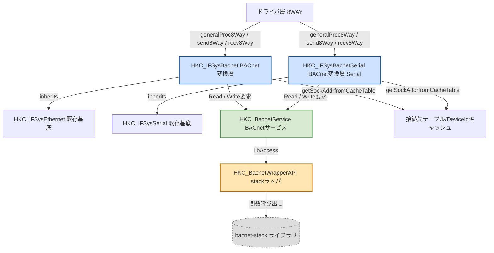
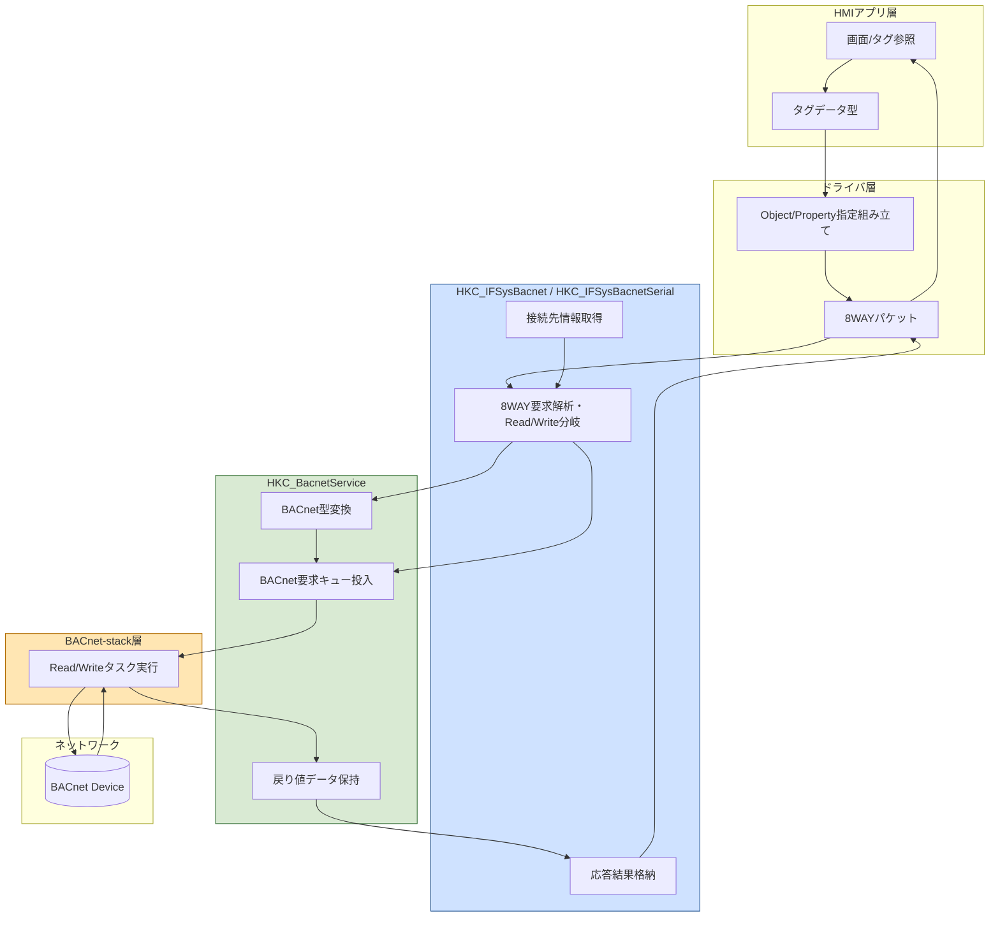
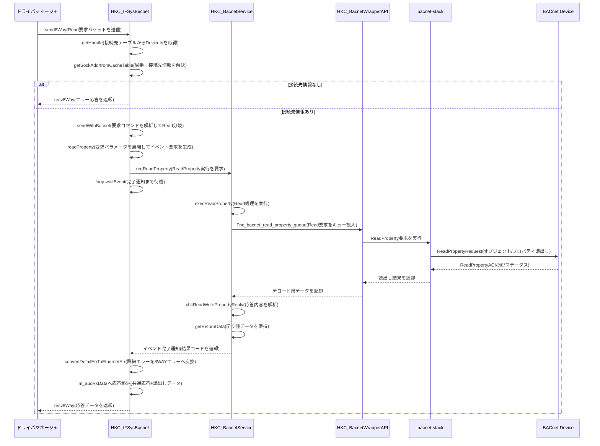
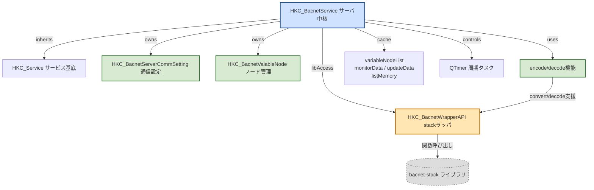
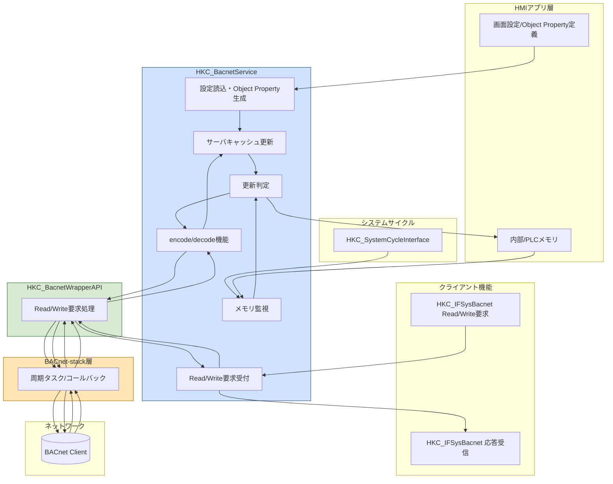

# BACnetクライアント機能

## 構造図（Mermaid）

### クラス構成図

### クラス構成（実装ソース抽出）

| 分類 | クラス/構造体 | 役割 | ファイル |
|---|---|---|---|
| 主体（ドライバ-BACnet変換） | HKC_IFSysBacnetEthernet | HKC_IFSysEthernetを継承。8WAY要求を解析し、ReadProperty/WriteProperty要求をHKC_BacnetServiceへ中継。接続先テーブルからDeviceIdを取得し、応答データを8WAY受信バッファへ格納。 | V10/src/com/interface/library/BACnet/HKC_IFSysBacnetEthernet.h V10/src/com/interface/library/BACnet/HKC_IFSysBacnetEthernet.cpp |
| 主体（ドライバ-BACnet変換: Serial拡張予定） | HKC_IFSysBacnetSerial | HKC_IFSysBacnetEthernetと同一の役割・処理構成を想定。相違点は継承元のみで、HKC_IFSysEthernetの代わりにHKC_IFSysSerialを継承する想定。ReadProperty/WriteProperty要求の中継先やサービス層以降の構成は共通。 | V10/src/com/interface/library/BACnet/HKC_IFSysBacnetSerial.h V10/src/com/interface/library/BACnet/HKC_IFSysBacnetSerial.cpp |
| 制御（BACnetサービス） | HKC_BacnetService | reqReadProperty/reqWritePropertyを受け、BACnet処理を実行して戻り値データを保持。クライアントIFからgetReturnDataで参照される。内部でHKC_BacnetWrapperAPIを保持。 | V10/src/sys/service/HKC_BacnetService.h V10/src/sys/service/HKC_BacnetService.cpp |
| 補助（ライブラリラッパ） | HKC_BacnetWrapperAPI | bacnet-stack関連ライブラリのロード/アンロード、関数ポインタ解決、各API呼び出しをラップ。address_add/address_set_device_TTL等の呼び出し窓口。 | V10/src/sys/service/BACnet/HKC_BacnetWrapperAPI.h V10/src/sys/service/BACnet/HKC_BacnetWrapperAPI.cpp |
| 補助（I/F要求応答構造体） | Bacnet_Send_Common Bacnet_Recv_Common Bacnet_Send_ReadProperty Bacnet_Send_WriteProperty | HKC_IFSysBacnetEthernet/HKC_IFSysBacnetSerialの送受信バッファで使用する要求/応答データ形式。 | Grobal/include/DrvLibraryStruct.h |
| 外部基底クラス | HKC_IFSysEthernet | Ethernet 8WAY通信の共通処理を提供。HKC_IFSysBacnetEthernetはこれを継承し、BACnet独自のsend/recv処理を実装。 | V9/src/com/interface/HKC_IFSysEthernet.h V9/src/com/interface/HKC_IFSysEthernet.cpp |
| 外部基底クラス | HKC_IFSysSerial | Serial 8WAY通信の共通処理を提供する想定基底クラス。HKC_IFSysBacnetSerialではこの基底に差し替える。 | V9/src/com/interface/HKC_IFSysSerial.h |

### データフロー図

### 1.9.2 シーケンス図（Read要求）

# BACnetサーバ機能

## 構造図（Mermaid）

### クラス構成図

### クラス構成（実装ソース抽出）

| 分類 | クラス/構造体 | 役割 | ファイル |
|---|---|---|---|
| 主体（サービス） | HKC_BacnetService | HKC_Serviceを継承するBACnetサービスの中核クラス。サーバ起動/停止、初期設定、Object生成、監視メモリ更新、ReadProperty/WriteProperty要求受付、戻り値保持、サーバキャッシュ更新を担う。内部で通信設定、ノード一覧、監視データ、更新データ、タイマ、ライブラリアクセサを保持する。 | V10/src/sys/service/HKC_BacnetService.h V10/src/sys/service/HKC_BacnetService.cpp |
| 制御（周期） | HKC_SysCycleBacnet | HKC_SystemCycleInterfaceを継承し、システム周期で対象メモリのchkMemStatを実施した後、HKC_BacnetServiceのデータ更新処理を呼び出して監視対象データを更新する。 | V10/src/app/control/syscycle/HKC_SysCycleBacnet.h V10/src/app/control/syscycle/HKC_SysCycleBacnet.cpp |
| 制御（ライブラリ抽象化） | HKC_BacnetWrapperAPI | QObject派生。bacnet-stack系ライブラリの動的ロード、関数ポインタ解決、各種BACnet API呼び出しをラップする。Read/Write要求、Who-Is、address_add、address_set_device_TTL、各種encode/decode補助の窓口となる。 | V10/src/sys/service/BACnet/HKC_BacnetWrapperAPI.h V10/src/sys/service/BACnet/HKC_BacnetWrapperAPI.cpp |
| 補助（通信設定） | HKC_BacnetServerCommSetting | 通信設定を保持するクラス。IPアドレス、デバイス名、セッションタイムアウト、接続形式、自局DeviceIdなどを保持し、内部でキャッシュ登録を行う。 | V10/src/sys/service/HKC_BacnetService.h V10/src/sys/service/HKC_BacnetService.cpp |
| 補助（ノード） | HKC_BacnetVaiableNode | BACnetのObject/Propertyに対応する内部ノード表現。 | V10/src/sys/service/HKC_BacnetService.h V10/src/sys/service/HKC_BacnetService.cpp |
| 補助（変換ユーティリティ） | HKD_BacnetNodeInfoConvert 名前空間 | BACNET_APPLICATION_DATA_VALUEとQVector<quint8>、メモリ要求、ノードキー情報の相互変換を行う関数群を提供する。書込用Variant生成、読出し値変換、ノードキー生成、メモリオーダー補正などを担う。 | V10/src/sys/service/HKC_BacnetService.h V10/src/sys/service/HKC_BacnetService.cpp |

### データフロー図

