## 目次

- [アーキテクチャ概要](#アーキテクチャ概要)
  - [プロセス構成](#プロセス構成)
  - [IPC種別と使い分け](#ipc種別と使い分け)
  - [各セクションの読み順](#各セクションの読み順)
- [BACnetクライアント機能](#bacnetクライアント機能)
  - [機能概要](#機能概要)
  - [配列・リスト型プロパティのアクセス制約](#配列リスト型プロパティのアクセス制約)
    - [配列型（BACnetARRAY）](#配列型bacnetarray)
    - [リスト型（BACnetLIST）](#リスト型bacnetlist)
  - [クラス構成](#クラス構成)
  - [構造図（Mermaid）](#構造図mermaid)
    - [クラス構成図](#クラス構成図)
    - [データフロー図](#データフロー図)
    - [シーケンス図（Read/Write要求）](#シーケンス図readwrite要求)
- [BACnetサーバ機能](#bacnetサーバ機能)
  - [機能概要](#機能概要-1)
  - [クラス構成](#クラス構成-1)
  - [構造図（Mermaid）](#構造図mermaid-1)
    - [クラス構成図](#クラス構成図-1)
    - [データフロー図](#データフロー図-1)
    - [シーケンス図（サーバ起動）](#シーケンス図サーバ起動)
    - [シーケンス図（周期更新）](#シーケンス図周期更新)
    - [シーケンス図（外部クライアントによるサーバデータ更新）](#シーケンス図外部クライアントによるサーバデータ更新)
- [Property同期メカニズム（QSharedMemory）](#property同期メカニズムqsharedmemory)
  - [概要](#概要)
  - [関連クラスとファイル](#関連クラスとファイル)
  - [共有メモリレイアウト](#共有メモリレイアウト)
  - [更新状態（updateState）](#更新状態updatestate)
  - [構造図](#構造図)
    - [共有メモリ構造図](#共有メモリ構造図)
    - [updateState 状態遷移図](#updatestate-状態遷移図)
    - [データフロー図](#データフロー図-2)
    - [シーケンス図（デバイスメモリ変化→BACnet Property反映）](#シーケンス図デバイスメモリ変化bacnet-property反映)
    - [シーケンス図（外部WP受信・内部値変化→デバイスメモリ反映）](#シーケンス図外部wp受信内部値変化デバイスメモリ反映)
- [BACnetExecutorプロセス](#bacnetexecutorプロセス)
  - [機能概要](#機能概要-2)
  - [クラス構成](#クラス構成-2)
  - [構造図（Mermaid）](#構造図mermaid-2)
    - [クラス構成図](#クラス構成図-2)
    - [シーケンス図（プロセス起動）](#シーケンス図プロセス起動)
    - [シーケンス図（RP/WP要求処理）](#シーケンス図rpwp要求処理)
    - [シーケンス図（外部BACnet WP受信・Property同期）](#シーケンス図外部bacnet-wp受信property同期)
    - [シーケンス図（周期処理）](#シーケンス図周期処理)
- [モニタッチで対応する機能一覧](#モニタッチで対応する機能一覧)
  - [Device Profile（Annex L）](#device-profileannex-l)
  - [BIBBs（対応サービス一覧）](#bibbs対応サービス一覧)
  - [Data Link Layer](#data-link-layer)
  - [Device Address Binding](#device-address-binding)
  - [Character Sets](#character-sets)
  - [Networking Options](#networking-options)
  - [Gateway Options](#gateway-options)
- [モニタッチで対応するObject Type一覧](#モニタッチで対応するobject-type一覧)
- [モニタッチで対応するプロパティ一覧](#モニタッチで対応するプロパティ一覧)
  - [共通事項](#共通事項)
    - [エディタ設定項目の要否（サーバ更新区分別）](#エディタ設定項目の要否サーバ更新区分別)
    - [使用データ型一覧](#使用データ型一覧)
  - [Analog Input (AI)](#analog-input-ai)
  - [Analog Output (AO)](#analog-output-ao)
  - [Binary Input (BI)](#binary-input-bi)
  - [Binary Output (BO)](#binary-output-bo)
  - [Device](#device)
  - [Network Port (NP)](#network-port-np)
    - [共通プロパティ（BIP / MSTP 両方）](#共通プロパティbip--mstp-両方)
    - [BACnet/IP 固有プロパティ（Network_Type = BIP）](#bacnetip-固有プロパティnetwork_type--bip)
    - [BACnet/MS/TP 固有プロパティ（Network_Type = MSTP）](#bacnetmstp-固有プロパティnetwork_type--mstp)
  - [BIT_STRING ビット定義](#bit_string-ビット定義)
    - [アプリ側キャッシュの割り当て方針](#アプリ側キャッシュの割り当て方針)
    - [BACnetStatusFlags](#bacnetstatusflags)
    - [BACnetServicesSupported](#bacnetservicessupported)
    - [BACnetObjectTypesSupported](#bacnetobjecttypessupported)
  - [ASHRAE 135 との差異一覧](#ashrae-135-との差異一覧)
    - [Reliability 実装差異（AI / AO / BI / BO / NP）](#reliability-実装差異ai--ao--bi--bo--np)
- [BACnetライブラリ管理プロパティ 読み取りマクロ](#bacnetライブラリ管理プロパティ-読み取りマクロ)
  - [機能概要](#機能概要-3)
  - [パラメータ](#パラメータ)
  - [動作仕様](#動作仕様)
  - [対象プロパティと出力形式](#対象プロパティと出力形式)
  - [Priority Array の読み取りについて](#priority-array-の読み取りについて)
    - [NULL（リリンキッシュ）スロットの出力形式](#nullリリンキッシュスロットの出力形式)
- [BACnet Priority Write / Relinquish 書き込みマクロ](#bacnet-priority-write--relinquish-書き込みマクロ)
  - [機能概要](#機能概要-4)
  - [パラメータ](#パラメータ-1)
  - [動作仕様](#動作仕様-1)
  - [対応プロパティ](#対応プロパティ)
  - [NULL 書き込み（Relinquish）の注意事項](#null-書き込みrelinquishの注意事項)
- [Appendix: bacnet-stack Setter/Getter リファレンス](#appendix-bacnet-stack-settergetter-リファレンス)
  - [AI（Analog Input）](#aianalog-input)
  - [AO（Analog Output）](#aoanalog-output)
  - [BI（Binary Input）](#bibinary-input)
  - [BO（Binary Output）](#bobinary-output)
  - [Device](#device-1)
  - [NP（Network Port）](#npnetwork-port)
  - [初期値（生成/初期化時）](#初期値生成初期化時)
    - [AI（Analog Input）](#aianalog-input-1)
    - [AO（Analog Output）](#aoanalog-output-1)
    - [BI（Binary Input）](#bibinary-input-1)
    - [BO（Binary Output）](#bobinary-output-1)
    - [Device](#device-2)
    - [NP（Network Port）](#npnetwork-port-1)
  - [①pollAndSyncBACnetValues 対象まとめ](#①pollandsyncbacnetvalues-対象まとめ)
  - [Status_Flags の取得方針](#status_flags-の取得方針)

# アーキテクチャ概要

## プロセス構成

BACnet機能は **Monitouchメインプロセス** と **BACnetExecutorプロセス** の2プロセス構成で実装されています。  
bacnet-stackライブラリの実行はBACnetExecutorプロセスが専任し、Monitouchメインプロセスとは2種類のIPCで連携します。  
BACnetExecutorプロセスはEthernet（BACnet/IP）用とSerial（BACnet/MSTP）用の2インスタンスが存在します。

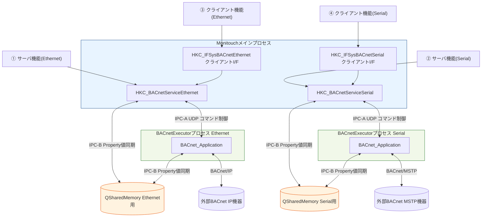
```mermaid
graph TD;
  P1["① サーバ機能(Ethernet)"];
  P2["② サーバ機能(Serial)"];
  P3["③ クライアント機能(Ethernet)"];
  P4["④ クライアント機能(Serial)"];

  subgraph MT[Monitouchメインプロセス];
  CE[HKC_IFSysBACnetEthernet クライアントI/F];
  CS[HKC_IFSysBACnetSerial クライアントI/F];
    SvcE[HKC_BACnetServiceEthernet];
    SvcS[HKC_BACnetServiceSerial];
  end;

  subgraph EE[BACnetExecutorプロセス Ethernet];
    AE[BACnet_Application];
  end;

  subgraph ES[BACnetExecutorプロセス Serial];
    AS[BACnet_Application];
  end;

  SME[(QSharedMemory Ethernet用)];
  SMS[(QSharedMemory Serial用)];
  ExtE[(外部BACnet IP機器)];
  ExtS[(外部BACnet MSTP機器)];

  P1 --> SvcE;
  P2 --> SvcS;
  P3 --> CE --> SvcE;
  P4 --> CS --> SvcS;
  SvcE <-->|"IPC-A  UDP コマンド制御"| AE;
  SvcS <-->|"IPC-A  UDP コマンド制御"| AS;
  SvcE <-->|"IPC-B  Property値同期"| SME;
  AE <-->|"IPC-B  Property値同期"| SME;
  SvcS <-->|"IPC-B  Property値同期"| SMS;
  AS <-->|"IPC-B  Property値同期"| SMS;
  AE <-->|"BACnet/IP"| ExtE;
  AS <-->|"BACnet/MSTP"| ExtS;

  style MT fill:#e8f4ff,stroke:#1a4d8c;
  style EE fill:#f1f8e9,stroke:#2e7d32;
  style ES fill:#f1f8e9,stroke:#2e7d32;
  style SME fill:#fff3e0,stroke:#e65100;
  style SMS fill:#fff3e0,stroke:#e65100;
```

上図の①〜④が有効になる条件は以下のとおりです。

| パターン | 有効条件 |
|---|---|
| ① サーバ機能(Ethernet) | エディタのIIoT設定で、BACnetサーバのEthernet用設定を追加した場合に有効 |
| ② サーバ機能(Serial) | エディタのIIoT設定で、BACnetサーバのSerial用設定を追加した場合に有効 |
| ③ クライアント機能(Ethernet) | エディタのPLC8Way設定で、BACnetクライアントのEthernetドライバを追加した場合に有効 |
| ④ クライアント機能(Serial) | エディタのPLC8Way設定で、BACnetクライアントのSerialドライバを追加した場合に有効 |

## IPC種別と使い分け

MonitouchプロセスとBACnetExecutorプロセスの間のIPCは用途に応じて2種類使い分けています。

| 種別 | 通信方式 | 用途 | 特性 |
|---|---|---|---|
| IPC-A コマンドIPC | QUdpSocket（localhost）| サーバ起動/停止・RP/WP要求・Object削除・LinkClearなどの制御コマンド送受信 | 要求/応答型。送信ごとに応答を待つ同期/非同期2モード。コマンド種別は`CommandType`列挙体で識別。 |
| IPC-B Property同期 | QSharedMemory + QSystemSemaphore | BACnet Property値とMonitouchデバイスメモリの双方向同期（高頻度） | 共有メモリにエントリごとの`updateState`（0/1/2）を設けて方向と状態を管理する。詳細: → [Property同期メカニズム（QSharedMemory）](#property同期メカニズムqsharedmemory) |

## 各セクションの読み順

| 読む順 | セクション | 読む目的 |
|---|---|---|
| 1 | [このセクション](#アーキテクチャ概要) | 全体のプロセス構成とIPCの使い分けを把握する |
| 2 | [BACnetクライアント機能](#bacnetクライアント機能) | HMI画面→外部BACnet機器へのRead/Write I/F層を理解する |
| 3 | [BACnetサーバ機能](#bacnetサーバ機能) | 外部BACnetクライアントからの受け付けとMonitouchデバイスメモリ同期を理解する |
| 4 | [Property同期メカニズム（QSharedMemory）](#property同期メカニズムqsharedmemory) | IPC-Bの詳細（共有メモリレイアウト・updateState遷移・シーケンス）を理解する |
| 5 | [BACnetExecutorプロセス](#bacnetexecutorプロセス) | BACnetライブラリ実行専任プロセスの内部動作を理解する |

---

# BACnetクライアント機能

## 機能概要

BACnetクライアント機能は、HMI画面側からドライバ経由でBACnet機器へアクセスし、Object/PropertyのRead/Writeを行う機能です。  
ドライバとHMIアプリ間は既存の8WAY通信I/Fでやり取りされ、`HKC_IFSysBACnet`系クラスが8WAY要求をBACnetサービス呼び出しへ変換します。  
BACnetサービス（`HKC_BACnetService`）はEthernet用（`HKC_BACnetServiceEthernet`）とSerial用（`HKC_BACnetServiceSerial`）に分かれており、それぞれが対応するモードのBACnetExecutorプロセスへUDP（localhost）経由でIPCします。  
本セクションではクライアントI/F層を対象とし、`HKC_BACnetService`以降のIPC処理・BACnetExecutor内部処理・bacnet-stack操作は対象外とします（→ [BACnetExecutorプロセス](#bacnetexecutorプロセス) 参照）。

| 項目 | 内容 |
|---|---|
| 通信I/F | 8WAY通信I/F（送信/受信/汎用処理） |
| 対応機能 | ReadProperty / WriteProperty |
| 対応データ型 | [使用データ型一覧](#使用データ型一覧) |
| 接続先解決 | 接続先テーブル情報からDeviceIdを取得して要求先を決定 |
| 呼出先 | HKC_BACnetServiceEthernet / HKC_BACnetServiceSerialにReadProperty/WriteProperty要求を依頼 |
| 通信モード別サービス | Ethernet（BIP）用はHKC_BACnetServiceEthernet、Serial（MSTP）用はHKC_BACnetServiceSerial |
| 範囲外 | HKC_BACnetService以降のIPC処理（BACnetExecutorへのUDP送信、Who-Is、静的バインド管理など）は本セクションの対象外 |

## 配列・リスト型プロパティのアクセス制約

BACnet規格上、配列型（BACnetARRAY）およびリスト型（BACnetLIST）のプロパティに対する ReadProperty / WriteProperty の `array_index` 指定には以下の制約がある。

### 配列型（BACnetARRAY）

| array_index 値 | 意味 | 備考 |
|---|---|---|
| `0` | 配列の要素数を返す | |
| `1〜n` | 指定インデックスの1要素のみを取得/書き込み | |
| `BACNET_ARRAY_ALL`（`UINT32_MAX`） | 全要素を一括取得/書き込み | |

モニタッチのクライアント機能では、8WAY通信I/Fを介してユーザーがプロジェクト作成時にリード/ライトするバイト数（デバイスメモリ割り当て）を固定する設計のため、`BACNET_ARRAY_ALL` による一括アクセスはできない。**配列型プロパティへのアクセスは1要素ずつのインデックス指定となる。**

### リスト型（BACnetLIST）

BACnetLIST はインデックスという概念が型仕様に存在せず、ReadProperty / WriteProperty では常に全体（`BACNET_ARRAY_ALL` 相当 = `array_index` 省略）での一括アクセスのみが規格上定義されている。要素単位の追加・削除は `AddListElement` / `RemoveListElement` サービスを使用する。

モニタッチのクライアント機能では、**リスト型プロパティのリード/ライトに通常の8WAY通信経由で対応する。** ただし以下の制約がある。

- **リード**：全データを一括取得し、ユーザーが指定したインデックスの要素をデバイスメモリへ格納する。指定インデックスの要素が存在しない場合はエラーを返す。
- **ライト（Read-Modify-Write）**：まず全データをリードして内部に保持し、ユーザーが指定したインデックスの要素のみを変更した上で全体をライトする。指定インデックスの要素が存在しない場合はエラーを返す。要素の追加・削除には対応しない。

全データのリード/ライトや要素の追加・削除が必要な場合は、専用マクロでの対応が必要となる。

## クラス構成

| 分類 | クラス/構造体 | 役割 | ファイル |
|---|---|---|---|
| 主体（BACnet共通処理 ミックスイン基底） | HKC_IFSysBACnet | EthernetとSerial共通のBACnet処理を提供するミックスイン基底クラス。ReadProperty/WriteProperty要求実行（`readProperty()`/`writeProperty()`）の実装を持ち、担当サービス取得（`bacnetService()`）は純粋仮想で各派生クラスが対応するサービスを返す。PLCテーブル取得、詳細エラー変換も担う。 | V10/src/com/interface/library/BACnet/HKC_IFSysBACnet.h<br>V10/src/com/interface/library/BACnet/HKC_IFSysBACnet.cpp |
| 主体（ドライバ-BACnet変換: Ethernet） | HKC_IFSysBACnetEthernet | `HKC_IFSysBACnet`と`HKC_IFSysEthernet`を多重継承。8WAY要求を解析しReadProperty/WriteProperty要求を`HKC_BACnetServiceEthernet`へ中継。接続先テーブルからDeviceIdを取得し、応答データを8WAY受信バッファへ格納。 | V10/src/com/interface/library/BACnet/HKC_IFSysBACnetEthernet.h<br>V10/src/com/interface/library/BACnet/HKC_IFSysBACnetEthernet.cpp |
| 主体（ドライバ-BACnet変換: Serial） | HKC_IFSysBACnetSerial | `HKC_IFSysBACnet`と`HKC_IFSysSerial`を多重継承。`HKC_IFSysBACnetEthernet`と同一の役割・処理構成。現時点ではスタブ実装。`bacnetService()`は`HKC_BACnetServiceSerial`を返す。 | V10/src/com/interface/library/BACnet/HKC_IFSysBACnetSerial.h<br>V10/src/com/interface/library/BACnet/HKC_IFSysBACnetSerial.cpp |
| 制御（BACnetサービス基底） | HKC_BACnetService | Read/Write要求受付（`reqReadProperty`/`reqWriteProperty`）を受け、HKC_BACnetCommandExecutor経由でBACnetExecutorプロセスへUDP（localhost）でIPCを送信し、応答データを保持する。クライアントIFから応答データ参照（`getReturnData`）で参照される。Ethernet/Serial用の共通処理を持つ基底クラス。 | V10/src/sys/service/BACnet/HKC_BacnetService.h<br>V10/src/sys/service/BACnet/HKC_BACnetService.cpp |
| 制御（BACnetサービス: Ethernet） | HKC_BACnetServiceEthernet | `HKC_BACnetService`を継承。Ethernet用BACnetExecutorプロセスとIPC通信するサービス。Ethernet用のIPCポートを使用する。担当サービス取得（`bacnetService()`）がグローバルインスタンス経由でEthernetサービスを参照する。 | V10/src/sys/service/BACnet/HKC_BACnetServiceEthernet.h<br>V10/src/sys/service/BACnet/HKC_BACnetServiceEthernet.cpp |
| 制御（BACnetサービス: Serial） | HKC_BACnetServiceSerial | `HKC_BACnetService`を継承。Serial用BACnetExecutorプロセスとIPC通信するサービス。Serial用のIPCポート（D_BACnetExecutorSerialPort）を使用する。 | V10/src/sys/service/BACnet/HKC_BACnetServiceSerial.h<br>V10/src/sys/service/BACnet/HKC_BACnetServiceSerial.cpp |
| 補助（I/F要求応答構造体） | Bacnet_Send_Common<br>Bacnet_Recv_Common<br>Bacnet_Send_ReadProperty<br>Bacnet_Send_WriteProperty | HKC_IFSysBACnetEthernet/HKC_IFSysBACnetSerialの送受信バッファで使用する要求/応答データ形式。 | Grobal/include/DrvLibraryStruct.h |
| 外部基底クラス | HKC_IFSysEthernet | Ethernet 8WAY通信の共通処理を提供。HKC_IFSysBACnetEthernetはこれを多重継承し、BACnet独自のsend/recv処理を実装。 | V9/src/com/interface/HKC_IFSysEthernet.h<br>V9/src/com/interface/HKC_IFSysEthernet.cpp |
| 外部基底クラス | HKC_IFSysSerial | Serial 8WAY通信の共通処理を提供する基底クラス。HKC_IFSysBACnetSerialはこれを多重継承する。 | V9/src/com/interface/HKC_IFSysSerial.h |

## 構造図（Mermaid）

### クラス構成図

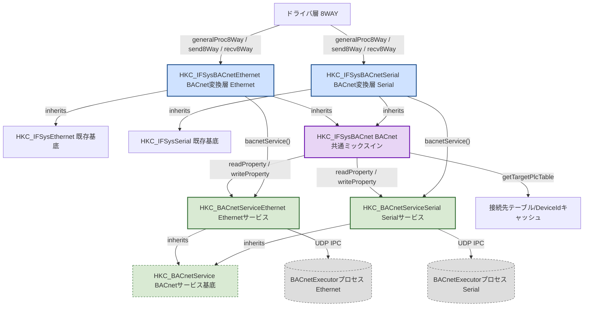
```mermaid
graph TD
  Driver[ドライバ層 8WAY]
  IFEth[HKC_IFSysEthernet 既存基底]
  IFSer[HKC_IFSysSerial 既存基底]
  IFBACnet[HKC_IFSysBACnet BACnet共通ミックスイン]
  IFBACnetEth[HKC_IFSysBACnetEthernet BACnet変換層 Ethernet]
  IFBACnetSer[HKC_IFSysBACnetSerial BACnet変換層 Serial]
  SvcBase[HKC_BACnetService BACnetサービス基底]
  SvcEth[HKC_BACnetServiceEthernet Ethernetサービス]
  SvcSer[HKC_BACnetServiceSerial Serialサービス]
  ExecEth[(BACnetExecutorプロセス Ethernet)]
  ExecSer[(BACnetExecutorプロセス Serial)]
  Cache[接続先テーブル/DeviceIdキャッシュ]

  Driver -->|generalProc8Way / send8Way / recv8Way| IFBACnetEth
  Driver -->|generalProc8Way / send8Way / recv8Way| IFBACnetSer
  IFBACnetEth -->|inherits| IFBACnet
  IFBACnetEth -->|inherits| IFEth
  IFBACnetSer -->|inherits| IFBACnet
  IFBACnetSer -->|inherits| IFSer
  IFBACnet -->|readProperty / writeProperty| SvcEth
  IFBACnet -->|readProperty / writeProperty| SvcSer
  IFBACnetEth -->|"bacnetService()"| SvcEth
  IFBACnetSer -->|"bacnetService()"| SvcSer
  IFBACnet -->|getTargetPlcTable| Cache
  SvcEth -->|inherits| SvcBase
  SvcSer -->|inherits| SvcBase
  SvcEth -->|UDP IPC| ExecEth
  SvcSer -->|UDP IPC| ExecSer

  style IFBACnet fill:#e8d5f5,stroke:#6a0dad,stroke-width:2px
  style IFBACnetEth fill:#cfe2ff,stroke:#1a4d8c,stroke-width:2px
  style IFBACnetSer fill:#cfe2ff,stroke:#1a4d8c,stroke-width:2px
  style SvcEth fill:#d9ead3,stroke:#2f6b2f,stroke-width:2px
  style SvcSer fill:#d9ead3,stroke:#2f6b2f,stroke-width:2px
  style SvcBase fill:#d9ead3,stroke:#2f6b2f,stroke-width:1px,stroke-dasharray:4 3
  style ExecEth fill:#dddddd,stroke:#666,stroke-dasharray:4 3
  style ExecSer fill:#dddddd,stroke:#666,stroke-dasharray:4 3
```

### データフロー図

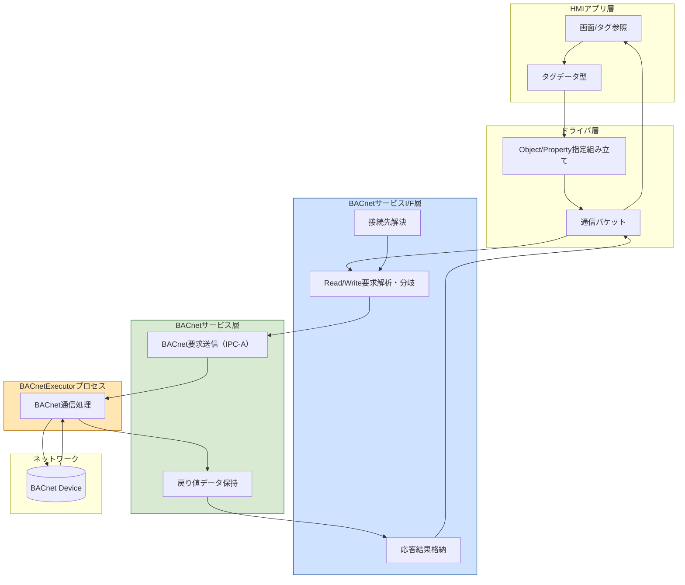
```mermaid
graph TD
    subgraph App[HMIアプリ層]
      UI[画面/タグ参照]
      Tag[タグデータ型]
    end
    subgraph Drv[ドライバ層]
      Pkt[通信パケット]
      Obj[Object/Property指定組み立て]
    end
    subgraph IF[BACnetサービスI/F層]
      Req[Read/Write要求解析・分岐]
      Hand[接続先解決]
      Resp[応答結果格納]
    end
    subgraph Svc[BACnetサービス層]
      APDU[BACnet要求送信（IPC-A）]
      Ret[戻り値データ保持]
    end
    subgraph Exec[BACnetExecutorプロセス]
      ExecTask[BACnet通信処理]
    end
    subgraph Net[ネットワーク]
      Dev[(BACnet Device)]
    end

    UI --> Tag --> Obj --> Pkt --> Req
    Hand --> Req
    Req --> APDU --> ExecTask --> Dev
    Dev --> ExecTask --> Ret --> Resp --> Pkt --> UI

    style IF fill:#cfe2ff,stroke:#1a4d8c
    style Svc fill:#d9ead3,stroke:#2f6b2f
    style Exec fill:#ffe6b3,stroke:#b06a00
```

### シーケンス図（Read/Write要求）

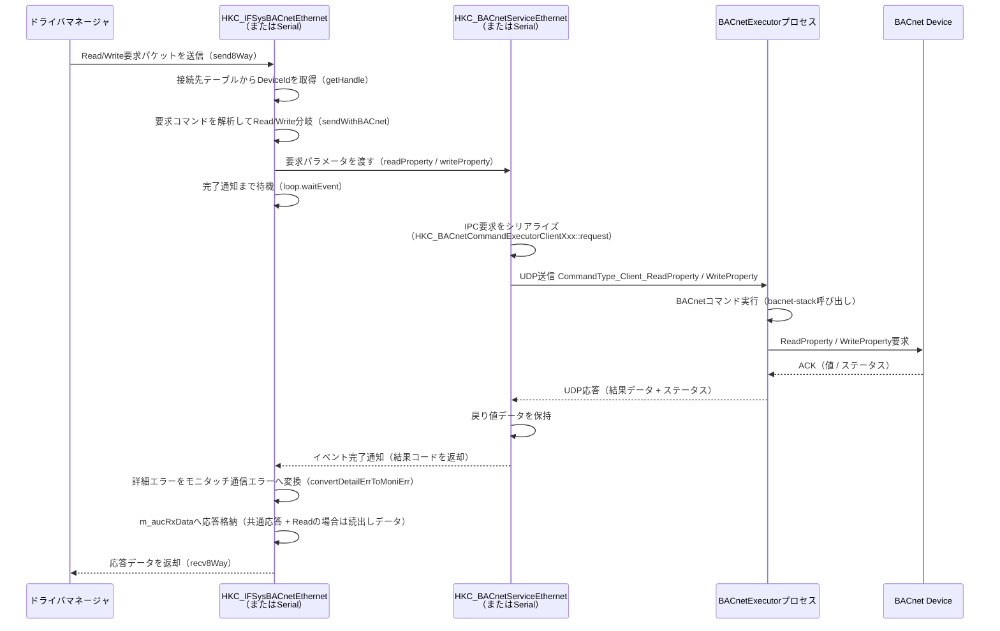
```mermaid
sequenceDiagram
  participant DM as ドライバマネージャ
  participant BAC as HKC_IFSysBACnetEthernet<br/>（またはSerial）
  participant SVC as HKC_BACnetServiceEthernet<br/>（またはSerial）
  participant EXEC as BACnetExecutorプロセス
  participant DEV as BACnet Device

  DM->>BAC: Read/Write要求パケットを送信（send8Way）
  BAC->>BAC: 接続先テーブルからDeviceIdを取得（getHandle）
  BAC->>BAC: 要求コマンドを解析してRead/Write分岐（sendWithBACnet）
  BAC->>SVC: 要求パラメータを渡す（readProperty / writeProperty）
  BAC->>BAC: 完了通知まで待機（loop.waitEvent）

  SVC->>SVC: IPC要求をシリアライズ<br/>（HKC_BACnetCommandExecutorClientXxx::request）
  SVC->>EXEC: UDP送信 CommandType_Client_ReadProperty / WriteProperty
  EXEC->>EXEC: BACnetコマンド実行（bacnet-stack呼び出し）
  EXEC->>DEV: ReadProperty / WriteProperty要求
  DEV-->>EXEC: ACK（値 / ステータス）
  EXEC-->>SVC: UDP応答（結果データ + ステータス）

  SVC->>SVC: 戻り値データを保持
  SVC-->>BAC: イベント完了通知（結果コードを返却）

  BAC->>BAC: 詳細エラーをモニタッチ通信エラーへ変換（convertDetailErrToMoniErr）
  BAC->>BAC: m_aucRxDataへ応答格納（共通応答 + Readの場合は読出しデータ）
  BAC-->>DM: 応答データを返却（recv8Way）
```

# BACnetサーバ機能

## 機能概要

BACnetサーバ機能は、HMI製品側の`HKC_BACnetService`がBACnetExecutorプロセスとIPCで連携し、外部BACnetクライアントからのRead/Write要求に応答しながら、HMI内部メモリ（内部/PLCデバイス値）とBACnet Property値を同期する機能です。  
bacnet-stackライブラリの実行はBACnetExecutorプロセスが専任し、`HKC_BACnetService`はIPCを通じてその制御を行います（→ [BACnetExecutorプロセス](#bacnetexecutorプロセス) 参照）。

サービスはEthernet（BACnet/IP）用の`HKC_BACnetServiceEthernet`とSerial（MS/TP）用の`HKC_BACnetServiceSerial`に分かれており、それぞれが対応するBACnetExecutorプロセスのインスタンスを管理します。

サーバ動作はサービススレッド`HKC_BACnetService`で管理され、システム周期処理`HKC_SysCycleBacnet`から周期的な監視メモリ取得（`getMemoryOrder`）/メモリ状態確認（`chkMemStat`）とデバイスメモリ監視更新（`updateMonitorData`）の呼び出しが行われます。  
デバイスメモリ監視更新（`updateMonitorData`）はデバイスメモリの現在値を取得して`monitorData`を更新し、更新処理要求（`reqUpdateProcess`）→更新実行（`updateProcess`）を呼び出します。  
`updateProcess`ではQSharedMemory経由でBACnetExecutorとProperty値を双方向に同期します（詳細: → [Property同期メカニズム（QSharedMemory）](#property同期メカニズムqsharedmemory) 参照）。

エディタ側で設定された各Propertyに対応する内部メモリ/PLCメモリのアクセス方式は、数値アクセスをDEC固定、文字列アクセスをLSB→MSB固定とします。

| 項目 | 内容 |
|---|---|
| 有効化方法 | 専用の構成ファイルでBACnet関連ソースを組み込み（`V10/work/bacnet.pri`） |
| bacnet-stack実行 | BACnetExecutorプロセスが専任（`libbacnet-stack.dll`） |
| サーバ初期化 | 共有メモリ作成 → BACnetExecutor起動 → IPC: サーバ初期化コマンド送信（`CommandType_Server_Initial`） |
| Property値の同期方式 | QSharedMemory + QSystemSemaphoreによる双方向同期（→ [Property同期メカニズム](#property同期メカニズムqsharedmemory)） |
| BACnet対応機能 | [モニタッチで対応する機能一覧](#モニタッチで対応する機能一覧) |
| BACnet対応Object Type | [モニタッチで対応するObject Type一覧](#モニタッチで対応するobject-type一覧) |
| BACnet対応Object Property | [モニタッチで対応するプロパティ一覧](#モニタッチで対応するプロパティ一覧) |

## クラス構成

| 分類 | クラス/構造体 | 役割 | ファイル |
|---|---|---|---|
| 主体（サービス基底） | HKC_BACnetService | `HKC_Service`を継承するBACnetサービスの基底クラス。サーバ起動/停止、Object生成、デバイスメモリ監視更新（`updateMonitorData`）、Property値更新判定・同期（`updateProcess`）、IPC送受信（RP/WP/ServerInitial等）、BACnetExecutorプロセス管理を担う。Ethernet/Serial共通処理を提供する。 | V10/src/sys/service/BACnet/HKC_BacnetService.h<br>V10/src/sys/service/BACnet/HKC_BACnetService.cpp |
| 主体（サービス: Ethernet） | HKC_BACnetServiceEthernet | `HKC_BACnetService`を継承。Ethernet（BACnet/IP）用BACnetExecutorプロセスを管理するサービス。起動前画面設定確認（`checkDispData`）でEthernet用のOpcUaServerHost設定をロードする。 | V10/src/sys/service/BACnet/HKC_BACnetServiceEthernet.h<br>V10/src/sys/service/BACnet/HKC_BACnetServiceEthernet.cpp |
| 主体（サービス: Serial） | HKC_BACnetServiceSerial | `HKC_BACnetService`を継承。Serial（MS/TP）用BACnetExecutorプロセスを管理するサービス。 | V10/src/sys/service/BACnet/HKC_BACnetServiceSerial.h<br>V10/src/sys/service/BACnet/HKC_BACnetServiceSerial.cpp |
| 制御（周期） | HKC_SysCycleBacnet | `HKC_SystemCycleInterface`を継承し、システム周期でメモリ状態確認（`chkMemStat`）を実施した後、デバイスメモリ監視更新（`HKC_BACnetService::updateMonitorData`）を呼び出してサーバ監視データを更新する。 | V10/src/app/control/syscycle/HKC_SysCycleBacnet.h<br>V10/src/app/control/syscycle/HKC_SysCycleBacnet.cpp |
| 制御（Property同期・Monitouch側） | HKC_BACnetPropertySyncCreator | QSharedMemory + QSystemSemaphoreを使用するProperty同期管理クラス（Monitouch側）。Property値更新判定（`updateProcess`）から呼び出される。詳細は → [Property同期メカニズム（QSharedMemory）](#property同期メカニズムqsharedmemory) 参照。 | V10/src/sys/service/BACnet/HKC_BACnetPropertySyncCreator.h<br>V10/src/sys/service/BACnet/HKC_BACnetPropertySyncCreator.cpp |
| 補助（通信設定） | HKC_BACnetServerCommSetting | 通信設定を保持するクラス。IPアドレス、デバイス名、セッションタイムアウト、接続形式、自局DeviceIdなどを保持し、内部でキャッシュ登録を行う。 | V10/src/sys/service/BACnet/HKC_BacnetService.h<br>V10/src/sys/service/BACnet/HKC_BACnetService.cpp |
| 補助（ノード） | HKC_BACnetVaiableNode | BACnetのObject/Propertyに対応する内部ノード表現。objectBaseInfo（objectType/objectInstance/property）、dataType、byteNum、memory等を保持する。 | V10/src/sys/service/BACnet/HKC_BacnetService.h<br>V10/src/sys/service/BACnet/HKC_BACnetService.cpp |
| 補助（変換ユーティリティ） | HKD_BACnetNodeInfoConvert 名前空間 | BACNET_APPLICATION_DATA_VALUEとQVector<quint8>、メモリ要求、ノードキー情報の相互変換を行う関数群を提供する。ノードキー生成（`convNodeKey`）、メモリアクセス補正（`adjustMemoryOrder`）、書込バッファ変換（`convertNodeDataToWriteBuffer`）などを担う。 | V10/src/sys/service/BACnet/HKC_BacnetService.h<br>V10/src/sys/service/BACnet/HKC_BACnetService.cpp |

## 構造図（Mermaid）

### クラス構成図

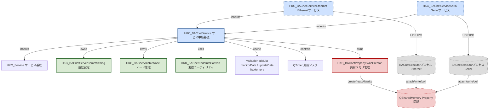
```mermaid
graph TD
    Base[HKC_Service サービス基底]
    SvcBase[HKC_BACnetService サービス中核基底]
    SvcEth[HKC_BACnetServiceEthernet Ethernetサービス]
    SvcSer[HKC_BACnetServiceSerial Serialサービス]
    Comm[HKC_BACnetServerCommSetting 通信設定]
    Node[HKC_BACnetVaiableNode ノード管理]
    ConvCls[HKD_BACnetNodeInfoConvert 変換ユーティリティ]
    Cache[variableNodeList<br/>monitorData / updateData<br/>listMemory]
    Timer[QTimer 周期タスク]
    Creator[HKC_BACnetPropertySyncCreator 共有メモリ管理]
    SharedMem[(QSharedMemory Property同期)]
    ExecEth[(BACnetExecutorプロセス Ethernet)]
    ExecSer[(BACnetExecutorプロセス Serial)]

    SvcBase -->|inherits| Base
    SvcEth -->|inherits| SvcBase
    SvcSer -->|inherits| SvcBase
    SvcBase -->|owns| Comm
    SvcBase -->|owns| Node
    SvcBase -->|uses| ConvCls
    SvcBase -->|cache| Cache
    SvcBase -->|controls| Timer
    SvcBase -->|owns| Creator
    Creator -->|create/readAll/write| SharedMem
    SvcEth -->|UDP IPC| ExecEth
    SvcSer -->|UDP IPC| ExecSer
    ExecEth -->|attach/write/poll| SharedMem
    ExecSer -->|attach/write/poll| SharedMem

    style SvcBase fill:#cfe2ff,stroke:#1a4d8c,stroke-width:2px
    style SvcEth fill:#cfe2ff,stroke:#1a4d8c,stroke-width:1px,stroke-dasharray:4 3
    style SvcSer fill:#cfe2ff,stroke:#1a4d8c,stroke-width:1px,stroke-dasharray:4 3
    style Comm fill:#d9ead3,stroke:#2f6b2f,stroke-width:2px
    style Node fill:#d9ead3,stroke:#2f6b2f,stroke-width:2px
    style ConvCls fill:#d9ead3,stroke:#2f6b2f,stroke-width:2px
    style Creator fill:#f4cccc,stroke:#a00,stroke-width:2px
    style SharedMem fill:#f4cccc,stroke:#a00,stroke-dasharray:4 3
    style ExecEth fill:#dddddd,stroke:#666,stroke-dasharray:4 3
    style ExecSer fill:#dddddd,stroke:#666,stroke-dasharray:4 3
```

### データフロー図

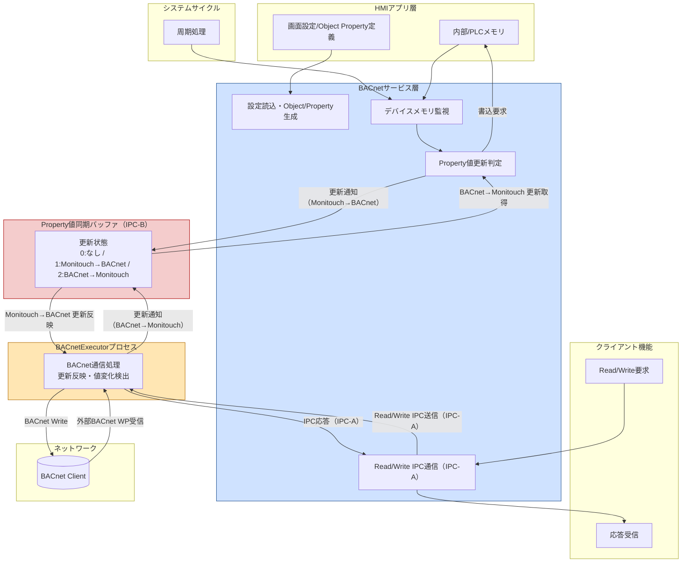
```mermaid
graph TD
    subgraph App[HMIアプリ層]
      UI[画面設定/Object Property定義]
      Mem[内部/PLCメモリ]
    end
    subgraph ClientFunc[クライアント機能]
      IFReq[Read/Write要求]
      IFResp[応答受信]
    end
    subgraph Cycle[システムサイクル]
      CycleIF[周期処理]
    end
    subgraph SvcLayer[BACnetサービス層]
      Init[設定読込・Object/Property生成]
      Mon[デバイスメモリ監視]
      Upd[Property値更新判定]
      SvcReq["Read/Write IPC通信（IPC-A）"]
    end
    subgraph IPC["Property値同期バッファ（IPC-B）"]
      SM["更新状態\n0:なし / 1:Monitouch→BACnet / 2:BACnet→Monitouch"]
    end
    subgraph Exec[BACnetExecutorプロセス]
      ExecTask[BACnet通信処理<br/>更新反映・値変化検出]
    end
    subgraph Net[ネットワーク]
      Client[(BACnet Client)]
    end

    UI --> Init
    CycleIF --> Mon --> Upd
    Mem --> Mon
    Upd -->|"更新通知（Monitouch→BACnet）"| SM
    SM -->|"Monitouch→BACnet 更新反映"| ExecTask
    ExecTask -->|"BACnet Write"| Client
    Client -->|"外部BACnet WP受信"| ExecTask
    ExecTask -->|"更新通知（BACnet→Monitouch）"| SM
    SM -->|"BACnet→Monitouch 更新取得"| Upd
    Upd -->|"書込要求"| Mem
    IFReq --> SvcReq -->|"Read/Write IPC送信（IPC-A）"| ExecTask
    ExecTask -->|"IPC応答（IPC-A）"| SvcReq --> IFResp

    style SvcLayer fill:#cfe2ff,stroke:#1a4d8c
    style IPC fill:#f4cccc,stroke:#a00
    style Exec fill:#ffe6b3,stroke:#b06a00
```

### シーケンス図（サーバ起動）

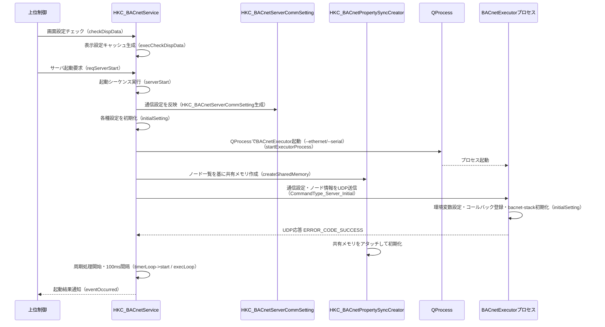
```mermaid
sequenceDiagram
  participant Caller as 上位制御
  participant Svc as HKC_BACnetService
  participant Setting as HKC_BACnetServerCommSetting
  participant Creator as HKC_BACnetPropertySyncCreator
  participant Proc as QProcess
  participant Exec as BACnetExecutorプロセス

  Caller->>Svc: 画面設定チェック（checkDispData）
  Svc->>Svc: 表示設定キャッシュ生成（execCheckDispData）

  Caller->>Svc: サーバ起動要求（reqServerStart）
  Svc->>Svc: 起動シーケンス実行（serverStart）
  Svc->>Setting: 通信設定を反映（HKC_BACnetServerCommSetting生成）
  Svc->>Svc: 各種設定を初期化（initialSetting）

  Svc->>Proc: QProcessでBACnetExecutor起動（--ethernet/--serial）<br/>（startExecutorProcess）
  Proc-->>Exec: プロセス起動

  Svc->>Creator: ノード一覧を基に共有メモリ作成（createSharedMemory）
  Svc->>Exec: 通信設定・ノード情報をUDP送信<br/>（CommandType_Server_Initial）
  Exec->>Exec: 環境変数設定・コールバック登録・bacnet-stack初期化（initialSetting）
  Exec-->>Svc: UDP応答 ERROR_CODE_SUCCESS

  Creator->>Creator: 共有メモリをアタッチして初期化
  Svc->>Svc: 周期処理開始・100ms間隔（timerLoop->start / execLoop）
  Svc-->>Caller: 起動結果通知（eventOccurred）
```

### シーケンス図（周期更新）

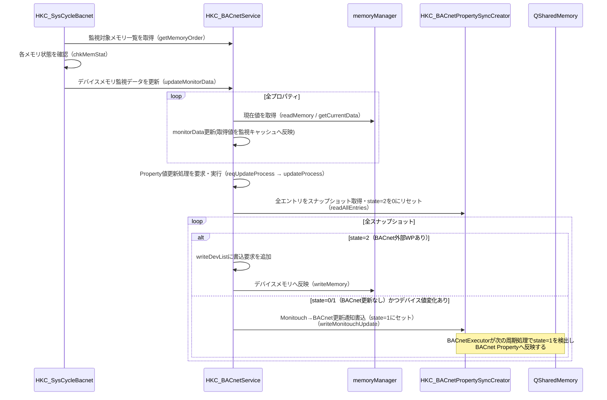
```mermaid
sequenceDiagram
  participant Cycle as HKC_SysCycleBacnet
  participant Svc as HKC_BACnetService
  participant MM as memoryManager
  participant Creator as HKC_BACnetPropertySyncCreator
  participant SharedMem as QSharedMemory

  Cycle->>Svc: 監視対象メモリ一覧を取得（getMemoryOrder）
  Cycle->>Cycle: 各メモリ状態を確認（chkMemStat）
  Cycle->>Svc: デバイスメモリ監視データを更新（updateMonitorData）

  loop 全プロパティ
    Svc->>MM: 現在値を取得（readMemory / getCurrentData）
    Svc->>Svc: monitorData更新(取得値を監視キャッシュへ反映)
  end

  Svc->>Svc: Property値更新処理を要求・実行（reqUpdateProcess → updateProcess）
  Svc->>Creator: 全エントリをスナップショット取得・state=2を0にリセット<br/>（readAllEntries）

  loop 全スナップショット
    alt state=2（BACnet外部WPあり）
      Svc->>Svc: writeDevListに書込要求を追加
      Svc->>MM: デバイスメモリへ反映（writeMemory）
    else state=0/1（BACnet更新なし）かつデバイス値変化あり
      Svc->>Creator: Monitouch→BACnet更新通知書込（state=1にセット）<br/>（writeMonitouchUpdate）
      Note over Creator,SharedMem: BACnetExecutorが次の周期処理でstate=1を検出し<br/>BACnet Propertyへ反映する
    end
  end
```

### シーケンス図（外部クライアントによるサーバデータ更新）

外部BACnetクライアントからのWriteProperty受信から共有メモリへの書き込み（state=2）はBACnetExecutorプロセス側で行われます。  
Monitouch側（`updateProcess`）はQSharedMemoryのstate=2エントリを検出してデバイスメモリへ反映します。  
BACnetExecutor側の詳細シーケンスは → [BACnetExecutorプロセス：外部BACnet WP受信・Property同期](#シーケンス図外部bacnet-wp受信property同期) を参照してください。

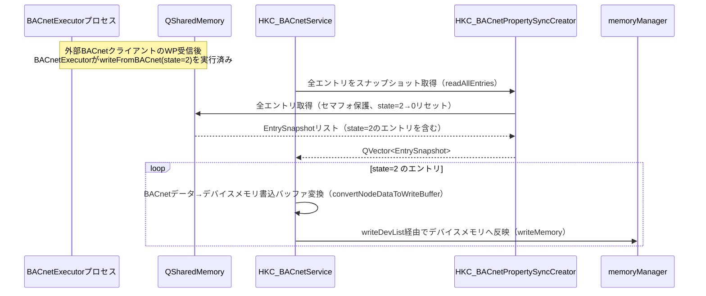
```mermaid
sequenceDiagram
  participant Exec as BACnetExecutorプロセス
  participant SharedMem as QSharedMemory
  participant Svc as HKC_BACnetService
  participant Creator as HKC_BACnetPropertySyncCreator
  participant MM as memoryManager

  Note over Exec,SharedMem: 外部BACnetクライアントのWP受信後<br/>BACnetExecutorがwriteFromBACnet(state=2)を実行済み

  Svc->>Creator: 全エントリをスナップショット取得（readAllEntries）
  Creator->>SharedMem: 全エントリ取得（セマフォ保護、state=2→0リセット）
  SharedMem-->>Creator: EntrySnapshotリスト（state=2のエントリを含む）
  Creator-->>Svc: QVector<EntrySnapshot>

  loop state=2 のエントリ
    Svc->>Svc: BACnetデータ→デバイスメモリ書込バッファ変換（convertNodeDataToWriteBuffer）
    Svc->>MM: writeDevList経由でデバイスメモリへ反映（writeMemory）
  end
```


# Property同期メカニズム（QSharedMemory）

## 概要

BACnetサーバ機能では、MonitouchプロセスとBACnetExecutorプロセスの間でBACnet Object/Property値とデバイスメモリ値の双方向同期に、**QSharedMemory + QSystemSemaphore** を使用しています。  
このメカニズムはUDP IPCとは独立した仕組みで、Property値の高頻度な読み書きに特化して設計されています。

| 特性 | 詳細 |
|---|---|
| 使用API | QSharedMemory（OSレベルのIPCメモリ共有）+ QSystemSemaphore（バイナリセマフォ） |
| 用途 | BACnet Object/Property値とMonitouchデバイスメモリの双方向同期専用。サーバ起動/停止などの制御はUDP IPCを使用する。 |
| 同期方向 | 双方向：Monitouch→BACnet（updateState=1）、BACnet→Monitouch（updateState=2） |
| 優先度 | updateState=2（BACnet側）はupdateState=1（Monitouch側）より最高優先で上書きする |
| 排他制御 | QSystemSemaphore（バイナリセマフォ）でデータ書き込みをアトミックに保護。セマフォキーは`getPropertySemaphoreKey(isEthernet)`で取得する。 |
| 所有関係 | MonitouchプロセスのHKC_BACnetPropertySyncCreatorがCreate、BACnetExecutorプロセスのBACnetPropertySyncManagerがAttach/Open |
| Ethernet/Serial分離 | Ethernet用とSerial用に別キーを使用（`getPropertySharedMemoryKey(true/false)`） |

## 関連クラスとファイル

| クラス/ファイル | プロセス | 役割 | ファイル |
|---|---|---|---|
| HKC_BACnetPropertySyncLayout.h | 両側共通 | 共有メモリのPOD型レイアウト定義（`HKC_BACnetPropertySyncSharedMemHeader`、`HKC_BACnetPropertySyncEntryHeader`、`HKC_BACnetPropertySyncUpdateState`）。両プロセスが同一ファイルをincludeすることでレイアウトの一致を保証する。 | V10/src/sys/service/BACnet/HKC_BACnetPropertySyncLayout.h |
| HKC_BACnetPropertySyncCreator | Monitouch | 共有メモリのCreate側。サーバ起動時に共有メモリ作成・初期化（`createSharedMemory()`）で共有メモリとセマフォを作成・初期化する。Property値更新判定（`updateProcess()`）から同期スナップショット取得（`readAllEntries()`）（全エントリ取得・state=2リセット）とMonitouch更新通知書込（`writeMonitouchUpdate()`）（state=1設定）を呼び出す。BACnetExecutor再起動時は再初期化（`reinitialize()`）でセマフォと全エントリをリセットする。 | V10/src/sys/service/BACnet/HKC_BACnetPropertySyncCreator.h/.cpp |
| BACnetPropertySyncManager | BACnetExecutor | 共有メモリのAttach側。共有メモリアタッチ・初期化（`initialize()`）でアタッチ後マジックナンバーとエントリ数を検証してインデックスキャッシュを構築する。周期処理でMonitouch→BACnet更新反映（`applyPendingMonitouchUpdates()`）（state=1→BACnet Property反映）とBACnet内部値変化検出（`pollAndSyncBACnetValues()`）（BACnet内部値変化→state=2設定）を実行する。外部WP受信時はBACnet値書込（`writeFromBACnet()`）で直接state=2を設定する。 | BACnetExecutor/src/BACnetPropertySyncManager.h/.cpp |

## 共有メモリレイアウト

共有メモリは以下の3領域が先頭から連続して配置されます。

**全体サイズ = 16B（SharedMemHeader固定） + 16B×N（EntryHeader配列、N=エントリ数） + `dataRegionSize` B（DataRegion、全エントリのプロパティ値バイト数の総和）**

| 領域 | サイズ | フィールド |
|---|---|---|
| SharedMemHeader | 16B固定 | `magic`(4B): 識別マジック `0xBAC34E70`（正常アタッチ確認用）<br>`entryCount`(4B): エントリ数 N（BACnetノード総数）<br>`indexTableSize`(4B): EntryHeader配列の合計バイト数（= 16B × N）<br>`dataRegionSize`(4B): DataRegion全体のバイト数（= 全エントリの`byteNum`の総和） |
| EntryHeader[0..N-1] | 16B × N | `nodeKey`(8B): ノードキー（property<<32 \| objectType<<22 \| objectInstance）<br>`dataOffset`(4B): DataRegion先頭からのバイトオフセット（このエントリのデータ開始位置）<br>`byteNum`(2B): このエントリのProperty値バイト数（Monitouchメモリ換算）<br>`updateState`(1B): 0/1/2<br>`reserved`(1B): 0固定 |
| DataRegion | `dataRegionSize` B<br>（全エントリの`byteNum`の総和） | 各エントリのProperty値バイト列を連続格納。各エントリは`dataOffset`を起点に`byteNum`バイト分を占有する。例: Entry 0がbyteNum=4なら先頭4B、Entry 1がbyteNum=2なら続く2B、… |

ノードキー算出式: $\text{nodeKey} = (\text{propertyId} \ll 32)\ |\ (\text{objectType} \ll 22)\ |\ \text{objectInstance}$

## 更新状態（updateState）

エントリヘッダの`updateState`フィールド（1バイト）が同期方向と処理状態を表します。

| 値 | 定数名 | 意味 | 設定する側と関数 | リセット（0に戻す）側と関数 |
|---|---|---|---|---|
| 0 | None | 更新なし（初期状態・処理済み） | 各側が処理後にクリア | - |
| 1 | Monitouch | MonitouchデバイスメモリをBACnet Propertyへ反映待ち | Monitouch更新通知書込（`HKC_BACnetPropertySyncCreator::writeMonitouchUpdate()`） | Monitouch→BACnet更新反映（`BACnetPropertySyncManager::applyPendingMonitouchUpdates()`）が反映後に0へ |
| 2 | BACnet | BACnet Property値をMonitouchデバイスメモリへ反映待ち（最高優先度） | BACnet値書込（`BACnetPropertySyncManager::writeFromBACnet()`）<br>BACnet内部値変化検出（`BACnetPropertySyncManager::pollAndSyncBACnetValues()`） | 同期スナップショット取得（`HKC_BACnetPropertySyncCreator::readAllEntries()`）が取得後に0へ |

> state=2はstate=1より優先され、`writeFromBACnet()`はstate=1ペンディング中でも常にstate=2へ上書きします。  
> state=1ペンディング中に再度デバイス値が変化した場合は後優先で最新値に上書きされます（二重処理防止のため反映前にstate=0へリセット）。

## 構造図

### 共有メモリ構造図

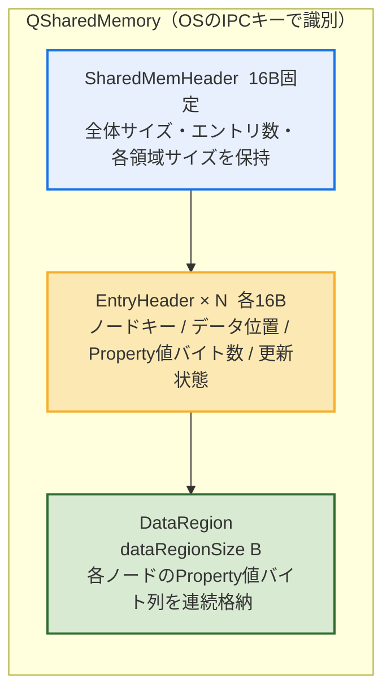
```mermaid
graph TD
    subgraph SHM["QSharedMemory（OSのIPCキーで識別）"]
        direction TB
        H["SharedMemHeader  16B固定<br/>全体サイズ・エントリ数・各領域サイズを保持"]
        ET["EntryHeader × N  各16B<br/>ノードキー / データ位置 / Property値バイト数 / 更新状態"]
        DR["DataRegion  dataRegionSize B<br/>各ノードのProperty値バイト列を連続格納"]
    end
    H --> ET --> DR

    style H fill:#e8f0fe,stroke:#1a73e8,stroke-width:2px
    style ET fill:#fce8b2,stroke:#f6ae2d,stroke-width:2px
    style DR fill:#d9ead3,stroke:#2f6b2f,stroke-width:2px
```

### updateState 状態遷移図

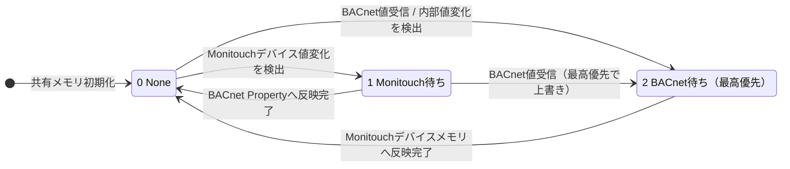
```mermaid
stateDiagram-v2
    direction LR
    s0: 0  None
    s1: 1  Monitouch待ち
    s2: 2  BACnet待ち（最高優先）

    [*] --> s0 : 共有メモリ初期化

    s0 --> s1 : Monitouchデバイス値変化を検出
    s1 --> s0 : BACnet Propertyへ反映完了

    s0 --> s2 : BACnet値受信 / 内部値変化を検出
    s1 --> s2 : BACnet値受信（最高優先で上書き）
    s2 --> s0 : Monitouchデバイスメモリへ反映完了
```

### データフロー図

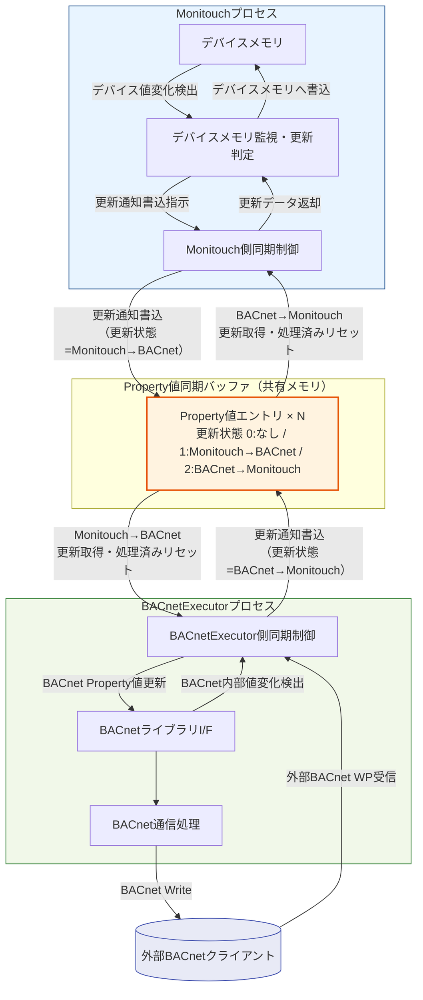
```mermaid
graph TD
    subgraph MT[Monitouchプロセス]
        DM[デバイスメモリ]
        SVC[デバイスメモリ監視・更新判定]
        CRT[Monitouch側同期制御]
    end

    subgraph SM["Property値同期バッファ（共有メモリ）"]
        ENTRY["Property値エントリ × N<br/>更新状態 0:なし / 1:Monitouch→BACnet / 2:BACnet→Monitouch"]
    end

    subgraph BE[BACnetExecutorプロセス]
        MGR[BACnetExecutor側同期制御]
        WRAP[BACnetライブラリI/F]
        STK[BACnet通信処理]
    end

    ExtClient[(外部BACnetクライアント)]

    DM -->|"デバイス値変化検出"| SVC
    SVC -->|"更新通知書込指示"| CRT
    CRT -->|"更新通知書込\n（更新状態=Monitouch→BACnet）"| ENTRY
    ENTRY -->|"Monitouch→BACnet\n更新取得・処理済みリセット"| MGR
    MGR -->|"BACnet Property値更新"| WRAP
    WRAP --> STK
    STK -->|"BACnet Write"| ExtClient

    ExtClient -->|"外部BACnet WP受信"| MGR
    WRAP -->|"BACnet内部値変化検出"| MGR
    MGR -->|"更新通知書込\n（更新状態=BACnet→Monitouch）"| ENTRY
    ENTRY -->|"BACnet→Monitouch\n更新取得・処理済みリセット"| CRT
    CRT -->|"更新データ返却"| SVC
    SVC -->|"デバイスメモリへ書込"| DM

    style ENTRY fill:#fff3e0,stroke:#e65100,stroke-width:2px
    style MT fill:#e8f4ff,stroke:#1a4d8c
    style BE fill:#f1f8e9,stroke:#2e7d32
    style ExtClient fill:#e8eaf6,stroke:#3949ab
```

### シーケンス図（デバイスメモリ変化→BACnet Property反映）

Monitouchのデバイスメモリ値が変化した際に、BACnetExecutorがBACnet Propertyへ反映するまでの流れです。

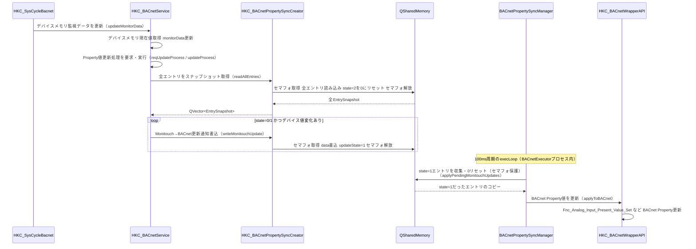
```mermaid
sequenceDiagram
    participant Cycle as HKC_SysCycleBacnet
    participant Svc as HKC_BACnetService
    participant Creator as HKC_BACnetPropertySyncCreator
    participant SM as QSharedMemory
    participant SyncMgr as BACnetPropertySyncManager
    participant Wrapper as HKC_BACnetWrapperAPI

    Cycle->>Svc: デバイスメモリ監視データを更新（updateMonitorData）
    Svc->>Svc: デバイスメモリ現在値取得 monitorData更新
    Svc->>Svc: Property値更新処理を要求・実行（reqUpdateProcess / updateProcess）
    Svc->>Creator: 全エントリをスナップショット取得（readAllEntries）
    Creator->>SM: セマフォ取得 全エントリ読み込み state=2を0にリセット セマフォ解放
    SM-->>Creator: 全EntrySnapshot
    Creator-->>Svc: QVector<EntrySnapshot>

    loop state=0/1 かつデバイス値変化あり
        Svc->>Creator: Monitouch→BACnet更新通知書込（writeMonitouchUpdate）
        Creator->>SM: セマフォ取得 data書込 updateState=1 セマフォ解放
    end

    Note over SyncMgr: 100ms周期のexecLoop（BACnetExecutorプロセス内）
    SyncMgr->>SM: state=1エントリを収集・0リセット（セマフォ保護）<br/>（applyPendingMonitouchUpdates）
    SM-->>SyncMgr: state=1だったエントリのコピー
    SyncMgr->>Wrapper: BACnet Property値を更新（applyToBACnet）
    Wrapper->>Wrapper: Fnc_Analog_Input_Present_Value_Set など BACnet Property更新
```

### シーケンス図（外部WP受信・内部値変化→デバイスメモリ反映）

外部BACnetクライアントのWriteProperty受信またはbacnet-stack内部値変化が発生した際に、Monitouchのデバイスメモリへ反映するまでの流れです。

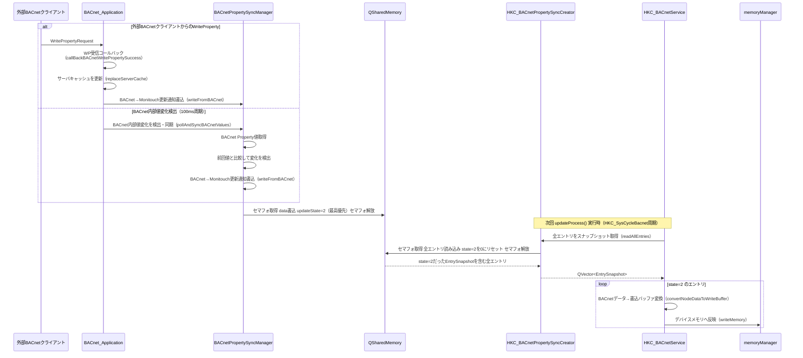
```mermaid
sequenceDiagram
    participant Client as 外部BACnetクライアント
    participant App as BACnet_Application
    participant SyncMgr as BACnetPropertySyncManager
    participant SM as QSharedMemory
    participant Creator as HKC_BACnetPropertySyncCreator
    participant Svc as HKC_BACnetService
    participant MM as memoryManager

    alt 外部BACnetクライアントからのWriteProperty
        Client->>App: WritePropertyRequest
        App->>App: WP受信コールバック<br/>（callBackBACnetWritePropertySuccess）
        App->>App: サーバキャッシュを更新（replaceServerCache）
        App->>SyncMgr: BACnet→Monitouch更新通知書込（writeFromBACnet）
    else BACnet内部値変化検出（100ms周期）
        App->>SyncMgr: BACnet内部値変化を検出・同期（pollAndSyncBACnetValues）
        SyncMgr->>SyncMgr: BACnet Property値取得
        SyncMgr->>SyncMgr: 前回値と比較して変化を検出
        SyncMgr->>SyncMgr: BACnet→Monitouch更新通知書込（writeFromBACnet）
    end

    SyncMgr->>SM: セマフォ取得 data書込 updateState=2（最高優先）セマフォ解放

    Note over Creator,Svc: 次回 updateProcess() 実行時（HKC_SysCycleBacnet周期）
    Svc->>Creator: 全エントリをスナップショット取得（readAllEntries）
    Creator->>SM: セマフォ取得 全エントリ読み込み state=2を0にリセット セマフォ解放
    SM-->>Creator: state=2だったEntrySnapshotを含む全エントリ
    Creator-->>Svc: QVector<EntrySnapshot>

    loop state=2 のエントリ
        Svc->>Svc: BACnetデータ→書込バッファ変換（convertNodeDataToWriteBuffer）
        Svc->>MM: デバイスメモリへ反映（writeMemory）
    end
```


# BACnetExecutorプロセス

## 機能概要

BACnetExecutorプロセスは、bacnet-stackライブラリの実行を専任する独立プロセスです。  
Monitouchメインプロセス（HKC_BACnetService）からの要求をUDP（localhost）で受信し、
RP/WP等のBACnetコマンドを実行して結果を返却します。
外部BACnetクライアントからのWrite要求はコールバック経由で検出し、QSharedMemoryを通じてMonitouchへ通知します。
また周期処理ループ（`execLoop`）でMonitouchからの値更新要求（state=1）をBACnet Propertyへ反映し、
bacnet-stackの内部値変化を検出（`pollAndSyncBACnetValues`）してMonitouchへ通知（state=2）します。

コマンドライン引数 `--ethernet` / `--serial` により、Ethernet（BACnet/IP）とSerial（MS/TP）のいずれかのモードで動作します。
引数省略時はEthernetモードとなります。EthernetモードとSerialモードは別インスタンスとして起動されます。

| 項目 | 内容 |
|---|---|
| プロセス起動方式 | HKC_BACnetServiceがQProcessで起動。起動時に`--ethernet`または`--serial`引数を渡す |
| プロセス停止方式 | IPC経由でプロセス停止コマンド（`CommandType_App_Stop`）を送信し自然終了を待つ。タイムアウト時はkill |
| 孤立プロセス対策 | Monitouchが正常な停止IPCを送れずにクラッシュした際、BACnetExecutorプロセスが取り残されるケースへの対処。3段階で実現する。<br>① **起動時**（BACnetExecutor）: 自プロセスIDをPIDファイル（`%TEMP%/BACnetExecutor_ethernet.pid` または `_serial.pid`）へ書き込む<br>② **正常終了時**（BACnetExecutor）: 終了前にPIDファイルを削除する。クラッシュ時はPIDファイルが残ったままになる<br>③ **次回起動時**（Monitouchサービス）: BACnetExecutor起動前にPIDファイルの有無を確認する。存在すれば前回プロセスが孤立していると判断し、記録されたPIDをOSコマンドで強制終了（Windows: `taskkill /F /PID`、Linux: `kill -9`）してからPIDファイルを削除する |
| Monitouchとの通信 | localhost UDP（Ethernetポート/Serialポート別）でIPCデータグラムを送受信 |
| データシリアライズ | QDataStream（Qt_4_7）でHKC_BACnetExecutorIpcInterfaceをシリアライズ |
| Property値同期 | QSharedMemory + QSystemSemaphoreによるプロセス間双方向同期 |
| 使用ライブラリ | bacnet-stack（DLL: `libbacnet-stack.dll`）、HKC_BACnetWrapperAPIでラップ |
| 周期処理間隔 | 100ms（ワンショットタイマーによる再帰的スケジューリング） |

## クラス構成

| 分類 | クラス/構造体 | 役割 | ファイル |
|---|---|---|---|
| 主体（アプリケーション） | BACnet_Application | QCoreApplicationを継承するBACnetExecutorプロセスの中核クラス。UDPソケット受信→コマンド実行→応答送信のメインループを管理。bacnet-stackライブラリのロード、コールバック登録、周期処理ループ（`execLoop`）を担う。ブロッキング（即時応答）とノンブロッキング（コールバック応答）の2種類の実行モードを持つ。 | BACnetExecutor/src/BACnet_Application.h<br>BACnetExecutor/src/BACnet_Application.cpp |
| 制御（Property同期・Executor側） | BACnetPropertySyncManager | QSharedMemoryへのアタッチと共有メモリアタッチ・初期化（`initialize`）、外部BACnet WP受信時のBACnet値書込（`writeFromBACnet`、state=2）、Monitouch→BACnet更新反映（`applyPendingMonitouchUpdates`、state=1→BACnet）、BACnet内部値変化検出（`pollAndSyncBACnetValues`、state=2）を担う。対応するMonitouche側クラスはHKC_BACnetPropertySyncCreator。 | BACnetExecutor/src/BACnetPropertySyncManager.h<br>BACnetExecutor/src/BACnetPropertySyncManager.cpp |
| 補助（変換ユーティリティ） | BACnet_NodeInfoConvert 名前空間 | BACNET_APPLICATION_DATA_VALUE型とQVector<quint8>の相互変換、ノードキー生成を行う関数群。WP事前準備（`preExecute`）およびRP/WP応答コールバック処理（`chkReadWritePropertyReply`）でデコードに使用する。BACnetExecutor側専用（Monitouchと共有のHKC_BACnetNodeInfoConvert名前空間とは別実装）。 | BACnetExecutor/src/BACnet_NodeInfoConvert.h<br>BACnetExecutor/src/BACnet_NodeInfoConvert.cpp |
| 共有（ライブラリラッパ） | HKC_BACnetWrapperAPI | Monitouchプロセスと共有するbacnet-stackラッパクラス。BACnetExecutorはMonitouchと同じヘッダ・実装を参照する。bacnet-stack関数ポインタの解決とAPI呼び出しをラップ。 | V10/src/sys/service/BACnet/HKC_BACnetWrapperAPI.h<br>V10/src/sys/service/BACnet/HKC_BACnetWrapperAPI.cpp |
| 共有（コマンド実行基底） | HKC_BACnetCommandExecutor<br>各派生クラス | Monitouchプロセスと共有するコマンド実行クラス群。IPC要求のシリアライズ/デシリアライズ、BACnet処理実行（`execute()`）を担う。CommandType別に派生クラスが存在する（ServerInitial / ServerLinkClear / ServerDeleteObject / ClientReadProperty / ClientReadMultiProperty / ClientWriteProperty / AppStop）。 | V10/src/sys/service/BACnet/HKC_BACnetCommandExecutor.h<br>V10/src/sys/service/BACnet/HKC_BACnetCommandExecutor.cpp |
| 共有（IPC通信定義） | HKC_BACnetExecutorIpcInterface | Monitouchプロセスと共有するIPC通信データ構造。CommandType列挙体、communicationKey、paramバイト列を保持する。QDataStreamによるシリアライズに対応。UDPポート番号・PIDファイルパス・セマフォキー・共有メモリキーの取得メソッドも提供する。 | Grobal/include/System.h |
| 共有（共有メモリレイアウト） | HKC_BACnetPropertySyncSharedMemHeader<br>HKC_BACnetPropertySyncEntryHeader<br>HKC_BACnetPropertySyncUpdateState | Monitouchプロセスと共有するQSharedMemoryのPODレイアウト定義。ヘッダ（マジック・エントリ数・領域サイズ）とエントリヘッダ（nodeKey・dataOffset・byteNum・updateState）で構成される。 | V10/src/sys/service/BACnet/HKC_BACnetPropertySyncLayout.h |

## 構造図（Mermaid）

### クラス構成図

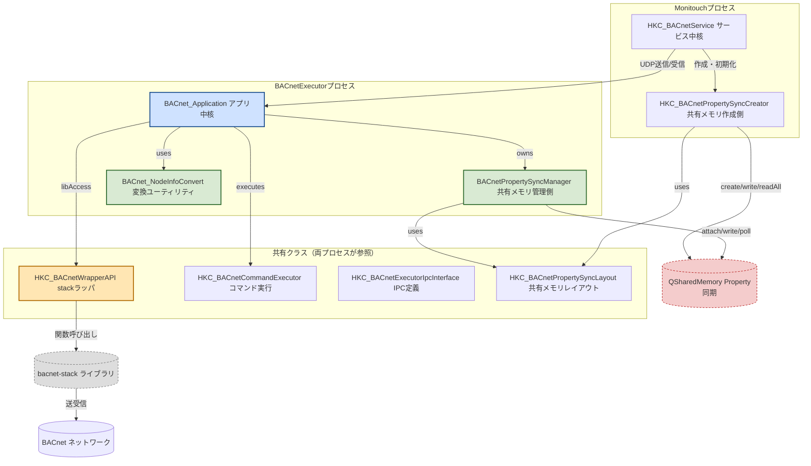
```mermaid
graph TD
    subgraph Monitouch[Monitouchプロセス]
        Svc[HKC_BACnetService サービス中核]
        Creator[HKC_BACnetPropertySyncCreator 共有メモリ作成側]
    end
    subgraph BACnetExec[BACnetExecutorプロセス]
        App[BACnet_Application アプリ中核]
        SyncMgr[BACnetPropertySyncManager 共有メモリ管理側]
        NodeConv[BACnet_NodeInfoConvert 変換ユーティリティ]
    end
    subgraph Shared[共有クラス（両プロセスが参照）]
        Wrapper[HKC_BACnetWrapperAPI stackラッパ]
        CmdExec[HKC_BACnetCommandExecutor コマンド実行]
        IpcIF[HKC_BACnetExecutorIpcInterface IPC定義]
        SyncLayout[HKC_BACnetPropertySyncLayout 共有メモリレイアウト]
    end
    StackLib[(bacnet-stack ライブラリ)]
    SharedMem[(QSharedMemory Property同期)]
    Net[(BACnet ネットワーク)]

    Svc -->|UDP送信/受信| App
    Svc -->|作成・初期化| Creator
    App -->|libAccess| Wrapper
    App -->|executes| CmdExec
    App -->|owns| SyncMgr
    App -->|uses| NodeConv
    Creator -->|create/write/readAll| SharedMem
    SyncMgr -->|attach/write/poll| SharedMem
    Wrapper -->|関数呼び出し| StackLib
    StackLib -->|送受信| Net
    SyncMgr -->|uses| SyncLayout
    Creator -->|uses| SyncLayout

    style App fill:#cfe2ff,stroke:#1a4d8c,stroke-width:2px
    style SyncMgr fill:#d9ead3,stroke:#2f6b2f,stroke-width:2px
    style NodeConv fill:#d9ead3,stroke:#2f6b2f,stroke-width:2px
    style Wrapper fill:#ffe6b3,stroke:#b06a00,stroke-width:2px
    style StackLib fill:#dddddd,stroke:#666,stroke-dasharray:4 3
    style SharedMem fill:#f4cccc,stroke:#a00,stroke-dasharray:4 3
```

### シーケンス図（プロセス起動）

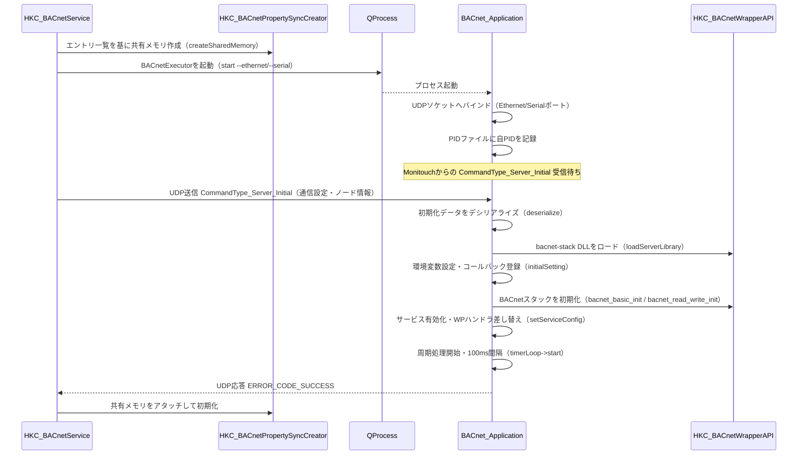
```mermaid
sequenceDiagram
  participant Svc as HKC_BACnetService
  participant Creator as HKC_BACnetPropertySyncCreator
  participant Proc as QProcess
  participant App as BACnet_Application
  participant Wrap as HKC_BACnetWrapperAPI

  Svc->>Creator: エントリ一覧を基に共有メモリ作成（createSharedMemory）
  Svc->>Proc: BACnetExecutorを起動（start --ethernet/--serial）
  Proc-->>App: プロセス起動

  App->>App: UDPソケットへバインド（Ethernet/Serialポート）
  App->>App: PIDファイルに自PIDを記録

  Note over App: Monitouchからの CommandType_Server_Initial 受信待ち

  Svc->>App: UDP送信 CommandType_Server_Initial（通信設定・ノード情報）
  App->>App: 初期化データをデシリアライズ（deserialize）
  App->>Wrap: bacnet-stack DLLをロード（loadServerLibrary）
  App->>App: 環境変数設定・コールバック登録（initialSetting）
  App->>Wrap: BACnetスタックを初期化（bacnet_basic_init / bacnet_read_write_init）
  App->>App: サービス有効化・WPハンドラ差し替え（setServiceConfig）
  App->>App: 周期処理開始・100ms間隔（timerLoop->start）
  App-->>Svc: UDP応答 ERROR_CODE_SUCCESS

  Svc->>Creator: 共有メモリをアタッチして初期化
```

### シーケンス図（RP/WP要求処理）

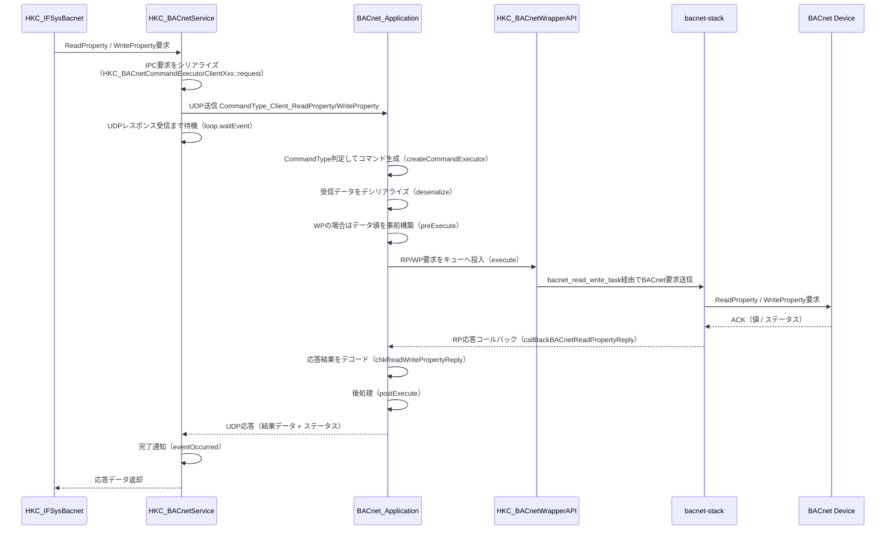
```mermaid
sequenceDiagram
  participant IFBacnet as HKC_IFSysBacnet
  participant Svc as HKC_BACnetService
  participant App as BACnet_Application
  participant Wrap as HKC_BACnetWrapperAPI
  participant STK as bacnet-stack
  participant DEV as BACnet Device

  IFBacnet->>Svc: ReadProperty / WriteProperty要求
  Svc->>Svc: IPC要求をシリアライズ<br/>（HKC_BACnetCommandExecutorClientXxx::request）
  Svc->>App: UDP送信 CommandType_Client_ReadProperty/WriteProperty
  Svc->>Svc: UDPレスポンス受信まで待機（loop.waitEvent）

  App->>App: CommandType判定してコマンド生成（createCommandExecutor）
  App->>App: 受信データをデシリアライズ（deserialize）
  App->>App: WPの場合はデータ値を事前構築（preExecute）
  App->>Wrap: RP/WP要求をキューへ投入（execute）
  Wrap->>STK: bacnet_read_write_task経由でBACnet要求送信
  STK->>DEV: ReadProperty / WriteProperty要求
  DEV-->>STK: ACK（値 / ステータス）
  STK-->>App: RP応答コールバック（callBackBACnetReadPropertyReply）
  App->>App: 応答結果をデコード（chkReadWritePropertyReply）
  App->>App: 後処理（postExecute）
  App-->>Svc: UDP応答（結果データ + ステータス）

  Svc->>Svc: 完了通知（eventOccurred）
  Svc-->>IFBacnet: 応答データ返却
```

### シーケンス図（外部BACnet WP受信・Property同期）

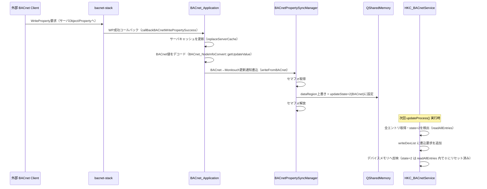
```mermaid
sequenceDiagram
  participant ExtClient as 外部 BACnet Client
  participant STK as bacnet-stack
  participant App as BACnet_Application
  participant SyncMgr as BACnetPropertySyncManager
  participant SharedMem as QSharedMemory
  participant Svc as HKC_BACnetService

  ExtClient->>STK: WriteProperty要求（サーバObject/Propertyへ）
  STK->>App: WP成功コールバック（callBackBACnetWritePropertySuccess）
  App->>App: サーバキャッシュを更新（replaceServerCache）
  App->>App: BACnet値をデコード（BACnet_NodeInfoConvert::getUpdateValue）
  App->>SyncMgr: BACnet→Monitouch更新通知書込（writeFromBACnet）
  SyncMgr->>SyncMgr: セマフォ取得
  SyncMgr->>SharedMem: dataRegion上書き + updateState=2(BACnet)に設定
  SyncMgr->>SyncMgr: セマフォ解放

  Note over Svc: 次回 updateProcess() 実行時
  Svc->>Svc: 全エントリ取得・state=2を検出（readAllEntries）
  Svc->>Svc: writeDevList に書込要求を追加
  Svc->>Svc: デバイスメモリへ反映（state=2 は readAllEntries 内で 0 にリセット済み）
```

### シーケンス図（周期処理）

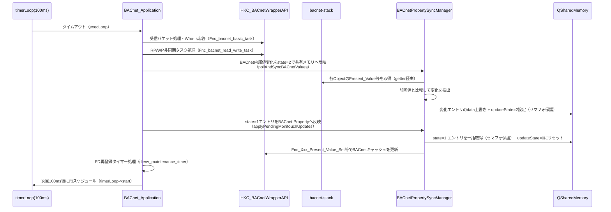
```mermaid
sequenceDiagram
  participant Timer as timerLoop(100ms)
  participant App as BACnet_Application
  participant Wrap as HKC_BACnetWrapperAPI
  participant STK as bacnet-stack
  participant SyncMgr as BACnetPropertySyncManager
  participant SharedMem as QSharedMemory

  Timer->>App: タイムアウト（execLoop）

  App->>Wrap: 受信パケット処理・Who-Is応答（Fnc_bacnet_basic_task）
  App->>Wrap: RP/WP非同期タスク処理（Fnc_bacnet_read_write_task）

  App->>SyncMgr: BACnet内部値変化をstate=2で共有メモリへ反映<br/>（pollAndSyncBACnetValues）
  SyncMgr->>STK: 各ObjectのPresent_Value等を取得（getter経由）
  SyncMgr->>SyncMgr: 前回値と比較して変化を検出
  SyncMgr->>SharedMem: 変化エントリのdata上書き + updateState=2設定（セマフォ保護）

  App->>SyncMgr: state=1エントリをBACnet Propertyへ反映<br/>（applyPendingMonitouchUpdates）
  SyncMgr->>SharedMem: state=1 エントリを一括取得（セマフォ保護）+ updateState=0にリセット
  SyncMgr->>Wrap: Fnc_Xxx_Present_Value_Set等でBACnetキャッシュを更新

  App->>App: FD再登録タイマー処理（dlenv_maintenance_timer）
  App->>Timer: 次回100ms後に再スケジュール（timerLoop->start）
```

# モニタッチで対応する機能一覧

## Device Profile（Annex L）

BACnet Standardized Device Profile（ASHRAE 135 Annex L）は、製品の用途・機能レベルを示す分類です。  
対応プロファイルに定められた最低限の BIBB およびオブジェクト型の対応が必須となります。

| Profile | 名称 | 対応 | 備考 |
|---|---|---|---|
| B-XAWS | BACnet Cross-Domain Advanced Operator Workstation | × | |
| B-AWS | BACnet Advanced Operator Workstation | × | |
| B-OWS | BACnet Operator Workstation | T.B.D | HMIとしてのこのプロファイルが候補 |
| B-OD | BACnet Operator Display | T.B.D | 読み取り専用の表示端末プロファイル |
| B-BC | BACnet Building Controller | × | |
| B-AAC | BACnet Advanced Application Controller | × | |
| B-ASC | BACnet Application Specific Controller | × | |
| B-SA | BACnet Smart Actuator | × | |
| B-SS | BACnet Smart Sensor | × | |
| B-RTR | BACnet Router | × | |
| B-GW | BACnet Gateway | × | |
| B-BBMD | BACnet Broadcast Management Device | × | |
| B-SCHUB | BACnet Secure Connect Hub | × | |
| B-GENERAL | BACnet General | T.B.D | 特定プロファイルに該当しない場合の汎用区分 |

## BIBBs（対応サービス一覧）

BIBBs（BACnet Interoperability Building Blocks）は ASHRAE 135 Annex K で定義された相互接続機能の単位です。  
**-A** はサービスを送信するイニシエータ側、**-B** は要求を受信・処理するエグゼキュータ側を示します。  
ただしアラーム通知系（AE-N-\*）は -A がアラーム発生・通知送信側（サーバ相当）、-B が通知受信・処理側（クライアント相当）です。

| カテゴリ | BIBB | BACnetサービス | 概要 | クライアント対応 | サーバ対応 | 備考 |
|---|---|---|---|---|---|---|
| データ共有 | DS-RP-A | ReadProperty | 他デバイスのプロパティ値を読み取る（要求送信） | ○ | — | |
| データ共有 | DS-RP-B | ReadProperty | プロパティ読み取り要求を受信して応答する | — | ○ | |
| データ共有 | DS-RPM-A | ReadPropertyMultiple | 複数プロパティを一括読み取りする（要求送信） | ○ | — | s_rpm.c に Send_Read_Property_Multiple_Request() あり。固定長プロパティ（Real, Unsigned, Enumerated 等）を RPM で一括読み取り。CharacterString 等の可変長プロパティは DS-RP-A（RP）で個別読み取りとする設計は ASHRAE 135 Section 15.7 上問題なし（クライアントがどのプロパティを RPM で送るかの制約は規定なし） |
| データ共有 | DS-RPM-B | ReadPropertyMultiple | 複数プロパティ読み取り要求を受信して応答する | — | ○ | |
| データ共有 | DS-WP-A | WriteProperty | 他デバイスのプロパティ値を書き込む（要求送信） | ○ | — | |
| データ共有 | DS-WP-B | WriteProperty | プロパティ書き込み要求を受信して処理する | — | ○ | |
| データ共有 | DS-WPM-A | WritePropertyMultiple | 複数プロパティを一括書き込みする（要求送信） | × | — | |
| データ共有 | DS-WPM-B | WritePropertyMultiple | 複数プロパティ書き込み要求を受信して処理する | — | ○ | |
| データ共有 | DS-COV-A | SubscribeCOV | 他デバイスの値変化通知（COV）を購読する | × | — | |
| データ共有 | DS-COV-B | SubscribeCOV / COVNotification | COV購読を受け付け、値変化時に通知を送信する | — | ○ | `handler_cov_subscribe` ハンドラおよび `handler_cov_task()` が登録済み。`COV_Increment` は AI/AO/BI/BO で実装済み |
| データ共有 | DS-COVP-A | SubscribeCOVProperty | 特定プロパティの変化通知を購読する | × | — | |
| データ共有 | DS-COVP-B | SubscribeCOVProperty / COVNotification | 特定プロパティのCOV購読を受け付け、変化時に通知を送信する | — | × | `h_cov.c` が `Present_Value` の監視のみハードコードされており任意プロパティの監視が未実装（FIXME コメントあり）。ハンドラ登録だけでは対応不可 |
| データ共有 | DS-WG-A | WriteGroup | グループへのプロパティ一括書き込みを送信する | × | — | WPとは別の専用I/Fが必要。Channelオブジェクト未対応のため非対応 |
| データ共有 | DS-WG-B | WriteGroup | グループへの一括書き込み要求を処理する | — | × | ハンドラ登録・Channelオブジェクトともに未実装 |
| アラーム・イベント | AE-N-I-A | ConfirmedEventNotification / UnconfirmedEventNotification | Intrinsic Reporting のアラーム通知を受信・処理する | × | — | Confirmed/Unconfirmed EventNotification の受信ハンドラが未実装。モニタッチがアラーム通知受信クライアントとして動作する場合は実装が必要 |
| アラーム・イベント | AE-N-I-B | ConfirmedEventNotification / UnconfirmedEventNotification | Intrinsic Reporting のアラーム通知を送信する | — | × | `INTRINSIC_REPORTING` マクロが未定義のため無効。AI/BI 等のオブジェクトにアラーム機能（High_Limit/Low_Limit 等）を付加する場合は、本マクロの有効化と Notification Class オブジェクト追加が必要 |
| アラーム・イベント | AE-N-EX-A | ConfirmedEventNotification / UnconfirmedEventNotification | Algorithmic Change Reporting のアラーム通知を受信・処理する | × | — | Confirmed/Unconfirmed EventNotification の受信ハンドラが未実装。モニタッチがアラーム通知受信クライアントとして動作する場合は実装が必要 |
| アラーム・イベント | AE-N-EX-B | ConfirmedEventNotification / UnconfirmedEventNotification | Algorithmic Change Reporting のアラーム通知を送信する | — | × | EventEnrollment オブジェクト未実装。`bacnet_basic_init()` 未登録。EventEnrollment オブジェクト Type を対応する場合は本 BIBB の実装が必要 |
| アラーム・イベント | AE-ACK-A | AcknowledgeAlarm | アラームの確認応答要求を送信する | × | — | 他デバイスへの AcknowledgeAlarm 送信ユースケースなし |
| アラーム・イベント | AE-ACK-B | AcknowledgeAlarm | アラームの確認応答要求を受信・処理する | — | × | `bacnet_basic_init()` で未登録。`handler_alarm_ack_set()` によるオブジェクト種別ごとの登録が必要。アラームイベント機能を対応する場合は本 BIBB の実装が必要 |
| アラーム・イベント | AE-ASUM-A | GetAlarmSummary | アラームサマリーを取得する（要求送信） | × | — | 135-2020 では非推奨（AE-ESUM を推奨）。他デバイスへの送信ユースケースなし |
| アラーム・イベント | AE-ASUM-B | GetAlarmSummary | アラームサマリー要求を受信して応答する | — | × | `bacnet_basic_init()` で未登録。`handler_get_alarm_summary_set()` によるオブジェクト種別ごとの登録が必要。アラームイベント機能を対応する場合は本 BIBB の実装が必要 |
| アラーム・イベント | AE-ESUM-A | GetEventInformation | イベント情報一覧を取得する（要求送信） | × | — | 他デバイスへの GetEventInformation 送信ユースケースなし |
| アラーム・イベント | AE-ESUM-B | GetEventInformation | イベント情報取得要求を受信して応答する | — | × | `bacnet_basic_init()` で未登録。アラームイベント機能を対応する場合は本 BIBB の実装が必要 |
| アラーム・イベント | AE-LS-A | LifeSafetyOperation | ライフセーフティ操作要求を送信する | × | — | 他デバイスへの LifeSafetyOperation 送信ユースケースなし |
| アラーム・イベント | AE-LS-B | LifeSafetyOperation | ライフセーフティ操作要求を受信・処理する | — | × | `bacnet_basic_init()` で未登録。LifeSafetyPoint/Zone オブジェクト Type を対応する場合は本 BIBB の実装が必要 |
| スケジューリング | SCHED-A | ReadProperty / WriteProperty | Schedule オブジェクトを参照・設定する（要求送信） | × | — | 他デバイスの Schedule を参照するユースケースなし |
| スケジューリング | SCHED-B | — | Schedule オブジェクトとして動作し、設定時刻に対象プロパティへ値を書き込む | — | × | Schedule オブジェクト未使用。`bacnet_basic_init()` 未登録。Schedule オブジェクト Type を対応する場合は本 BIBB の実装が必要 |
| トレンド | T-VMT-A | ReadRange / WriteProperty | TrendLog の閲覧・設定を行う（要求送信） | × | — | 他デバイスの TrendLog を参照するユースケースなし |
| トレンド | T-VMT-B | ReadRange / WriteProperty | TrendLog の閲覧・設定要求を受信して応答する | — | × | TrendLog オブジェクト未使用。`bacnet_basic_init()` で ReadRange ハンドラが未登録。TrendLog オブジェクト Type を対応する場合は本 BIBB の実装が必要 |
| トレンド | T-ATR-A | ReadRange | TrendLog データを自動取得する | × | — | 他デバイスの TrendLog を自動取得するユースケースなし |
| トレンド | T-ATR-B | ReadRange | TrendLog データ取得要求を受信して応答する | — | × | TrendLog オブジェクト未使用。`bacnet_basic_init()` で ReadRange ハンドラが未登録。TrendLog オブジェクト Type を対応する場合は本 BIBB の実装が必要 |
| デバイス・ネットワーク管理 | DM-DDB-A | Who-Is / I-Am | Who-Is を送信してデバイスを検索し、I-Am を受信する | × | — | 静的バインドで指定するため非対応 |
| デバイス・ネットワーク管理 | DM-DDB-B | Who-Is / I-Am | Who-Is を受信し、I-Am で自デバイス情報を応答する | — | ○ | bacnet-stack にて対応 |
| デバイス・ネットワーク管理 | DM-DOB-A | Who-Has / I-Have | Who-Has を送信してオブジェクトを検索し、I-Have を受信する | × | — | 静的バインドで指定するため非対応 |
| デバイス・ネットワーク管理 | DM-DOB-B | Who-Has / I-Have | Who-Has を受信し、I-Have で応答する | — | ○ | bacnet-stack にて対応 |
| デバイス・ネットワーク管理 | DM-DCC-A | DeviceCommunicationControl | 他デバイスの通信を一時停止・再開する（要求送信） | × | — | 専用I/F未実装 |
| デバイス・ネットワーク管理 | DM-DCC-B | DeviceCommunicationControl | 通信制御要求を受信・処理する | — | ○ | bacnet_basic_init()にて自動登録済み。DISABLE受信時はモニタッチ自身のRP/WP送信（クライアント機能）も停止し、停止中の要求はAPDUタイムアウト後にTIMEOUTエラーとなる |
| デバイス・ネットワーク管理 | DM-PT-A | PrivateTransfer | ベンダー固有のPrivateTransfer 要求を送信する | × | — | bacnet-stack にエンコーダはあるが、ベンダー固有コンテンツの定義が必要で活用ユースケースなし |
| デバイス・ネットワーク管理 | DM-PT-B | PrivateTransfer | PrivateTransfer 要求を受信・処理する | — | × | Confirmed PT ハンドラ未実装。Unconfirmed PT ハンドラは存在するが `bacnet_basic_init()` で未登録 |
| デバイス・ネットワーク管理 | DM-TM-A | TextMessage | テキストメッセージを送信する | × | — | bacnet-stack に送信関数・エンコーダが未実装 |
| デバイス・ネットワーク管理 | DM-TM-B | TextMessage | テキストメッセージを受信・表示する | — | × | bacnet-stack にハンドラが未実装 |
| デバイス・ネットワーク管理 | DM-RD-A | ReinitializeDevice | 他デバイスの再初期化要求を送信する | × | — | bacnet-stack に `Send_Reinitialize_Device_Request()` あり。他デバイスへの送信ユースケースが存在しないため非対応 |
| デバイス・ネットワーク管理 | DM-RD-B | ReinitializeDevice | 再初期化要求を受信・処理する | — | △ | `bacnet_basic_init()` 内で `handler_reinitialize_device()` が自動登録される。ACTIVATE_CHANGES は自動処理済み。COLDSTART/WARMSTART は SimpleACK 返却のみで実際の再起動は未実装 |
| デバイス・ネットワーク管理 | DM-TS-A | TimeSynchronization | 時刻同期メッセージを送信する | × | — | bacnet-stack に `Send_TimeSync()` 等の送信関数あり。送信機能（`BACNET_TIME_MASTER`）は現状非対応 |
| デバイス・ネットワーク管理 | DM-TS-B | TimeSynchronization | 時刻同期メッセージを受信してシステム時刻を更新する | — | × | bacnet-stack に `handler_timesync()` あり。受信時のOS時刻反映は現状非対応 |
| デバイス・ネットワーク管理 | DM-UTC-A | UTCTimeSynchronization | UTC時刻同期メッセージを送信する | × | — | bacnet-stack に `Send_TimeSyncUTC()` 等の送信関数あり。送信機能（`BACNET_TIME_MASTER`）は現状非対応 |
| デバイス・ネットワーク管理 | DM-UTC-B | UTCTimeSynchronization | UTC時刻同期メッセージを受信してシステム時刻を更新する | — | × | bacnet-stack に `handler_timesync_utc()` あり。受信時のOS時刻反映は現状非対応 |
| デバイス・ネットワーク管理 | DM-NM-A | ネットワーク管理系メッセージ | ルータ・ネットワーク管理メッセージを送信する | × | × | ルータ機能が必要なため対象外 |
| デバイス・ネットワーク管理 | DM-NM-B | ネットワーク管理系メッセージ | ルータ・ネットワーク管理メッセージを処理する | × | × | ルータ機能が必要なため対象外 |
| デバイス・ネットワーク管理 | DM-AUDR-A | AuditNotification | 監査ログ通知を送信する | — | × | 135-2020 新規追加機能。bacnet-stack 未実装 |
| デバイス・ネットワーク管理 | DM-AUDR-B | AuditNotification | 監査ログ通知を受信・記録する | × | — | bacnet-stack 未実装 |

## Data Link Layer

ASHRAE 135 Annex J / Clause 9 に基づくデータリンク層の対応状況です。

| プロトコル | 機能 | 内容 | 対応 | 備考 |
|---|---|---|---|---|
| BACnet/IP（Annex J） | 基本通信 | UDP/IP によるBACnet通信 | ○ | |
| | BBMD機能 | Broadcast Management Device として動作 | × | モニタッチ自身がBBMDとして動作し他デバイスのFD登録を受け付ける機能。別サブネット上のデバイスへのアクセスは静的バインドまたはFD登録（Foreign Device）で対応するため不要 |
| | Foreign Device登録（FD） | BBMDへのForeign Device登録 | ○ | `FD_BBMD_Address` / `FD_Subscription_Lifetime` で設定 |
| | NAT Traversal | NATルータ越えの通信 | × | |
| BACnet/IPv6（Annex U） | 基本通信 | IPv6 によるBACnet通信 | × | |
| | BBMD機能 | IPv6環境でのBBMD機能 | × | |
| MS/TP（Clause 9） | Master | RS-485 マルチマスタ通信 | ○ | トークンパッシングリングに参加し、トークン保持中にRP/WP要求を送信できる（クライアント機能あり）。要求の受信・応答（サーバ機能）も可能 |
| | Slave | RS-485 スレーブ通信 | ○ | トークンパッシングリングに参加せず、マスタからの要求に応答するのみ（サーバ機能のみ）。クライアント機能なし。`dlmstp_slave_mode_enabled_set(true)` でスレーブノードのステートマシンを有効化 |
| ARCNET | — | ARCNET 通信 | × | |
| Ethernet（ISO 8802-3） | — | ダイレクトEthernet（Clause 7） | × | |
| LonTalk（ISO/IEC 14908.1） | — | LonWorks 通信（Clause 11） | × | |
| BACnet Secure Connect（Annex AB） | — | TLS 1.3 によるセキュア通信 | × | |
| Point-To-Point EIA-232（Clause 10） | — | シリアルポイント間通信 | × | |
| BACnet/ZigBee（Annex O） | — | ZigBee 通信 | × | |

**MS/TP 対応データレート：**

| データレート | 対応 |
|---|---|
| 9600 bps | ○ |
| 19200 bps | ○ |
| 38400 bps | ○ |
| 57600 bps | ○ |
| 76800 bps | ○ |
| 115200 bps | ○ |

## Device Address Binding

| 項目 | 対応 | 備考 |
|---|---|---|
| Static Device Binding | ○ | DeviceID とMACアドレス・ネットワーク番号の静的マッピングを保持し、Who-Isによる動的検出を経ずに通信先を解決する。ネットワーク番号を指定することでBACnetルータ経由の相手先も指定可能。MS/TPスレーブや異ネットワーク上の特定デバイスとの双方向通信に必要 |

## Character Sets

| 文字セット | 対応 | 備考 |
|---|---|---|
| ISO 10646 (UTF-8) | ○ | BACnet CharacterString の標準エンコーディング。ただし、モニタッチの文字列アイテムからUTF-8を表示、または書き込みすることができない。BLT認証を考慮する場合、上記制限も考慮する必要がある可能性がある。 |
| ISO 8859-1 | × | |
| IBM/Microsoft DBCS | × | |
| ISO 10646 (UCS-2) | × | |
| ISO 10646 (UCS-4) | × | |
| JIS X 0208 | × | |

## Networking Options

| 項目 | 対応 | 備考 |
|---|---|---|
| Router（Clause 6） | × | モニタッチ自身が複数のBACnetネットワーク間でパケットを転送するルータとして動作する機能。既存ルータ経由で通信すること自体は可能（Static Device Binding参照） |
| BACnet Tunneling Router over IP（Annex H） | × | モニタッチ自身がトンネルルータとして異なるネットワーク間のパケットを中継・転送する機能。既存ルータ経由で通信するための静的バインド（Device Address Binding）とは別機能 |

## Gateway Options

| 項目 | 対応 | 備考 |
|---|---|---|
| 非BACnet機器／ネットワークへのゲートウェイ機能 | × | モニタッチはBACnetネイティブ機器であり、Modbus等の他プロトコルへの変換機能は持たない |
| 仮想BACnetデバイス群として提示するゲートウェイ機能 | × | ゲートウェイが背後の非BACnet機器を複数の仮想BACnetデバイスとして表現する機能。前項同様、ゲートウェイ機能自体が非対応のため対象外 |

# モニタッチで対応するObject Type一覧

| Object Type | `BACNET_OBJECT_TYPE` 定数 | 略称 | コマンダブル | クライアント機能 | サーバ機能 |
|---|---|---|---|---|---|
| Analog Input | `OBJECT_ANALOG_INPUT` | AI | なし | ○ | ○ |
| Analog Output | `OBJECT_ANALOG_OUTPUT` | AO | あり（Priority Array） | ○ | ○ |
| Binary Input | `OBJECT_BINARY_INPUT` | BI | なし | ○ | ○ |
| Binary Output | `OBJECT_BINARY_OUTPUT` | BO | あり（Priority Array） | ○ | ○ |
| Device | `OBJECT_DEVICE` | — | なし | ○ | ○（必須、1インスタンス） |
| Network Port | `OBJECT_NETWORK_PORT` | NP | なし | ○ | ○（必須、1インスタンス） |

---

# モニタッチで対応するプロパティ一覧

## 共通事項

- 以下の表は ASHRAE 135-2024 の各 Object Type 仕様表に基づき、モニタッチが対応するプロパティの一覧です。
- 「ASHRAE区分」は ASHRAE 135-2024 上の必須/オプショナル区分を示します：「Required」= 必須、「Optional」= 任意。
- 「R」= Read Only、「RW」= Read/Write。
- データ型は bacnet-stack の `BACNET_APPLICATION_DATA_VALUE.tag` に対応する `BACNET_APPLICATION_TAG_*` 定数で示します。
- 「サーバ更新区分」は bacnet-stack サーバ側からのプロパティ更新タイミングを示します。
  - `ライブラリ固定` … bacnet-stack ライブラリ内部で設定・保持する。値はライブラリが自律的に算出・更新するものを含む。アプリ側の `_Set` 呼び出しおよびユーザーメモリの割り付けは不要
  - `初回設定（ユーザー値）` … 起動時に 1 回 `_Set` 関数でユーザー設定値（設定画面等で指定した値）を設定。以降は外部WPによる変更が発生しないため、ユーザーメモリの割り付けは不要
  - `初回設定（内部固定）` … 起動時に 1 回 `_Set` 関数でセット。値の起点はユーザーによる BACnet 専用設定ではなく、アプリコードの定数またはOS・システム設定（ネットワーク設定等）から取得した値による。以降は変更なし
  - `初回設定（WP更新あり）` … 起動時に 1 回 `_Set` 関数で初期値を設定。以降はアプリが周期処理でユーザー割付メモリ（PLCデバイス値など）を前回値と比較し、変化があった場合に `_Set` 関数でライブラリへ差分書き込みを行う。さらに RW プロパティでは外部 BACnet クライアントの WP による変更も発生し得るため、ユーザーメモリの割り付けと前回値保持が必要
  - `アプリ内部更新` … アプリが OS やシステム内部状態（ネットワーク状態・DHCP リース情報等）を参照して自律的に判定し、変化があった場合に `_Set` 関数でライブラリへ書き込む。ユーザーメモリの割り付けは不要。ライブラリ内部では自動更新しない
  - `毎スキャン監視` … ライブラリが内部アルゴリズムにより自律的に値を更新する。アプリからの `_Set` によるライブラリへの書き込みは不可。アプリは周期処理で getter により現在値を取得し、ユーザー割付メモリへ書き込んで反映し続ける
  - `ライブラリ管理` … bacnet-stack ライブラリが自動管理する。要素数が不定または動的増減するプロパティ（`Object_List`、`Device_Address_Binding` 等）はバッファ超過・領域破壊の危険があるためアプリ側からの `_Set` およびユーザーメモリへの値保持は不可。`Priority_Array` については要素数は16固定だが、各要素が `NULL`（リリンキッシュ済み）または実値の選択型であり、リリンキッシュ状態をユーザーメモリで表現する適切な番兵値が存在しないため同様にユーザーメモリへの値保持は行わない。読み取りが必要な場合は専用マクロを使用する（詳細は[BACnetライブラリ管理プロパティ 読み取りマクロ](#bacnetライブラリ管理プロパティ-読み取りマクロ)を参照）
- `ライブラリ管理` プロパティをアプリ側から読み取る場合は、以下のパラメータを持つ**専用マクロ**を新規作成することで対応する。詳細は[BACnetライブラリ管理プロパティ 読み取りマクロ](#bacnetライブラリ管理プロパティ-読み取りマクロ)を参照。
- AO / BO の `Present_Value` 書き込みには **WriteProperty Priority** が必要です。Priority はインスタンス単位で個別に設定可能としますが、設定値は固定となり動作中の動的変更は行いません。
  - Priority 範囲: 1（最優先・Manual-Life Safety）〜 16（最低優先度）
  - 推奨: HMI が唯一の制御源の場合は Priority 1、外部クライアントとの共存が必要な場合は Priority 8 以下

#### 区分統合ルール（最終判定）

- 最終判定は常に「サーバ更新区分」とし、表の正式区分はこれに統一する
- 判定の最優先は `メモリ設定` の要否とする
- A〜F（Appendix の Setter/Getter 区分）は最終区分ではなく、判定理由を示す根拠情報として併記する
- 両者が矛盾する場合は、`メモリ設定` の要否に合うようにサーバ更新区分を採用する

#### A〜F 区分の扱い（判定手順）

1. そのプロパティで `メモリ設定` が必要かを先に確定する
2. 必要なら `初回設定（WP更新あり）` または `毎スキャン監視` を選ぶ
3. 不要なら `ライブラリ固定` / `初回設定（ユーザー値）` / `初回設定（内部固定）` / `アプリ内部更新` / `ライブラリ管理` から選ぶ
4. 最後に A〜F を「なぜその区分にしたか」の根拠として備考に記載する

#### 実装根拠区分（A〜F / R / V / M）

プロパティ表の「実装根拠区分」は、`bacnet-stack` の setter/getter 実装挙動を要約した参照情報です。最終判定区分ではありません。

| 区分 | 意味（要約） | 表での読み方 |
|---|---|---|
| A | Setter で内部値を即時更新 | 通常の初期設定・更新候補 |
| B | 条件付きで外部反映（コールバック経由） | 条件を満たすと外部反映 |
| C | 内部値更新 + ライブラリ副作用あり | 更新時の内部状態変化を伴う |
| D | 保留後に Activate で適用 | 即時反映されない可能性あり |
| E | Property 値のみ更新（通信実体は未反映） | 表示値と実体反映を分けて解釈 |
| F | 値更新 + `Changes_Pending` 設定 | 反映確定に追加処理が必要 |
| R | 参照専用（固定長） | Setter対象外 |
| V | 参照専用（可変長 getter-only） | Setter対象外 |
| M | ライブラリ管理（可変長） | アプリ保持・Setter対象外 |

詳細定義と代表例は [Setter反映方式（実装確認済み）](#setter反映方式実装確認済み) を参照。

#### 運用区分（モニタッチ方針: U1/U2/U3）

プロパティ表の「運用区分」は、モニタッチ側の設定責務の置き方を示す運用ラベルです。

| 区分 | 意味（要約） | 想定する設定責務 |
|---|---|---|
| U1 | Property単位で初期値を直接設定 | 当該Propertyを個別に設定 |
| U2 | 別UI/環境設定の値を反映して使用 | 環境設定側で一元管理 |
| U3 | 別設定値から導出して使用 | Property個別設定は行わない |

詳細定義は [運用区分（モニタッチ方針: U1/U2/U3）](#運用区分モニタッチ方針-u1u2u3) を参照。

#### エディタ設定項目の要否（サーバ更新区分別）

初期値の指定とメモリ設定がいずれも不要なサーバ更新区分は、エディタ上でユーザーが設定する情報が存在しないため、Property自体をエディタに表示しない。

| サーバ更新区分 | エディタ表示 | 初期値の指定 | メモリ設定 |
|---|---|---|---|
| `ライブラリ固定` | しない | 不要 | 不要 |
| `初回設定（ユーザー値）` | **する** | **必要** | 不要 |
| `初回設定（内部固定）` | しない | 不要 | 不要 |
| `初回設定（WP更新あり）` | **する** | **必要** | **必要** |
| `アプリ内部更新` | しない | 不要 | 不要 |
| `毎スキャン監視` | **する** | 不要 | **必要** |
| `ライブラリ管理` | しない | 不要 | 不要 |

### 使用データ型一覧

以下の表は、対応プロパティで使用される `BACNET_APPLICATION_TAG_*` 定数と、キャッシュとして確保すべき 1 要素あたりのバイト数をまとめたものです。

| `BACNET_APPLICATION_TAG` 定数 | BACnetデータ型 | C 型（bacnet-stack） | 1要素のキャッシュサイズ | 備考 |
|---|---|---|---|---|
| `BACNET_APPLICATION_TAG_BOOLEAN` | BOOLEAN | `uint8_t` | 1 バイト | 0 = FALSE、1 = TRUE |
| `BACNET_APPLICATION_TAG_UNSIGNED_INT` | Unsigned | `BACNET_UNSIGNED_INTEGER`（`uint64_t` / `uint32_t`） | 8 バイト（固定割当）※ | ※モニタッチ側キャッシュは 64 bit 固定（8 バイト）で確保する。BACnetワイヤ形式は可変長で、値に応じて 1〜8 バイト（`UINT64_MAX` 非対応環境では 1〜4 バイト）で送受信される |
| `BACNET_APPLICATION_TAG_REAL` | REAL | `float` | 4 バイト | IEEE 754 単精度浮動小数点 |
| `BACNET_APPLICATION_TAG_ENUMERATED` | ENUMERATED | `uint32_t` | 4 バイト | |
| `BACNET_APPLICATION_TAG_BIT_STRING` | BIT STRING | `BACNET_BIT_STRING` | 可変長（プロパティ依存） | キャッシュバイト数はユーザー指定（2 バイト単位）。詳細は[BIT_STRING ビット定義](#bit_string-ビット定義)を参照 |
| `BACNET_APPLICATION_TAG_CHARACTER_STRING` | CharacterString | `BACNET_CHARACTER_STRING` | 可変長（プロパティ依存） | キャッシュバイト数はユーザー指定（2 バイト単位） |
| `BACNET_APPLICATION_TAG_OCTET_STRING` | OCTET STRING | `BACNET_OCTET_STRING` | 可変長（プロパティ依存） | キャッシュバイト数はユーザー指定（2 バイト単位） |
| `BACNET_APPLICATION_TAG_OBJECT_ID` | BACnetObjectIdentifier | `BACNET_OBJECT_ID`（構造体） | **4 バイト** | C 構造体は 8 バイトだが、BACnet ワイヤフォーマットに変換した **32 bit 値**としてキャッシュする。`BACNET_ID_VALUE` / `BACNET_TYPE` / `BACNET_INSTANCE` マクロで変換。ビットレイアウトは下表参照 |
| `BACNET_APPLICATION_TAG_NULL` | NULL | — | 0 バイト（値なし） | Priority_Array のリリンキッシュスロット専用。マクロ出力形式は[NULL（リリンキッシュ）スロットの出力形式](#nullリリンキッシュスロットの出力形式)を参照 |

#### UNSIGNED INT の実運用制約

- `BACNET_APPLICATION_TAG_UNSIGNED_INT` は BACnet 仕様上は可変長エンコード（Clause 20.2.4）である。
- モニタッチ側のメモリ割当は 64 bit 固定（8 バイト）とする。
- ただし、接続先に 32 bit 実装（1〜4 バイトのみ受理）のクライアント/サーバが含まれる運用では、相互接続性を優先し、実値は `0xFFFFFFFF` 以下に制限する。
- 32 bit 実装が含まれる運用で `0x100000000` 以上の値を設定すると、RP/WP のデコード失敗により対象プロパティの通信が成立しない場合がある。
- 32 bit を超える値を許可するプロパティは、64 bit 対応機器どうしでのみ使用することを前提とし、対象プロパティと接続条件を仕様に明記する。

#### BACNET_APPLICATION_TAG_OBJECT_ID のビットレイアウト（32 bit）

```
bit 31                 bit 22  bit 21                      bit 0
┌─────────────────────────────┬──────────────────────────────────┐
│   Object Type  (10 bit)     │      Instance Number  (22 bit)   │
│   BACNET_MAX_OBJECT = 0x3FF │  BACNET_MAX_INSTANCE = 0x3FFFFF  │
└─────────────────────────────┴──────────────────────────────────┘
```

| フィールド | ビット位置 | ビット幅 | マスク値 | 対応マクロ |
|---|---|---|---|---|
| Object Type | bit 31 〜 bit 22 | 10 bit | `0x3FF` | `BACNET_TYPE(id32)` = `(id32 >> 22) & 0x3FF` |
| Instance Number | bit 21 〜 bit 0 | 22 bit | `0x3FFFFF` | `BACNET_INSTANCE(id32)` = `id32 & 0x3FFFFF` |

- 構造体 → 32 bit へのパック: `BACNET_ID_VALUE(instance, type)` = `(type & 0x3FF) << 22 | (instance & 0x3FFFFF)`
- Object Type の値は `BACNET_OBJECT_TYPE` 列挙型（`OBJECT_ANALOG_INPUT` = 0、`OBJECT_DEVICE` = 8 など）と対応する。

---

## Analog Input (AI)

ASHRAE 135-2024 Table 12-2 に基づくモニタッチ対応プロパティ。

**実装参照（Setter/Getter・初期値）**

| 観点 | 参照先 |
|---|---|
| Setter/Getter 詳細 | [AI（Analog Input）](#aianalog-input) |
| 初期値詳細 | [AI（Analog Input）初期値](#aianalog-input-1) |

| プロパティ名 | 概要 | Property Identifier | ASHRAE区分 | アクセス | BACnetデータ型 | `BACNET_APPLICATION_TAG` | サーバ更新区分 | 実装根拠区分 | 運用区分 |
|---|---|---|---|---|---|---|---|---|---|
| Object_Identifier | このオブジェクトを識別する数値コード。デバイス内で一意 | 75 | Required | R | BACnetObjectIdentifier | `BACNET_APPLICATION_TAG_OBJECT_ID` | ライブラリ固定 | — | — |
| Object_Name | デバイス内で一意のオブジェクト名文字列（最低1文字） | 77 | Required | R | CharacterString | `BACNET_APPLICATION_TAG_CHARACTER_STRING` | 初回設定（ユーザー値） | A | U1 |
| Object_Type | オブジェクト種別を示す読み取り専用プロパティ（ANALOG_INPUT固定） | 79 | Required | R | BACnetObjectType (ENUMERATED) | `BACNET_APPLICATION_TAG_ENUMERATED` | ライブラリ固定 | — | — |
| Present_Value | アナログ入力の現在値（工学単位）。Out_Of_Service=TRUEの場合のみ書き込み可 | 85 | Required | R | REAL | `BACNET_APPLICATION_TAG_REAL` | 初回設定（WP更新あり） | C | — |
| Description | 内容が制限されない任意の印刷可能文字列 | 28 | Optional | R | CharacterString | `BACNET_APPLICATION_TAG_CHARACTER_STRING` | 初回設定（ユーザー値） | A | U1 |
| Status_Flags | オブジェクトの健全性を示す4ビットフラグ（IN_ALARM / FAULT / OVERRIDDEN / OUT_OF_SERVICE） | 111 | Required | R | BACnetStatusFlags (BIT STRING) | `BACNET_APPLICATION_TAG_BIT_STRING` | ライブラリ固定 | — | — |
| Event_State | 現在のイベント状態。イベント報告非対応時はNORMAL | 36 | Required | R | BACnetEventState (ENUMERATED) | `BACNET_APPLICATION_TAG_ENUMERATED` | 毎スキャン監視 | R | — |
| Reliability | Present_Valueまたは物理入力が信頼できるかどうかの表示 | 103 | Optional | R | BACnetReliability (ENUMERATED) | `BACNET_APPLICATION_TAG_ENUMERATED` | アプリ内部更新 | C | — |
| Out_Of_Service | TRUEのとき物理入力とPresent_Valueが切り離される | 81 | Required | RW | BOOLEAN | `BACNET_APPLICATION_TAG_BOOLEAN` | 毎スキャン書込 | C | — |
| Units | Present_Valueの工学単位 | 117 | Required | RW | BACnetEngineeringUnits (ENUMERATED) | `BACNET_APPLICATION_TAG_ENUMERATED` | 初回設定（WP更新あり） | A | — |
| COV_Increment | COV通知を発行するPresent_Valueの最小変化量 | 22 | Optional | RW | REAL | `BACNET_APPLICATION_TAG_REAL` | 初回設定（WP更新あり） | C | — |
| Property_List | このオブジェクトに存在するプロパティ識別子の配列 | 371 | Required | R | BACnetARRAY[N] of BACnetPropertyIdentifier (ENUMERATED) | `BACNET_APPLICATION_TAG_ENUMERATED` | ライブラリ固定 | V | — |

> `Present_Value` は `Out_Of_Service = TRUE` の場合のみ書き込み可。

> `Status_Flags` の各ビット定義は [BACnetStatusFlags](#bacnetstatusflags) を参照。

---

## Analog Output (AO)

ASHRAE 135-2024 Table 12-3 に基づくモニタッチ対応プロパティ。

**実装参照（Setter/Getter・初期値）**

| 観点 | 参照先 |
|---|---|
| Setter/Getter 詳細 | [AO（Analog Output）](#aoanalog-output) |
| 初期値詳細 | [AO（Analog Output）初期値](#aoanalog-output-1) |

| プロパティ名 | 概要 | Property Identifier | ASHRAE区分 | アクセス | BACnetデータ型 | `BACNET_APPLICATION_TAG` | サーバ更新区分 | 実装根拠区分 | 運用区分 |
|---|---|---|---|---|---|---|---|---|---|
| Object_Identifier | このオブジェクトを識別する数値コード。デバイス内で一意 | 75 | Required | R | BACnetObjectIdentifier | `BACNET_APPLICATION_TAG_OBJECT_ID` | ライブラリ固定 | — | — |
| Object_Name | デバイス内で一意のオブジェクト名文字列（最低1文字） | 77 | Required | R | CharacterString | `BACNET_APPLICATION_TAG_CHARACTER_STRING` | 初回設定（ユーザー値） | A | U1 |
| Object_Type | オブジェクト種別を示す読み取り専用プロパティ（ANALOG_OUTPUT固定） | 79 | Required | R | BACnetObjectType (ENUMERATED) | `BACNET_APPLICATION_TAG_ENUMERATED` | ライブラリ固定 | — | — |
| Present_Value | アナログ出力の現在値（工学単位）。BACnetコマンド優先制御に従う | 85 | Required | RW | REAL | `BACNET_APPLICATION_TAG_REAL` | 初回設定（WP更新あり） | B | — |
| Description | 内容が制限されない任意の印刷可能文字列 | 28 | Optional | R | CharacterString | `BACNET_APPLICATION_TAG_CHARACTER_STRING` | 初回設定（ユーザー値） | A | U1 |
| Status_Flags | オブジェクトの健全性を示す4ビットフラグ（IN_ALARM / FAULT / OVERRIDDEN / OUT_OF_SERVICE） | 111 | Required | R | BACnetStatusFlags (BIT STRING) | `BACNET_APPLICATION_TAG_BIT_STRING` | ライブラリ固定 | — | — |
| Event_State | 現在のイベント状態。イベント報告非対応時はNORMAL | 36 | Required | R | BACnetEventState (ENUMERATED) | `BACNET_APPLICATION_TAG_ENUMERATED` | ライブラリ固定 | — | — |
| Reliability | Present_Valueまたは物理出力の信頼性の表示 | 103 | Optional | R | BACnetReliability (ENUMERATED) | `BACNET_APPLICATION_TAG_ENUMERATED` | 毎スキャン監視 | C | — |
| Out_Of_Service | TRUEのとき物理出力とPresent_Valueが切り離される | 81 | Required | RW | BOOLEAN | `BACNET_APPLICATION_TAG_BOOLEAN` | 初回設定（WP更新あり） | C | — |
| Units | Present_Valueの工学単位 | 117 | Required | RW | BACnetEngineeringUnits (ENUMERATED) | `BACNET_APPLICATION_TAG_ENUMERATED` | 初回設定（WP更新あり） | A | — |
| Min_Pres_Value | アナログ出力の最小出力値（工学単位） | 69 | Optional | RW | REAL | `BACNET_APPLICATION_TAG_REAL` | 初回設定（WP更新あり） | A | — |
| Max_Pres_Value | アナログ出力の最大出力値（工学単位） | 65 | Optional | RW | REAL | `BACNET_APPLICATION_TAG_REAL` | 初回設定（WP更新あり） | A | — |
| COV_Increment | COV通知を発行するPresent_Valueの最小変化量 | 22 | Optional | RW | REAL | `BACNET_APPLICATION_TAG_REAL` | 初回設定（WP更新あり） | A | — |
| Priority_Array | 読み取り専用。現在有効な優先制御コマンドの16段階配列 | 87 | Required | R | BACnetPriorityArray (16要素配列) | `BACNET_APPLICATION_TAG_NULL` / `BACNET_APPLICATION_TAG_REAL` | ライブラリ管理 | R | — |
| Relinquish_Default | Priority_Arrayがすべてnullのときに使用されるデフォルト値 | 104 | Required | R | REAL | `BACNET_APPLICATION_TAG_REAL` | 初回設定（ユーザー値） | A | — |
| Current_Command_Priority | 読み取り専用。現在有効な優先度インデックス（1〜16、nullはRelinquish_Default使用中） | 431 | Required | R | BACnetOptionalUnsigned (NULL(0で表現) または Unsigned 1〜16) | `BACNET_APPLICATION_TAG_UNSIGNED_INT` | 毎スキャン監視 | R | — |
| Property_List | このオブジェクトに存在するプロパティ識別子の配列 | 371 | Required | R | BACnetARRAY[N] of BACnetPropertyIdentifier (ENUMERATED) | `BACNET_APPLICATION_TAG_ENUMERATED` | ライブラリ固定 | V | — |

> **Present_Value 書き込み Priority 設計方針**
> - Priority はインスタンス単位で個別に設定可能とする。設定値は固定となり、動的変更は行わない
> - `priority` パラメータはWP時に使用する

> `Status_Flags` の各ビット定義は [BACnetStatusFlags](#bacnetstatusflags) を参照。

> `Event_State` は bacnet-stack ライブラリ（`ao.c` の ReadProperty ハンドラ）で `EVENT_STATE_NORMAL` に**ハードコード**されており、専用 getter・内部更新機能ともに存在しない。AO では Intrinsic Reporting が未実装であるため、値は常に NORMAL 固定となり、`Status_Flags` の `IN_ALARM` ビットも常に `false` となる。このため `pollAndSyncBACnetValues` での監視対象から除外する。

---

## Binary Input (BI)

ASHRAE 135-2024 Table 12-6 に基づくモニタッチ対応プロパティ。

**実装参照（Setter/Getter・初期値）**

| 観点 | 参照先 |
|---|---|
| Setter/Getter 詳細 | [BI（Binary Input）](#bibinary-input) |
| 初期値詳細 | [BI（Binary Input）初期値](#bibinary-input-1) |

| プロパティ名 | 概要 | Property Identifier | ASHRAE区分 | アクセス | BACnetデータ型 | `BACNET_APPLICATION_TAG` | サーバ更新区分 | 実装根拠区分 | 運用区分 |
|---|---|---|---|---|---|---|---|---|---|
| Object_Identifier | このオブジェクトを識別する数値コード。デバイス内で一意 | 75 | Required | R | BACnetObjectIdentifier | `BACNET_APPLICATION_TAG_OBJECT_ID` | ライブラリ固定 | — | — |
| Object_Name | デバイス内で一意のオブジェクト名文字列（最低1文字） | 77 | Required | R | CharacterString | `BACNET_APPLICATION_TAG_CHARACTER_STRING` | 初回設定（ユーザー値） | A | U1 |
| Object_Type | オブジェクト種別を示す読み取り専用プロパティ（BINARY_INPUT固定） | 79 | Required | R | BACnetObjectType (ENUMERATED) | `BACNET_APPLICATION_TAG_ENUMERATED` | ライブラリ固定 | — | — |
| Present_Value | バイナリ入力の論理状態（INACTIVE / ACTIVE）。Out_Of_Service=TRUEの場合のみ書き込み可 | 85 | Required | R | BACnetBinaryPV (ENUMERATED: INACTIVE=0 / ACTIVE=1) | `BACNET_APPLICATION_TAG_ENUMERATED` | 初回設定（WP更新あり） | C | — |
| Description | 内容が制限されない任意の印刷可能文字列 | 28 | Optional | R | CharacterString | `BACNET_APPLICATION_TAG_CHARACTER_STRING` | 初回設定（ユーザー値） | A | U1 |
| Status_Flags | オブジェクトの健全性を示す4ビットフラグ（IN_ALARM / FAULT / OVERRIDDEN / OUT_OF_SERVICE） | 111 | Required | R | BACnetStatusFlags (BIT STRING) | `BACNET_APPLICATION_TAG_BIT_STRING` | ライブラリ固定 | — | — |
| Event_State | 現在のイベント状態。イベント報告非対応時はNORMAL | 36 | Required | R | BACnetEventState (ENUMERATED) | `BACNET_APPLICATION_TAG_ENUMERATED` | 毎スキャン監視 | R | — |
| Reliability | Present_Valueまたは物理入力が信頼できるかどうかの表示 | 103 | Optional | R | BACnetReliability (ENUMERATED) | `BACNET_APPLICATION_TAG_ENUMERATED` | 毎スキャン監視 | C | — |
| Out_Of_Service | TRUEのとき物理入力とPresent_Valueが切り離される | 81 | Required | RW | BOOLEAN | `BACNET_APPLICATION_TAG_BOOLEAN` | 初回設定（WP更新あり） | C | — |
| Polarity | 物理的状態と論理状態の対応関係（NORMAL：小真対応 / REVERSE：反転） | 90 | Required | RW | BACnetPolarity (ENUMERATED: NORMAL=0 / REVERSE=1) | `BACNET_APPLICATION_TAG_ENUMERATED` | 初回設定（WP更新あり） | A | — |
| Active_Text | ACTIVE状態を人間可読に表現する文字列 | 4 | Optional | R | CharacterString | `BACNET_APPLICATION_TAG_CHARACTER_STRING` | 初回設定（ユーザー値） | A | — |
| Inactive_Text | INACTIVE状態を人間可読に表現する文字列 | 46 | Optional | R | CharacterString | `BACNET_APPLICATION_TAG_CHARACTER_STRING` | 初回設定（ユーザー値） | A | — |
| Property_List | このオブジェクトに存在するプロパティ識別子の配列 | 371 | Required | R | BACnetARRAY[N] of BACnetPropertyIdentifier (ENUMERATED) | `BACNET_APPLICATION_TAG_ENUMERATED` | ライブラリ固定 | V | — |

> `Present_Value` は `Out_Of_Service = TRUE` の場合のみ書き込み可。

> `Status_Flags` の各ビット定義は [BACnetStatusFlags](#bacnetstatusflags) を参照。

---

## Binary Output (BO)

ASHRAE 135-2024 Table 12-8 に基づくモニタッチ対応プロパティ。

**実装参照（Setter/Getter・初期値）**

| 観点 | 参照先 |
|---|---|
| Setter/Getter 詳細 | [BO（Binary Output）](#bobinary-output) |
| 初期値詳細 | [BO（Binary Output）初期値](#bobinary-output-1) |

| プロパティ名 | 概要 | Property Identifier | ASHRAE区分 | アクセス | BACnetデータ型 | `BACNET_APPLICATION_TAG` | サーバ更新区分 | 実装根拠区分 | 運用区分 |
|---|---|---|---|---|---|---|---|---|---|
| Object_Identifier | このオブジェクトを識別する数値コード。デバイス内で一意 | 75 | Required | R | BACnetObjectIdentifier | `BACNET_APPLICATION_TAG_OBJECT_ID` | ライブラリ固定 | — | — |
| Object_Name | デバイス内で一意のオブジェクト名文字列（最低1文字） | 77 | Required | R | CharacterString | `BACNET_APPLICATION_TAG_CHARACTER_STRING` | 初回設定（ユーザー値） | A | U1 |
| Object_Type | オブジェクト種別を示す読み取り専用プロパティ（BINARY_OUTPUT固定） | 79 | Required | R | BACnetObjectType (ENUMERATED) | `BACNET_APPLICATION_TAG_ENUMERATED` | ライブラリ固定 | — | — |
| Present_Value | バイナリ出力の論理状態（INACTIVE / ACTIVE）。BACnetコマンド優先制御に従う | 85 | Required | RW | BACnetBinaryPV (ENUMERATED: INACTIVE=0 / ACTIVE=1) | `BACNET_APPLICATION_TAG_ENUMERATED` | 初回設定（WP更新あり） | B | — |
| Description | 内容が制限されない任意の印刷可能文字列 | 28 | Optional | R | CharacterString | `BACNET_APPLICATION_TAG_CHARACTER_STRING` | 初回設定（ユーザー値） | A | U1 |
| Status_Flags | オブジェクトの健全性を示す4ビットフラグ（IN_ALARM / FAULT / OVERRIDDEN / OUT_OF_SERVICE） | 111 | Required | R | BACnetStatusFlags (BIT STRING) | `BACNET_APPLICATION_TAG_BIT_STRING` | ライブラリ固定 | — | — |
| Event_State | 現在のイベント状態。イベント報告非対応時はNORMAL | 36 | Required | R | BACnetEventState (ENUMERATED) | `BACNET_APPLICATION_TAG_ENUMERATED` | ライブラリ固定 | — | — |
| Reliability | Present_Valueまたは物理出力の信頼性の表示 | 103 | Optional | R | BACnetReliability (ENUMERATED) | `BACNET_APPLICATION_TAG_ENUMERATED` | 毎スキャン監視 | C | — |
| Out_Of_Service | TRUEのとき物理出力とPresent_Valueが切り離される | 81 | Required | RW | BOOLEAN | `BACNET_APPLICATION_TAG_BOOLEAN` | 初回設定（WP更新あり） | C | — |
| Polarity | 物理出力状態と論理状態の対応関係（NORMAL：小真対応 / REVERSE：反転） | 90 | Required | RW | BACnetPolarity (ENUMERATED: NORMAL=0 / REVERSE=1) | `BACNET_APPLICATION_TAG_ENUMERATED` | 初回設定（WP更新あり） | A | — |
| Active_Text | ACTIVE状態を人間可読に表現する文字列 | 4 | Optional | R | CharacterString | `BACNET_APPLICATION_TAG_CHARACTER_STRING` | 初回設定（ユーザー値） | A | — |
| Inactive_Text | INACTIVE状態を人間可読に表現する文字列 | 46 | Optional | R | CharacterString | `BACNET_APPLICATION_TAG_CHARACTER_STRING` | 初回設定（ユーザー値） | A | — |
| Priority_Array | 読み取り専用。現在有効な優先制御コマンドの16段階配列 | 87 | Required | R | BACnetPriorityArray (16要素配列) | `BACNET_APPLICATION_TAG_NULL` / `BACNET_APPLICATION_TAG_ENUMERATED` | ライブラリ管理 | R | — |
| Relinquish_Default | Priority_Arrayがすべてnullのときに使用されるデフォルト値 | 104 | Required | R | BACnetBinaryPV (ENUMERATED) | `BACNET_APPLICATION_TAG_ENUMERATED` | 初回設定（ユーザー値） | A | — |
| Current_Command_Priority | 読み取り専用。現在有効な優先度インデックス（1〜16、nullはRelinquish_Default使用中） | 431 | Required | R | BACnetOptionalUnsigned (NULL(0で表現) または Unsigned 1〜16) | `BACNET_APPLICATION_TAG_UNSIGNED_INT` | 毎スキャン監視 | R | — |
| Property_List | このオブジェクトに存在するプロパティ識別子の配列 | 371 | Required | R | BACnetARRAY[N] of BACnetPropertyIdentifier (ENUMERATED) | `BACNET_APPLICATION_TAG_ENUMERATED` | ライブラリ固定 | V | — |

> **Present_Value 書き込み Priority 設計方針**
> - Priority はインスタンス単位で個別に設定可能とする。設定値は固定となり、動的変更は行わない
> - `priority` パラメータはWP時に使用する

> `Status_Flags` の各ビット定義は [BACnetStatusFlags](#bacnetstatusflags) を参照。

> `Event_State` は bacnet-stack ライブラリ（`bo.c` の ReadProperty ハンドラ）で `EVENT_STATE_NORMAL` に**ハードコード**されており、専用 getter・内部更新機能ともに存在しない。BO では Intrinsic Reporting が未実装であるため、値は常に NORMAL 固定となり、`Status_Flags` の `IN_ALARM` ビットも常に `false` となる。このため `pollAndSyncBACnetValues` での監視対象から除外する。

---

## Device

ASHRAE 135-2024 Table 12-11 に基づくモニタッチ対応プロパティ。

**実装参照（Setter/Getter・初期値）**

| 観点 | 参照先 |
|---|---|
| Setter/Getter 詳細 | [Device（Appendix）](#device-1) |
| 初期値詳細 | [Device 初期値](#device-2) |

| プロパティ名 | 概要 | Property Identifier | ASHRAE区分 | アクセス | BACnetデータ型 | `BACNET_APPLICATION_TAG` | サーバ更新区分 | 実装根拠区分 | 運用区分 |
|---|---|---|---|---|---|---|---|---|---|
| Object_Identifier | インターネットワーク全体で一意の数値コード | 75 | Required | R | BACnetObjectIdentifier | `BACNET_APPLICATION_TAG_OBJECT_ID` | 初回設定（内部固定） | C | U1 |
| Object_Name | インターネットワーク全体で一意の名前文字列 | 77 | Required | R | CharacterString | `BACNET_APPLICATION_TAG_CHARACTER_STRING` | 初回設定（ユーザー値） | C | U1 |
| Object_Type | オブジェクト種別を示す読み取り専用プロパティ（DEVICE固定） | 79 | Required | R | BACnetObjectType (ENUMERATED) | `BACNET_APPLICATION_TAG_ENUMERATED` | ライブラリ固定 | — | — |
| System_Status | デバイスの現在の物理的・論理的状態（OPERATIONAL等） | 112 | Required | R | BACnetDeviceStatus (ENUMERATED) | `BACNET_APPLICATION_TAG_ENUMERATED` | 毎スキャン監視 | A | — |
| Vendor_Name | デバイスのベンダー名文字列 | 121 | Required | R | CharacterString | `BACNET_APPLICATION_TAG_CHARACTER_STRING` | 初回設定（内部固定） | A | — |
| Vendor_Identifier | ASHRAEに登録されたベンダー ID番号 | 120 | Required | R | Unsigned16 | `BACNET_APPLICATION_TAG_UNSIGNED_INT` | 初回設定（内部固定） | A | — |
| Model_Name | デバイスのモデル名文字列 | 70 | Required | R | CharacterString | `BACNET_APPLICATION_TAG_CHARACTER_STRING` | 初回設定（内部固定） | A | — |
| Firmware_Revision | ファームウェアのリビジョン文字列 | 44 | Required | R | CharacterString | `BACNET_APPLICATION_TAG_CHARACTER_STRING` | 初回設定（内部固定） | A | — |
| Application_Software_Version | アプリケーションソフトウェアのバージョン文字列 | 12 | Required | R | CharacterString | `BACNET_APPLICATION_TAG_CHARACTER_STRING` | 初回設定（内部固定） | A | — |
| Protocol_Version | 準拠するBACnetプロトコルのバージョン番号 | 98 | Required | R | Unsigned | `BACNET_APPLICATION_TAG_UNSIGNED_INT` | ライブラリ固定 | R | — |
| Protocol_Revision | プロトコルリビジョン番号 | 139 | Required | R | Unsigned | `BACNET_APPLICATION_TAG_UNSIGNED_INT` | ライブラリ固定 | R | — |
| Protocol_Services_Supported | デバイスがサポートするBACnetサービスのビット列 | 97 | Required | R | BACnetServicesSupported (BIT STRING) | `BACNET_APPLICATION_TAG_BIT_STRING` | ライブラリ固定 | — | — |
| Protocol_Object_Types_Supported | デバイスがサポートするBACnetオブジェクト型のビット列 | 96 | Required | R | BACnetObjectTypesSupported (BIT STRING) | `BACNET_APPLICATION_TAG_BIT_STRING` | ライブラリ固定 | — | — |
| Object_List | デバイス内の全オブジェクト識別子の配列 | 76 | Required | R | BACnetObjectIdentifier の配列 | `BACNET_APPLICATION_TAG_OBJECT_ID` | ライブラリ管理 | V | — |
| Max_APDU_Length_Accepted | 受け入れ可能なAPDUの最大バイト長 | 62 | Required | R | Unsigned | `BACNET_APPLICATION_TAG_UNSIGNED_INT` | ライブラリ固定 | — | — |
| Segmentation_Supported | APDUセグメンテーションの対応状況 | 107 | Required | R | BACnetSegmentation (ENUMERATED) | `BACNET_APPLICATION_TAG_ENUMERATED` | ライブラリ固定 | R | — |
| APDU_Timeout | 確認済みAPDU送信後の応答待機タイムアウト（ミリ秒） | 11 | Required | R | Unsigned | `BACNET_APPLICATION_TAG_UNSIGNED_INT` | 初回設定（WP更新あり） | A | U2 |
| Number_Of_APDU_Retries | APDUの最大再送回数 | 73 | Required | R | Unsigned | `BACNET_APPLICATION_TAG_UNSIGNED_INT` | 初回設定（WP更新あり） | A | U2 |
| Device_Address_Binding | デバイスIDとネットワークアドレスのバインディングリスト | 30 | Required | R | BACnetAddressBinding のリスト | — | ライブラリ管理 | M | — |
| Database_Revision | オブジェクト変更時にインクリメントされるデータベースリビジョン番号 | 155 | Required | R | Unsigned | `BACNET_APPLICATION_TAG_UNSIGNED_INT` | 毎スキャン監視 | A | — |
| Property_List | このオブジェクトに存在するプロパティ識別子の配列 | 371 | Required | R | BACnetARRAY[N] of BACnetPropertyIdentifier (ENUMERATED) | `BACNET_APPLICATION_TAG_ENUMERATED` | ライブラリ固定 | V | — |

> `Protocol_Services_Supported` の各ビット定義は [BACnetServicesSupported](#bacnetservicessupported) を参照。

> `Protocol_Object_Types_Supported` の各ビット定義は [BACnetObjectTypesSupported](#bacnetobjecttypessupported) を参照。

> **セグメンテーションについて**
> bacnet-stack は `Segmentation_Supported` が **`SEGMENTATION_NONE`（セグメンテーション非対応）** にハードコードされている（`Device_Segmentation_Supported()` 参照）。
> セグメント化されたリクエストを受信した場合は `ERROR_CODE_ABORT_SEGMENTATION_NOT_SUPPORTED` を返す。
> このため、1回のリード/ライトで扱えるデータの上限は **`Max_APDU_Length_Accepted` の最大値（1476バイト）** となり、リスト型可変データを含む全データを1476バイト以内に収める必要がある。

---

## Network Port (NP)

ASHRAE 135-2024 Table 12-56 に基づくモニタッチ対応プロパティ。  
`Network_Type` の値によって有効なプロパティが異なる。モニタッチでは以下の2種類に対応する。

**実装参照（Setter/Getter・初期値）**

| 観点 | 参照先 |
|---|---|
| Setter/Getter 詳細 | [NP（Network Port）](#npnetwork-port) |
| 初期値詳細 | [NP（Network Port）初期値](#npnetwork-port-1) |

| 通信方式 | `Network_Type` 値 | `PORT_TYPE_*` 定数 | 略称 |
|---|---|---|---|
| BACnet/IP (IPv4) | 5 | `PORT_TYPE_BIP` | BIP |
| BACnet/MS/TP | 2 | `PORT_TYPE_MSTP` | MSTP |

### 共通プロパティ（BIP / MSTP 両方）

ASHRAE 135-2024 Table 12-71 に基づく全 Network_Type 共通プロパティ。

| プロパティ名 | 概要 | Property Identifier | ASHRAE区分 | アクセス | BACnetデータ型 | `BACNET_APPLICATION_TAG` | サーバ更新区分 | 実装根拠区分 | 運用区分 |
|---|---|---|---|---|---|---|---|---|---|
| Object_Identifier | このオブジェクトを識別する数値コード。デバイス内で一意 | 75 | Required | R | BACnetObjectIdentifier | `BACNET_APPLICATION_TAG_OBJECT_ID` | 初回設定（内部固定） | A | U1 |
| Object_Name | デバイス内で一意のオブジェクト名文字列（最低1文字） | 77 | Required | R | CharacterString | `BACNET_APPLICATION_TAG_CHARACTER_STRING` | 初回設定（ユーザー値） | A | U1 |
| Object_Type | オブジェクト種別を示す読み取り専用プロパティ（NETWORK_PORT固定） | 79 | Required | R | BACnetObjectType (ENUMERATED) | `BACNET_APPLICATION_TAG_ENUMERATED` | ライブラリ固定 | — | — |
| Description | 内容が制限されない任意の印刷可能文字列 | 28 | Optional | R | CharacterString | `BACNET_APPLICATION_TAG_CHARACTER_STRING` | 初回設定（ユーザー値） | A | U1 |
| Status_Flags | ポートの健全性を示す4ビットフラグ（IN_ALARM / FAULT / OVERRIDDEN / OUT_OF_SERVICE） | 111 | Required | R | BACnetStatusFlags (BIT STRING) | `BACNET_APPLICATION_TAG_BIT_STRING` | ライブラリ固定 | — | — |
| Reliability | ポートが信頼できるかどうかの表示 | 103 | Required | R | BACnetReliability (ENUMERATED) | `BACNET_APPLICATION_TAG_ENUMERATED` | 毎スキャン監視 | A | — |
| Out_Of_Service | TRUEのとき物理ポートがサービス外 | 81 | Required | R | BOOLEAN | `BACNET_APPLICATION_TAG_BOOLEAN` | 初回設定（内部固定） | A | — |
| Network_Type | ネットワーク通信方式の種別（BIP=5 / MSTP=2） | 427 | Required | R | BACnetNetworkType (ENUMERATED) | `BACNET_APPLICATION_TAG_ENUMERATED` | 初回設定（内部固定） | A | U3 |
| Protocol_Level | このポートのBACnetプロトコル階層レベル | 482 | Required | R | BACnetProtocolLevel (ENUMERATED) | `BACNET_APPLICATION_TAG_ENUMERATED` | ライブラリ固定 | — | — |
| Changes_Pending | TRUEのとき未適用の設定変更が存在する | 416 | Required | R | BOOLEAN | `BACNET_APPLICATION_TAG_BOOLEAN` | 毎スキャン監視 | C | — |
| Property_List | このオブジェクトに存在するプロパティ識別子の配列 | 371 | Required | R | BACnetARRAY[N] of BACnetPropertyIdentifier | `BACNET_APPLICATION_TAG_ENUMERATED` | ライブラリ固定 | V | — |

> `Status_Flags` の各ビット定義は [BACnetStatusFlags](#bacnetstatusflags) を参照。

> **`Changes_Pending` の処理フロー**
>
> `Changes_Pending` が `true` になるのは、WP を受け付けるプロパティへの書き込みが成功した場合のみである。  
> WP を受け付けるプロパティは以下の通り（それ以外のプロパティへの WP は bacnet-stack ライブラリ内の `Network_Port_Write_Property()` の `default` ケースで `WRITE_ACCESS_DENIED` を返して拒否されるため、アプリ側の処理を経ずに `Changes_Pending` は変化しない）。
>
> | 通信方式 | WP を受け付けるプロパティ |
> |---|---|
> | BIP | `FD_BBMD_Address`、`FD_Subscription_Lifetime` |
> | MSTP | `MAC_Address`、`Link_Speed`、`Max_Master`（`Max_Manager`）、`Max_Info_Frames` |
>
> コールバックでは、どのプロパティが変更されたかは `Changes_Pending` 単独では判別できないため、関連する全プロパティの現在値を getter で取得して通信スタックへ一括再適用する設計とする。  
> `Changes_Pending` が `false` に戻るのは `Network_Port_Changes_Activate()` 呼び出し後（または `Network_Port_Changes_Pending_Discard()` による破棄時）である。
>
> 1. **起動時（1回）**: `Network_Port_Changes_Pending_Activate_Callback_Set()` でコールバック関数を登録する。コールバック内には、NP プロパティの新値を getter で読み取り、実際の通信スタック（IP スタック・シリアルドライバ等）へ反映する処理をアプリ側で実装する
> 2. **毎スキャン**: getter で `Changes_Pending` を監視し、`true` になったら `Network_Port_Changes_Activate()` を呼び出してコールバックを実行させる

---

### BACnet/IP 固有プロパティ（Network_Type = BIP）

ASHRAE 135-2024 Table 12-71.4 の順序に基づく。

| プロパティ名 | 概要 | Property Identifier | ASHRAE区分 | アクセス | BACnetデータ型 | `BACNET_APPLICATION_TAG` | サーバ更新区分 | 実装根拠区分 | 運用区分 |
|---|---|---|---|---|---|---|---|---|---|
| Network_Number | このBACnetネットワークのネットワーク番号 | 425 | Optional（PR≥24） | R | Unsigned16 | `BACNET_APPLICATION_TAG_UNSIGNED_INT` | 初回設定（ユーザー値） | A | — |
| Network_Number_Quality | Network_Numberの信頼性（CONFIGURED / LEARNED等） | 426 | Optional（PR≥24） | R | BACnetNetworkNumberQuality (ENUMERATED) | `BACNET_APPLICATION_TAG_ENUMERATED` | 初回設定（内部固定） | A | — |
| APDU_Length | このポートでサポートするAPDUの最大バイト長 | 399 | Optional（PR≥24） | R | Unsigned | `BACNET_APPLICATION_TAG_UNSIGNED_INT` | ライブラリ固定 | A | U3 |
| MAC_Address | IPv4アドレス（4バイト）＋UDPポート（2バイト）を連結した6バイトOCTET STRING | 423 | Optional | R | OCTET STRING（6バイト: IPv4アドレス4バイト + UDPポート2バイト） | `BACNET_APPLICATION_TAG_OCTET_STRING` | 初回設定（内部固定） | E | U2 |
| BACnet_IP_Mode | BACnet/IP動作モード（NORMAL / FOREIGN / BBMD） | 408 | Required | RW | BACnetIPMode (ENUMERATED: NORMAL=0 / FOREIGN=1 / BBMD=2) | `BACNET_APPLICATION_TAG_ENUMERATED` | 初回設定（ユーザー値） | F | U2 |
| BACnet_IP_UDP_Port | BACnet/IP通信で使用するUDPポート番号（デフォルト47808） | 412 | Required | R | Unsigned16（デフォルト 0xBAC0 = 47808） | `BACNET_APPLICATION_TAG_UNSIGNED_INT` | 初回設定（ユーザー値） | F | U2 |
| FD_BBMD_Address | Foreign Deviceとして登録する中継BBMDのアドレス（BACnetHostNPort型） | 418 | Required（FOREIGN時） | RW | BACnetHostNPort | — | 初回設定（WP更新あり） | D | U2 |
| FD_Subscription_Lifetime | Foreign Device登録の有効期限（秒） | 419 | Required（FOREIGN時） | RW | Unsigned16（秒） | `BACNET_APPLICATION_TAG_UNSIGNED_INT` | 初回設定（WP更新あり） | D | U2 |
| IP_Address | ポートのIPv4アドレス（4バイト） | 400 | Required | R | OCTET STRING（4バイト IPv4） | `BACNET_APPLICATION_TAG_OCTET_STRING` | 初回設定（内部固定） | E | U3 |
| IP_Subnet_Mask | サブネットマスク（4バイト） | 411 | Required | R | OCTET STRING（4バイト） | `BACNET_APPLICATION_TAG_OCTET_STRING` | 初回設定（内部固定） | F | U3 |
| IP_Default_Gateway | デフォルトゲートウェイのIPv4アドレス | 401 | Required | R | OCTET STRING（4バイト IPv4） | `BACNET_APPLICATION_TAG_OCTET_STRING` | 初回設定（内部固定） | E | U3 |
| IP_DNS_Server | DNSサーバアドレスのリスト（各4バイト） | 406 | Required | R | OCTET STRING のリスト（各4バイト） | `BACNET_APPLICATION_TAG_OCTET_STRING` | 初回設定（内部固定） | F | — |
| IP_DHCP_Enable | DHCPによる自動アドレス割当の有効/無効 | 402 | Required（DHCP対応時） | R | BOOLEAN | `BACNET_APPLICATION_TAG_BOOLEAN` | 初回設定（内部固定） | F | — |
| IP_DHCP_Lease_Time | DHCPリース時間（秒） | 403 | Required（DHCP対応時） | R | Unsigned | `BACNET_APPLICATION_TAG_UNSIGNED_INT` | アプリ内部更新 | F | — |
| IP_DHCP_Lease_Time_Remaining | DHCPリース残存時間（秒） | 404 | Required（DHCP対応時） | R | Unsigned | `BACNET_APPLICATION_TAG_UNSIGNED_INT` | ライブラリ固定 | R | — |
| IP_DHCP_Server | DHCPサーバのIPアドレス（4バイト） | 405 | Required（DHCP対応時） | R | OCTET STRING（4バイト） | `BACNET_APPLICATION_TAG_OCTET_STRING` | アプリ内部更新 | F | — |
| Link_Speed | リンク速度（bps）。BIPでは常に0.0 | 420 | Optional（PR≥24） | R | REAL（bps） | `BACNET_APPLICATION_TAG_REAL` | ライブラリ固定 | F | — |

> BIP の場合、`Link_Speed` は bacnet-stack が常に 0.0 を返す。アプリによる Setter 呼び出しも WP も不要（ライブラリ固定）。

> ASHRAE 135-2024 では `BACnet_IP_Mode` は Clause 12.56.25 で書き込み時の反映動作まで規定されている。`BACnet_IP_UDP_Port` / `IP_Address` / `IP_Subnet_Mask` / `IP_Default_Gateway` / `IP_DNS_Server` は「If this property is writable」の条件付き記述であり、`Network_Number` は Clause 12.56.13 でルータ等に対して writable と規定される。現在の bacnet-stack 実装は、これらすべてのプロパティを `Network_Port_Write_Property()` の `default` ケース経由で `WRITE_ACCESS_DENIED` として拒否する。  
>
> **DHCP対応時の実装要件（`BACNET_NETWORK_PORT_IP_DHCP_ENABLED=ON`）**  
> モニタッチの LAN ポートは DHCP 動的割当に対応しているため、`BACNET_NETWORK_PORT_IP_DHCP_ENABLED=ON` をビルドオプションに追加する必要がある。  
> 各プロパティの設定値は OS（`GetAdaptersInfo()` 等）から取得し、初期化時に以下の Setter で設定する必要がある。  
>
> | プロパティ | Setter 関数 | 設定値の取得元 |
> |---|---|---|
> | `IP_DHCP_Enable` | `Network_Port_IP_DHCP_Enable_Set()` | NIC の DHCP 有効フラグ |
> | `IP_DHCP_Lease_Time` | `Network_Port_IP_DHCP_Lease_Time_Set()` | DHCP リース時間（秒） |
> | `IP_DHCP_Lease_Time_Remaining` | Setter 不要（ライブラリが自動計算） | — |
> | `IP_DHCP_Server` | `Network_Port_IP_DHCP_Server_Set()` | DHCP サーバ IP アドレス |
>
> **BBMD 関連プロパティ（`BBMD_Broadcast_Distribution_Table` / `BBMD_Accept_FD_Registrations` / `BBMD_Foreign_Device_Table`）**  
> モニタッチはルーターとして動作しない見込みのため BBMD 機能は非対応とする。`BACnet_IP_Mode` は `NORMAL` または `FOREIGN` のみサポート。  
>
> **FD 関連プロパティ（`FD_BBMD_Address` / `FD_Subscription_Lifetime`）**  
> モニタッチが異なるサブネット上の BACnet 機器と通信する場合、`BACnet_IP_Mode = FOREIGN` を設定し Foreign Device として動作させる。  
> この場合、`FD_BBMD_Address`（中継 BBMD の IP アドレス + UDP ポート）と `FD_Subscription_Lifetime`（登録有効期限、秒）の設定が必要となる。  
>
> **WP による FD 設定の外部更新と反映**  
> `FD_BBMD_Address` および `FD_Subscription_Lifetime` は外部からの WP で更新可能（`BACnet_IP_Mode = FOREIGN` 時のみ）。  
> WP 受信時に `Changes_Pending = true` がセットされ、その後 `ReinitializeDevice`（`activate-changes` または `warm-start`）を受信したタイミングで実際の BBMD への再登録が実行される。  
>
> **`FD_BBMD_Address` のアドレス形式制限**  
> `FD_BBMD_Address` は BACnet 仕様上 `BACnetHostNPort` 型であり、**IPアドレス形式とホスト名形式の両方**を書き込むことが可能である。  
> ただし、本実装では **IPアドレス形式のみ対応**する。ホスト名形式で WP した場合、値は NP オブジェクト内に保持されるが、`activate-changes` 受信時の BBMD 再登録は実行されない（無視される）。  
> 外部機器から `FD_BBMD_Address` を WP する際は必ず IPv4 アドレス形式（4バイト OCTET STRING + ポート番号）で指定すること。  
>
> **FD 登録の再送（自動更新）**  
> `FD_Subscription_Lifetime` で指定した有効期限内に再登録しないと BBMD 上の登録が削除される。  
> 再登録は周期タスクにて実施し、自動更新する。

---

### BACnet/MS/TP 固有プロパティ（Network_Type = MSTP）

ASHRAE 135-2024 Table 12-71.6 の順序に基づく。

| プロパティ名 | 概要 | Property Identifier | ASHRAE区分 | アクセス | BACnetデータ型 | `BACNET_APPLICATION_TAG` | サーバ更新区分 | 実装根拠区分 | 運用区分 |
|---|---|---|---|---|---|---|---|---|---|
| Network_Number | このBACnetネットワークのネットワーク番号 | 425 | Optional（PR≥24） | R | Unsigned16 | `BACNET_APPLICATION_TAG_UNSIGNED_INT` | 初回設定（ユーザー値） | A | — |
| Network_Number_Quality | Network_Numberの信頼性（CONFIGURED / LEARNED等） | 426 | Optional（PR≥24） | R | BACnetNetworkNumberQuality (ENUMERATED) | `BACNET_APPLICATION_TAG_ENUMERATED` | 初回設定（内部固定） | A | — |
| APDU_Length | このポートでサポートするAPDUの最大バイト長 | 399 | Optional（PR≥24） | R | Unsigned | `BACNET_APPLICATION_TAG_UNSIGNED_INT` | ライブラリ固定 | A | U3 |
| MAC_Address | MS/TPステーションアドレス（0〜127）を格納し1バイトOCTET STRING | 423 | Optional | RW | OCTET STRING（1バイト: ステーションアドレス） | `BACNET_APPLICATION_TAG_OCTET_STRING` | 初回設定（WP更新あり） | D | U2 |
| Link_Speed | シリアル通信ボーレート（bps）。WP受付可だが実際の通信速度は変化しない | 420 | Optional（PR≥24） | RW | REAL（bps） | `BACNET_APPLICATION_TAG_REAL` | 初回設定（WP更新あり） | D | U2 |
| Link_Speeds | サポートするボーレートの一覧（読み取り専用配列） | 421 | Optional（PR≥24） | R | BACnetARRAY[N] of REAL（bps） | `BACNET_APPLICATION_TAG_REAL` | ライブラリ固定 | R | — |
| Max_Manager | MS/TPネットワーク上のマネージャノードの最大アドレス番号（0〜127） | 64 | Optional ※3 | RW | Unsigned（0〜127） | `BACNET_APPLICATION_TAG_UNSIGNED_INT` | 初回設定（WP更新あり） | D | U2 |
| Max_Info_Frames | トークン保持中に送信できる最大フレーム数 | 63 | Optional ※3 | RW | Unsigned（1〜8）※4 | `BACNET_APPLICATION_TAG_UNSIGNED_INT` | 初回設定（WP更新あり） | D | U2 |

> ※3 MSTP マネージャノードの場合のみ Required（ASHRAE 135-2024 Clause 12.56.55 / 12.56.56）。モニタッチは常にマネージャノードとして動作するため実装必須。  
> MS/TP のステーションアドレス（0〜127）は `MAC_Address`（1バイト OCTET STRING）として表現される。  
> `Link_Speed` は有効なボーレート値（9600 / 19200 / 38400 / 57600 / 76800 / 115200 bps）の WP を受け付けるが、**実際のシリアル通信速度は変化しない**。  
> `Link_Speeds` は bacnet-stack がサポートするボーレートの一覧を固定配列（`{ 9600, 19200, 38400, 57600, 76800, 115200 }`）として返す。  
> ※4 `Max_Info_Frames` の書き込み可能範囲は **1〜8** に制限される（**BTL 認証 PICS の申告値も 1〜8 とすること**）。  
> BACnet 規格上の有効値は 1〜255 だが、bacnet-stack の PDU 送信キュー（`MSTP_PDU_PACKET_COUNT = 8`）が 2の累乗サイズの固定リングバッファとして実装されており、9 以上は動作できない。  
> 9 以上の値を WriteProperty で指定した場合、`device.c` および `netport.c` は `ERROR_CLASS_PROPERTY / ERROR_CODE_VALUE_OUT_OF_RANGE` を返す。  
> 上限値は `dlmstp_max_info_frames_limit()` 関数（`ports/win32/dlmstp.c`、`ports/linux/dlmstp.c`）が `MSTP_PDU_PACKET_COUNT` を返すことで動的に取得できる。

#### MS/TP シリアル通信パラメータ（固定値）

BACnet/MS/TP のシリアル通信パラメータは以下の値に固定である。

| パラメータ | 値 |
|---|---|
| データ長 | 8bit |
| パリティ | なし |
| ストップビット | 1 |

---

## BIT_STRING ビット定義

ASHRAE 135-2024 Chapter 21 "Enumerated Values and Bit String Values" に基づく、各 BIT_STRING プロパティのビット位置と説明。  
bacnet-stack の `bacenum.h` はこれらのビット番号を直接定数値として定義しており、本表はそれに準拠する。

### アプリ側キャッシュの割り当て方針

BIT_STRING プロパティのキャッシュバイト数はユーザーが設定で指定する。

| 区分 | 内容 |
|---|---|
| キャッシュサイズ | ユーザーが対象プロパティごとにバイト数を指定する。モニタッチの基準がワード単位のため、**2 バイト単位**で指定する |
| リード時の動作 | 指定バイト数の範囲内に含まれるビットのみアプリキャッシュへ反映する。指定バイト数を超えるビットは無視する |
| ライト | 対象外（BIT_STRING プロパティへの書き込みは行わない） |
| サーバ機能 | クライアント機能と同一の方針とする |

> `Protocol_Services_Supported`（50 bit）および `Protocol_Object_Types_Supported`（64 bit）は bacnet-stack のバージョンアップにより  
> ビット数が増加する可能性がある。キャッシュバイト数を小さく設定した場合、新規追加ビットは反映されないが動作上の問題は生じない。  
> ビット定義の最新情報は使用する bacnet-stack バージョンの `bacenum.h` を参照すること。

---

### BACnetStatusFlags

`Status_Flags`（AI / AO / BI / BO / NP 共通）のビット定義。4 ビット固定。

| Bit 番号 | `bacenum.h` 定数 | 説明 |
|---|---|---|
| 0 | `STATUS_FLAG_IN_ALARM` | `Event_State` が `NORMAL` 以外のとき `1`（アラーム状態） |
| 1 | `STATUS_FLAG_FAULT` | `Reliability` が `RELIABLE` 以外のとき `1`（信頼性異常） |
| 2 | `STATUS_FLAG_OVERRIDDEN` | ローカルオーバーライド中のとき `1` |
| 3 | `STATUS_FLAG_OUT_OF_SERVICE` | `Out_Of_Service = TRUE` のとき `1` |

> NP（Network Port）オブジェクトは `Event_State` プロパティを持たないため、Bit 0（IN_ALARM）は常に `0` となる。

---

### BACnetServicesSupported

`Protocol_Services_Supported`（Device）のビット定義。bacnet-stack V1.4.2 時点で 50 ビット。ASHRAE 135 の改訂により増加する可能性がある。

| Bit 番号 | `bacenum.h` 定数 | BACnet サービス名 | 区分 |
|---|---|---|---|
| 0 | `SERVICE_SUPPORTED_ACKNOWLEDGE_ALARM` | AcknowledgeAlarm | Confirmed |
| 1 | `SERVICE_SUPPORTED_CONFIRMED_COV_NOTIFICATION` | ConfirmedCOVNotification | Confirmed |
| 2 | `SERVICE_SUPPORTED_CONFIRMED_EVENT_NOTIFICATION` | ConfirmedEventNotification | Confirmed |
| 3 | `SERVICE_SUPPORTED_GET_ALARM_SUMMARY` | GetAlarmSummary | Confirmed |
| 4 | `SERVICE_SUPPORTED_GET_ENROLLMENT_SUMMARY` | GetEnrollmentSummary | Confirmed |
| 5 | `SERVICE_SUPPORTED_SUBSCRIBE_COV` | SubscribeCOV | Confirmed |
| 6 | `SERVICE_SUPPORTED_ATOMIC_READ_FILE` | AtomicReadFile | Confirmed |
| 7 | `SERVICE_SUPPORTED_ATOMIC_WRITE_FILE` | AtomicWriteFile | Confirmed |
| 8 | `SERVICE_SUPPORTED_ADD_LIST_ELEMENT` | AddListElement | Confirmed |
| 9 | `SERVICE_SUPPORTED_REMOVE_LIST_ELEMENT` | RemoveListElement | Confirmed |
| 10 | `SERVICE_SUPPORTED_CREATE_OBJECT` | CreateObject | Confirmed |
| 11 | `SERVICE_SUPPORTED_DELETE_OBJECT` | DeleteObject | Confirmed |
| 12 | `SERVICE_SUPPORTED_READ_PROPERTY` | ReadProperty | Confirmed |
| 13 | `SERVICE_SUPPORTED_READ_PROP_CONDITIONAL` | ReadPropertyConditional | Confirmed（廃止） |
| 14 | `SERVICE_SUPPORTED_READ_PROP_MULTIPLE` | ReadPropertyMultiple | Confirmed |
| 15 | `SERVICE_SUPPORTED_WRITE_PROPERTY` | WriteProperty | Confirmed |
| 16 | `SERVICE_SUPPORTED_WRITE_PROP_MULTIPLE` | WritePropertyMultiple | Confirmed |
| 17 | `SERVICE_SUPPORTED_DEVICE_COMMUNICATION_CONTROL` | DeviceCommunicationControl | Confirmed |
| 18 | `SERVICE_SUPPORTED_PRIVATE_TRANSFER` | ConfirmedPrivateTransfer | Confirmed |
| 19 | `SERVICE_SUPPORTED_TEXT_MESSAGE` | ConfirmedTextMessage | Confirmed |
| 20 | `SERVICE_SUPPORTED_REINITIALIZE_DEVICE` | ReinitializeDevice | Confirmed |
| 21 | `SERVICE_SUPPORTED_VT_OPEN` | VT-Open | Confirmed（廃止） |
| 22 | `SERVICE_SUPPORTED_VT_CLOSE` | VT-Close | Confirmed（廃止） |
| 23 | `SERVICE_SUPPORTED_VT_DATA` | VT-Data | Confirmed（廃止） |
| 24 | `SERVICE_SUPPORTED_AUTHENTICATE` | Authenticate | Confirmed（廃止） |
| 25 | `SERVICE_SUPPORTED_REQUEST_KEY` | RequestKey | Confirmed（廃止） |
| 26 | `SERVICE_SUPPORTED_I_AM` | I-Am | Unconfirmed |
| 27 | `SERVICE_SUPPORTED_I_HAVE` | I-Have | Unconfirmed |
| 28 | `SERVICE_SUPPORTED_UNCONFIRMED_COV_NOTIFICATION` | UnconfirmedCOVNotification | Unconfirmed |
| 29 | `SERVICE_SUPPORTED_UNCONFIRMED_EVENT_NOTIFICATION` | UnconfirmedEventNotification | Unconfirmed |
| 30 | `SERVICE_SUPPORTED_UNCONFIRMED_PRIVATE_TRANSFER` | UnconfirmedPrivateTransfer | Unconfirmed |
| 31 | `SERVICE_SUPPORTED_UNCONFIRMED_TEXT_MESSAGE` | UnconfirmedTextMessage | Unconfirmed |
| 32 | `SERVICE_SUPPORTED_TIME_SYNCHRONIZATION` | TimeSynchronization | Unconfirmed |
| 33 | `SERVICE_SUPPORTED_WHO_HAS` | Who-Has | Unconfirmed |
| 34 | `SERVICE_SUPPORTED_WHO_IS` | Who-Is | Unconfirmed |
| 35 | `SERVICE_SUPPORTED_READ_RANGE` | ReadRange | Confirmed |
| 36 | `SERVICE_SUPPORTED_UTC_TIME_SYNCHRONIZATION` | UTCTimeSynchronization | Unconfirmed |
| 37 | `SERVICE_SUPPORTED_LIFE_SAFETY_OPERATION` | LifeSafetyOperation | Confirmed |
| 38 | `SERVICE_SUPPORTED_SUBSCRIBE_COV_PROPERTY` | SubscribeCOVProperty | Confirmed |
| 39 | `SERVICE_SUPPORTED_GET_EVENT_INFORMATION` | GetEventInformation | Confirmed |
| 40 | `SERVICE_SUPPORTED_WRITE_GROUP` | WriteGroup | Unconfirmed |
| 41 | `SERVICE_SUPPORTED_SUBSCRIBE_COV_PROPERTY_MULTIPLE` | SubscribeCOVPropertyMultiple | Confirmed |
| 42 | `SERVICE_SUPPORTED_CONFIRMED_COV_NOTIFICATION_MULTIPLE` | ConfirmedCOVNotificationMultiple | Confirmed |
| 43 | `SERVICE_SUPPORTED_UNCONFIRMED_COV_NOTIFICATION_MULTIPLE` | UnconfirmedCOVNotificationMultiple | Unconfirmed |
| 44 | `SERVICE_SUPPORTED_CONFIRMED_AUDIT_NOTIFICATION` | ConfirmedAuditNotification | Confirmed |
| 45 | `SERVICE_SUPPORTED_AUDIT_LOG_QUERY` | AuditLogQuery | Confirmed |
| 46 | `SERVICE_SUPPORTED_UNCONFIRMED_AUDIT_NOTIFICATION` | UnconfirmedAuditNotification | Unconfirmed |
| 47 | `SERVICE_SUPPORTED_WHO_AM_I` | Who-Am-I | Unconfirmed |
| 48 | `SERVICE_SUPPORTED_YOU_ARE` | You-Are | Unconfirmed |
| 49 | `SERVICE_SUPPORTED_AUTH_REQUEST` | Auth-Request | Confirmed |

---

### BACnetObjectTypesSupported

`Protocol_Object_Types_Supported`（Device）のビット定義。bacnet-stack V1.4.2 時点で 65 ビット（bit0〜64）。ASHRAE 135 の改訂により増加する可能性がある。ビット番号は `BACNET_OBJECT_TYPE` 列挙値と一致する。

| Bit 番号 | `bacenum.h` 定数 | Object Type 名 |
|---|---|---|
| 0 | `OBJECT_ANALOG_INPUT` | Analog Input |
| 1 | `OBJECT_ANALOG_OUTPUT` | Analog Output |
| 2 | `OBJECT_ANALOG_VALUE` | Analog Value |
| 3 | `OBJECT_BINARY_INPUT` | Binary Input |
| 4 | `OBJECT_BINARY_OUTPUT` | Binary Output |
| 5 | `OBJECT_BINARY_VALUE` | Binary Value |
| 6 | `OBJECT_CALENDAR` | Calendar |
| 7 | `OBJECT_COMMAND` | Command |
| 8 | `OBJECT_DEVICE` | Device |
| 9 | `OBJECT_EVENT_ENROLLMENT` | Event Enrollment |
| 10 | `OBJECT_FILE` | File |
| 11 | `OBJECT_GROUP` | Group |
| 12 | `OBJECT_LOOP` | Loop |
| 13 | `OBJECT_MULTI_STATE_INPUT` | Multi-state Input |
| 14 | `OBJECT_MULTI_STATE_OUTPUT` | Multi-state Output |
| 15 | `OBJECT_NOTIFICATION_CLASS` | Notification Class |
| 16 | `OBJECT_PROGRAM` | Program |
| 17 | `OBJECT_SCHEDULE` | Schedule |
| 18 | `OBJECT_AVERAGING` | Averaging |
| 19 | `OBJECT_MULTI_STATE_VALUE` | Multi-state Value |
| 20 | `OBJECT_TRENDLOG` | Trend Log |
| 21 | `OBJECT_LIFE_SAFETY_POINT` | Life Safety Point |
| 22 | `OBJECT_LIFE_SAFETY_ZONE` | Life Safety Zone |
| 23 | `OBJECT_ACCUMULATOR` | Accumulator |
| 24 | `OBJECT_PULSE_CONVERTER` | Pulse Converter |
| 25 | `OBJECT_EVENT_LOG` | Event Log |
| 26 | `OBJECT_GLOBAL_GROUP` | Global Group |
| 27 | `OBJECT_TREND_LOG_MULTIPLE` | Trend Log Multiple |
| 28 | `OBJECT_LOAD_CONTROL` | Load Control |
| 29 | `OBJECT_STRUCTURED_VIEW` | Structured View |
| 30 | `OBJECT_ACCESS_DOOR` | Access Door |
| 31 | `OBJECT_TIMER` | Timer |
| 32 | `OBJECT_ACCESS_CREDENTIAL` | Access Credential |
| 33 | `OBJECT_ACCESS_POINT` | Access Point |
| 34 | `OBJECT_ACCESS_RIGHTS` | Access Rights |
| 35 | `OBJECT_ACCESS_USER` | Access User |
| 36 | `OBJECT_ACCESS_ZONE` | Access Zone |
| 37 | `OBJECT_CREDENTIAL_DATA_INPUT` | Credential Data Input |
| 38 | `OBJECT_NETWORK_SECURITY` | Network Security |
| 39 | `OBJECT_BITSTRING_VALUE` | Bitstring Value |
| 40 | `OBJECT_CHARACTERSTRING_VALUE` | CharacterString Value |
| 41 | `OBJECT_DATE_PATTERN_VALUE` | Date Pattern Value |
| 42 | `OBJECT_DATE_VALUE` | Date Value |
| 43 | `OBJECT_DATETIME_PATTERN_VALUE` | Datetime Pattern Value |
| 44 | `OBJECT_DATETIME_VALUE` | Datetime Value |
| 45 | `OBJECT_INTEGER_VALUE` | Integer Value |
| 46 | `OBJECT_LARGE_ANALOG_VALUE` | Large Analog Value |
| 47 | `OBJECT_OCTETSTRING_VALUE` | OctetString Value |
| 48 | `OBJECT_POSITIVE_INTEGER_VALUE` | Positive Integer Value |
| 49 | `OBJECT_TIME_PATTERN_VALUE` | Time Pattern Value |
| 50 | `OBJECT_TIME_VALUE` | Time Value |
| 51 | `OBJECT_NOTIFICATION_FORWARDER` | Notification Forwarder |
| 52 | `OBJECT_ALERT_ENROLLMENT` | Alert Enrollment |
| 53 | `OBJECT_CHANNEL` | Channel |
| 54 | `OBJECT_LIGHTING_OUTPUT` | Lighting Output |
| 55 | `OBJECT_BINARY_LIGHTING_OUTPUT` | Binary Lighting Output |
| 56 | `OBJECT_NETWORK_PORT` | Network Port |
| 57 | `OBJECT_ELEVATOR_GROUP` | Elevator Group |
| 58 | `OBJECT_ESCALATOR` | Escalator |
| 59 | `OBJECT_LIFT` | Lift |
| 60 | `OBJECT_STAGING` | Staging |
| 61 | `OBJECT_AUDIT_LOG` | Audit Log |
| 62 | `OBJECT_AUDIT_REPORTER` | Audit Reporter |
| 63 | `OBJECT_COLOR` | Color |
| 64 | `OBJECT_COLOR_TEMPERATURE` | Color Temperature |

---

## ASHRAE 135 との差異一覧

以下のプロパティは ASHRAE 135-2024 の書き込み要件とモニタッチ実装が異なる。

| Object | プロパティ名 | Property ID | ASHRAE 135 アクセス | モニタッチ実装 | 源ファイル | Clause |
|---|---|---|---|---|---|---|
| Device | Object_Name | 77 | R | WP受付可 | `device.c` | 12.11.2 |
| Device | APDU_Timeout | 11 | R | WP受付可 | `device.c` | 12.11.28 |
| Device | Number_Of_APDU_Retries | 73 | R | WP受付可 | `device.c` | 12.11.29 |
| NP (BIP) | BACnet_IP_Mode | 408 | W | `WRITE_ACCESS_DENIED` | `netport.c` | 12.56.25 |
| NP (MSTP) | Max_Info_Frames | 63 | W（1〜255） | WP受付範囲は 1〜8（PDU送信キュー `MSTP_PDU_PACKET_COUNT=8` の物理上限）→ 9 以上は `VALUE_OUT_OF_RANGE` | `device.c`, `netport.c` | 12.56.56 |

### Reliability 実装差異（AI / AO / BI / BO / NP）

- AI / AO / BI / BO については、`Reliability` は Property として公開しているが、ASHRAE 135 が想定する故障アルゴリズム（例: 上下限整合性に基づく `CONFIGURATION_ERROR` 判定）を実装していない
- そのため AI / AO / BI / BO の `Reliability` は、規格記述どおりの故障理由判定までは行われない
- 一方、NP（Network Port）は実装内で `Network_Port_Reliability_Set()` が呼ばれており、モニタッチ方針では実装済み扱いとする

> Device の `Object_Name` / `APDU_Timeout` / `Number_Of_APDU_Retries` は Table 12-11 の Conformance Code は `R` だが、現在の bacnet-stack 実装は `Device_Write_Property()` で WP を受け付ける。  
> `BACnet_IP_Mode` は Clause 12.56.25 で書き込み時の反映動作が規定されているが、現在の bacnet-stack 実装は `Network_Port_Write_Property()` の `default` ケースで `WRITE_ACCESS_DENIED` を返す。  
> `Max_Info_Frames` は ASHRAE 135-2024 Clause 12.56.56 で、対象デバイスが WriteProperty サービスをサポートする場合は 1〜255 の範囲で書き込み可能とされる。  
> bacnet-stack / モニタッチ実装は内部キュー上限のため 1〜8 のみ受け付け、9 以上は `VALUE_OUT_OF_RANGE` を返す。

> AI/AO/BI/BO の `Description`、BI/BO の `Active_Text` / `Inactive_Text`、AO/BO の `Relinquish_Default`（なお `bo.c` 実装は WP を受け付けるが ASHRAE 135 Clause 12.7.22 の R 規定に従い除外）、Device の `System_Status` / `Model_Name`、NP (BIP) の `BACnet_IP_UDP_Port` / `Network_Number` / `IP_Address` / `IP_Subnet_Mask` / `IP_Default_Gateway` / `IP_DNS_Server` は、ASHRAE 135-2024 の該当表・条文を再確認した結果、書き込み必須とは断定できない、または read-only 記述が優勢であるため差異一覧から除外した。

---

# BACnetライブラリ管理プロパティ 読み取りマクロ

## 機能概要

`ライブラリ管理` に区分されたプロパティ（`Object_List`、`Device_Address_Binding`、`Priority_Array` 等）を専用に読み取るマクロ。

これらは bacnet-stack ライブラリが内部で自動管理するため、アプリ側でのキャッシュ保持ができない。読み取りが必要な場合は本マクロを使用する。

`ライブラリ管理` 以外の通常プロパティの読み取りは、通常のクライアント読み取り機能（8WAY通信経由）を使用する。

本マクロはプロセス内の bacnet-stack 内部関数を直接呼び出すため、ネットワーク通信・APDU は関係しない。

> [!WARNING]
> **本マクロは「自デバイスのBACnetサーバ」が保持するプロパティを内部から直接参照するものです。**  
> リモートBACnet機器からのネットワーク越しの ReadProperty とは**別の機能**となります。  

---

## パラメータ

| パラメータ名 | 方向 | 型 | 説明 |
|---|---|---|---|
| Object Type | 入力 | BACNET_OBJECT_TYPE | 対象オブジェクト種別（例：`OBJECT_DEVICE`） |
| Object Instance | 入力 | uint32_t | 対象インスタンス番号 |
| Object Property | 入力 | BACNET_PROPERTY_ID | 対象プロパティID（例：`PROP_OBJECT_LIST`） |
| Array Index | 入力 | uint32_t | 配列プロパティのインデックス（非配列の場合は `BACNET_ARRAY_ALL`）。`PROP_PRIORITY_ARRAY` を個別スロット取得する場合は 1〜16 を指定 |
| 最大出力バイト数 | 入力 | uint16_t | 出力先に書き込み可能な最大バイト数（16bit単位） |
| 出力先メモリアドレス | 入力/出力 | 内部/PLCメモリ情報 | 読み取り結果を書き込む出力先メモリ |
| 実際の出力バイト数 | 出力 | uint16_t | 取得したデータのバイト数を格納する（エラー時も同様） |

---

## 動作仕様

1. 指定された Object Type / Instance / Property / Array Index に対応する bacnet-stack 内部関数を呼び出し、データを取得する
2. 取得したデータのバイト数が最大出力バイト数以内であれば、出力先メモリに書き込み、実際の出力バイト数を返す
3. 取得したバイト数が最大出力バイト数を超えた場合は**エラー**とし、出力先への書き込みは行わない（実際の出力バイト数 = 必要なバイト数）
4. 対応プロパティ以外が指定された場合は**エラー**とする

---

## 対象プロパティと出力形式

| Object Type | Property | 出力データ形式 | 備考 |
|---|---|---|---|
| Device | `PROP_OBJECT_LIST` | `BACNET_OBJECT_ID` 構造体の配列（各8バイト: type=4B + instance=4B） | 件数は `Device_Object_List_Count()` で取得可 |
| Device | `PROP_DEVICE_ADDRESS_BINDING` | `BACNET_ADDRESS_BINDING` 構造体のリスト | 件数は実行時まで不定 |
| AO/BO/AV/BV 等 | `PROP_PRIORITY_ARRAY` | Priority スロット値の配列（Array Index 指定で個別スロット取得も可） | 詳細は下記参照 |

> 出力データの形式はプロパティによって異なる。ユーザーは最大出力バイト数に十分な領域を確保した上で本マクロを呼び出すこと。

> [!NOTE]
> **クライアント機能によるリスト型プロパティのリード**  
> モニタッチがBACnetクライアントとして、リモート機器のリスト型プロパティ（`BACnetLIST`）を読み取る場合は、通常のクライアント読み取り機能（8WAY通信経由）で対応する。全データを一括取得し、ユーザーが指定したインデックスの要素をデバイスメモリへ格納する。指定インデックスの要素が存在しない場合はエラーを返す。  
> 全データのリードや要素の追加・削除が必要な場合は、専用マクロでの対応が必要となる。

---

## Priority Array の読み取りについて

`PROP_PRIORITY_ARRAY` はコマンダブルプロパティ（AO / BO / AV / BV 等）が持つ配列プロパティで、Array Index によって取得範囲を制御できる。

| Array Index 指定 | 取得内容 |
|---|---|
| `BACNET_ARRAY_ALL`（`~0`） | 全16スロット分のデータをまとめて取得 |
| `1〜16` | 指定した Priority スロット1件のみ取得 |

書き込みマクロの Priority / Array Index との対応は以下の通り：

| 操作 | 読み取りマクロ Array Index | 書き込みマクロ Priority | 書き込みマクロ Array Index |
|---|---|---|---|
| Priority Array の全スロット読み取り | `BACNET_ARRAY_ALL` | — | — |
| Priority Array の特定スロット読み取り | 1〜16 | — | — |
| Priority Write（値書き込み） | — | 1〜16 | `BACNET_ARRAY_ALL` または対象スロット |
| Relinquish（NULL 書き込み） | — | 1〜16（解放するスロット） | `BACNET_ARRAY_ALL` または対象スロット |

### NULL（リリンキッシュ）スロットの出力形式

Priority Array の各スロットは BACnet 仕様上 `NULL` または実値の選択型である。 `NULL` を表現するため、各スロットの出力を以下の固定レイアウトとする。

**1スロットあたりの出力レイアウト**

| バイトオフセット | サイズ | 内容 |
|---|---|---|
| +0 | 1バイト | リリンキッシュフラグ（`1` = リリンキッシュ済み、`0` = 有効値あり） |
| +1〜 | データ型のバイト数 | Priority Array の値（リリンキッシュ時は `0` 固定） |

**Object Type 別の1スロットサイズ**

| Object Type | 有効値のデータ型 | 値部のバイト数 | 1スロット合計バイト数 |
|---|---|---|---|
| AO | REAL | 4バイト | 5バイト（フラグ1 + 値4） |
| BO | ENUMERATED（INACTIVE=0 / ACTIVE=1） | 4バイト | 5バイト（フラグ1 + 値4） |

**出力例（AO、Priority 3 がリリンキッシュ済み / Priority 8 に 50.0 が書き込まれている場合）**

```
Priority 3: [01] [00 00 00 00]   ← リリンキッシュ済み（フラグ=1、値=0固定）
Priority 8: [00] [42 48 00 00]   ← 有効値 50.0f（フラグ=0、値=IEEE 754）
```

`BACNET_ARRAY_ALL` 指定で全16スロットを一括取得した場合、出力は Priority 1〜16 の順に各スロット（5バイト）が連続して並ぶ（合計 16 × 5 = 80バイト）。

---

# BACnet Priority Write / Relinquish 書き込みマクロ

## 機能概要

bacnet-stack 内部関数を直接呼び出し、コマンダブルプロパティへの Priority Write および Relinquish（NULL 書き込み）を実施する専用マクロ。

対象は **AO / BO の `Present_Value`** に限定する。これらのプロパティは Priority Array を持つコマンダブルプロパティであり、bacnet-stack 内部の setter に Priority を渡す必要があるため、通常の 8WAY ライト経路とは別のアプローチが必要である。

本マクロはプロセス内の bacnet-stack 内部関数を直接呼び出すため、ネットワーク通信・APDU は関係しない。

> [!WARNING]
> **本マクロは「自デバイスのBACnetサーバ」が保持するプロパティを内部から直接書き換えるものです。**  
> リモートBACnet機器からのネットワーク越しの WriteProperty とは**別の機能**となります。  

---

## パラメータ

| パラメータ名 | 方向 | 型 | 説明 |
|---|---|---|---|
| Object Type | 入力 | BACNET_OBJECT_TYPE | 対象オブジェクト種別（例：`OBJECT_ANALOG_OUTPUT`） |
| Object Instance | 入力 | uint32_t | 対象インスタンス番号 |
| Object Property | 入力 | BACNET_PROPERTY_ID | 対象プロパティID（例：`PROP_PRESENT_VALUE`） |
| Array Index | 入力 | uint32_t | 配列プロパティのインデックス（非配列の場合は `BACNET_ARRAY_ALL`） |
| Priority | 入力 | uint8_t | Priority Array への書き込み優先度（1〜16）。Priority Write 不要の場合は `0` を指定 |
| NULL 書き込みフラグ | 入力 | bool | `true` のとき NULL（Relinquish）書き込みを行う。`true` の場合、書き込み値は無視される |
| 書き込み値 | 入力 | 内部/PLCメモリ情報 | 書き込むデータを格納したメモリ。NULL 書き込みフラグが `true` の場合は参照されない |
| 書き込みバイト数 | 入力 | uint16_t | 書き込み値のバイト数。NULL 書き込みフラグが `true` の場合は参照されない |

---

## 動作仕様

1. **対応プロパティチェック**：対応プロパティ以外が指定された場合は**エラー**とし、内部キャッシュの更新は行わない
2. NULL 書き込みフラグが `true` の場合は、Priority に `BACNET_APPLICATION_TAG_NULL` を書き込む（Relinquish 操作）。書き込み値・書き込みバイト数は無視する
3. NULL 書き込みフラグが `false` の場合は、書き込み値を指定されたプロパティへ書き込む
4. Priority に `1～16` が指定された場合は Priority Write として扱い、対応する Priority Array スロットへ値または NULL を書き込む
5. Priority に `0` が指定された場合は Priority 指定なし（非コマンダブルプロパティへの通常書き込み）として扱う

---

## 対応プロパティ

| Object Type | Property | 主な用途 |
|---|---|---|
| AO (`OBJECT_ANALOG_OUTPUT`) | `PROP_PRESENT_VALUE` | Priority Write / Relinquish |
| BO (`OBJECT_BINARY_OUTPUT`) | `PROP_PRESENT_VALUE` | Priority Write / Relinquish |

> 上記以外の Object Type / Property の組み合わせが指定された場合はエラーを返す。

---

## NULL 書き込み（Relinquish）の注意事項

- NULL 書き込みはコマンダブルプロパティ（AO / BO / AV / BV 等の `Present_Value`）に対してのみ有効
- NULL を書き込むと、指定した Priority スロットの占有が解放され、より低い Priority の値が有効になる（または `Relinquish_Default` に戻る）
- 非コマンダブルプロパティに対して NULL を書き込んだ場合はエラーが返ることがある（機器依存）

> [!NOTE]
> **クライアント機能によるリスト型プロパティのライト**  
> モニタッチがBACnetクライアントとして、リモート機器のリスト型プロパティ（`BACnetLIST`）に書き込む場合は、通常のクライアント書き込み機能（8WAY通信経由）で対応する。Read-Modify-Write 方式により、まず全データをリードして内部に保持し、ユーザーが指定したインデックスの要素のみを変更した上で全体をライトする。指定インデックスの要素が存在しない場合はエラーを返す。要素の追加・削除には対応しない。  
> 全データのライトや要素の追加・削除が必要な場合は、専用マクロでの対応が必要となる。

---

# Appendix: bacnet-stack Setter/Getter リファレンス

`pollAndSyncBACnetValues`（ライブラリ内部更新値の監視）および `applyToBACnet`（Monitouch → BACnet書き込み）実装時の参照用。  
bacnet-stack V1.4.2 の `src/bacnet/basic/object/` 以下を調査した結果。

本 Appendix の区分（A〜F）は実装挙動の根拠情報であり、モニタッチ仕様としての最終区分は「サーバ更新区分」を使用する。最終判定ルールは[区分統合ルール（最終判定）](#区分統合ルール最終判定)を参照。

**凡例**
- **①** `pollAndSyncBACnetValues` 対象：ライブラリが内部で自動更新するプロパティ
- **②** `applyToBACnet` 対象：Monitouchデバイスメモリ → ライブラリへ書き込むプロパティ
- **合成値**：専用getter不在。`ReadProperty` ハンドラ内で構成要素から動的合成される

### 運用区分（モニタッチ方針: U1/U2/U3）

以下は A〜F（実装挙動）とは別に、モニタッチ運用上の設定方針として追加する区分。

| 区分 | 運用方針 | 想定用途 |
|---|---|---|
| U1 | Property 単位で初期値を設定するのみ | 初期設定以降は変更しない項目 |
| U2 | 別の UI で設定した値を環境設定で反映して使用 | 環境設定経由で決まる項目（運用中の通常変更なし） |
| U3 | 別設定の値を使用する | 個別 Property 設定ではなく他設定から導出する項目 |

### Setter反映方式（実装確認済み）

Setter の戻り値が成功でも、対象機能への反映タイミングは一律ではない。エディタ側の割当判断に使いやすいよう、実装上は以下の区分に整理する。

| 区分 | 反映方式 | 代表プロパティ / Setter | 実反映トリガ |
|---|---|---|---|
| A | 内部値更新のみ | 各 Object の `Name_Set` / `Description_Set` / `Units_Set` など | Setter 呼び出し直後にライブラリ内部値へ反映。`Changed` / `Change_Of_Value` / `Database_Revision` / `Changes_Pending` / callback 呼び出し等の副作用は持たない |
| B | 条件付きで外部反映（コールバック） | AO/BO の `Present_Value_Set`（Priority 指定） | WriteProperty 経路で `Out_Of_Service=false` かつコールバック登録済みの場合に実行 |
| C | 内部値更新 + ライブラリ管理副作用（RW割当向け） | AI/BI の `Present_Value_Set`、Device の `Object_Name_Set` など | 値更新は即時に反映され、加えて `Changed` / `Change_Of_Value` / `Database_Revision` などの内部状態も更新される |
| D | 変更保留 → Activate で適用（RO割当向け） | NP の WP対象 Setter 群（`FD_BBMD_Address_Set`、`FD_Subscription_Lifetime_Set`、`MSTP_Max_Master_Set` 等） | Setter 実行時点では即時反映せず `Changes_Pending=true` の保留状態となり、`Network_Port_Changes_Activate()` または `ReinitializeDevice(activate-changes / warm-start)` で適用される |
| E | Property値のみ更新（通信実体は未反映） | NP(BIP) の `IP_Address_Set` / `MAC_Address_Set` / `IP_Gateway_Set` など | ReadProperty で返る値は更新されるが、BIPソケットの bind 先IP等は変更されない（再初期化等の別処理が必要） |
| F | Property値更新 + `Changes_Pending` 設定（RO割当向け） | NP(BIP) の `BACnet_IP_Mode_Set` / `BACnet_IP_UDP_Port_Set` / `IP_DHCP_Enable_Set` / `IP_DNS_Server_Set` など | ReadProperty値は更新されるが同時に `Changes_Pending=true` となる。現行BIP Activateコールバックでは通信実体への適用を確認できない |
| R | 参照専用（固定長） | `Protocol_Version` / `Protocol_Revision` / `Segmentation_Supported` など | getter で返る固定長値のみを参照し、Setter による更新は行わない |
| V | 参照専用（可変長 getter-only） | `Property_List` / `Object_List` など | getter で返る可変長配列・列挙列のみを参照し、Setter による更新は行わない |
| M | 参照専用（可変長・管理対象） | `Device_Address_Binding` など | getter / setter を持たず、ライブラリが可変長リストとして管理する |

**エディタ割当判断の目安**
- RW割当候補: `A` `B` `C`
- RO割当候補: `D` `E` `F` `R` `V` `M`（setter があってもエディタからの通常RW対象にはしない想定）

> Device の `Object_Name_Set` は内部値更新に加えて `Database_Revision` をインクリメントする。  
> ただし通信スタック再設定のような外部機能適用は別トリガで行う。

---

## AI（Analog Input）

| プロパティ | Getter I/F | Setter I/F | 区分 | 備考 | 運用区分 |
|---|---|---|---|---|---|
| `Object_Identifier` | なし（インスタンス参照系のみ: `Analog_Input_Index_To_Instance()` など） | なし（インスタンス生成時に設定） | — | Property Getter/Setter は未提供 | — |
| `Object_Name` | `Analog_Input_Object_Name()` / `Analog_Input_Name_ASCII()` | `Analog_Input_Name_Set()` | A |  | U1 |
| `Object_Type` | なし | なし | — | 固定値を ReadProperty で返す | — |
| `Present_Value` | `Analog_Input_Present_Value()` | `Analog_Input_Present_Value_Set()` | C | COV検出により `Changed` / `Prior_Value` を更新 | — |
| `Description` | `Analog_Input_Description()` | `Analog_Input_Description_Set()` | A |  | U1 |
| `Status_Flags` | なし（合成値） | なし | — | ReadProperty 内で構成要素から合成。変更理由は「## Status_Flags の取得方針」を参照 | — |
| `Event_State` | `Analog_Input_Event_State()` | `Analog_Input_Event_State_Set()` | A |  | — |
| `Reliability` | `Analog_Input_Reliability()` | `Analog_Input_Reliability_Set()` | C | fault 状態変化時に `Changed` を更新 | — |
| `Out_Of_Service` | `Analog_Input_Out_Of_Service()` | `Analog_Input_Out_Of_Service_Set()` | C | 値変化時に `Changed` を更新 | — |
| `Units` | `Analog_Input_Units()` | `Analog_Input_Units_Set()` | A |  | — |
| `COV_Increment` | `Analog_Input_COV_Increment()` | `Analog_Input_COV_Increment_Set()` | C | 更新後に COV 検出を再実行 | — |
| `Property_List` | `Analog_Input_Property_Lists()` | なし | V | Property List 提供I/F | — |

---

## AO（Analog Output）

| プロパティ | Getter I/F | Setter I/F | 区分 | 備考 | 運用区分 |
|---|---|---|---|---|---|
| `Object_Identifier` | なし（インスタンス参照系のみ: `Analog_Output_Index_To_Instance()` など） | なし（インスタンス生成時に設定） | — | Property Getter/Setter は未提供 | — |
| `Object_Name` | `Analog_Output_Object_Name()` / `Analog_Output_Name_ASCII()` | `Analog_Output_Name_Set()` | A |  | U1 |
| `Object_Type` | なし | なし | — | 固定値を ReadProperty で返す | — |
| `Present_Value` | `Analog_Output_Present_Value()` | `Analog_Output_Present_Value_Set()` | B | Priority 指定付き Setter | — |
| `Description` | `Analog_Output_Description()` | `Analog_Output_Description_Set()` | A |  | U1 |
| `Status_Flags` | なし（合成値） | なし | — | ReadProperty 内で構成要素から合成。変更理由は「## Status_Flags の取得方針」を参照 | — |
| `Event_State` | なし | なし | — | ReadProperty で固定値返却 | — |
| `Reliability` | `Analog_Output_Reliability()` | `Analog_Output_Reliability_Set()` | C | fault 状態変化時に `Changed` を更新 | — |
| `Out_Of_Service` | `Analog_Output_Out_Of_Service()` | `Analog_Output_Out_Of_Service_Set()` | C | 値変化時に `Changed` を更新 | — |
| `Units` | `Analog_Output_Units()` | `Analog_Output_Units_Set()` | A |  | — |
| `Min_Pres_Value` | `Analog_Output_Min_Pres_Value()` | `Analog_Output_Min_Pres_Value_Set()` | A |  | — |
| `Max_Pres_Value` | `Analog_Output_Max_Pres_Value()` | `Analog_Output_Max_Pres_Value_Set()` | A |  | — |
| `COV_Increment` | `Analog_Output_COV_Increment()` | `Analog_Output_COV_Increment_Set()` | A |  | — |
| `Priority_Array` | `Analog_Output_Priority_Array_Value()` / `Analog_Output_Priority_Array_Relinquished()` | なし（直接Setterなし） | R | 要素参照I/Fのみ | — |
| `Relinquish_Default` | `Analog_Output_Relinquish_Default()` | `Analog_Output_Relinquish_Default_Set()` | A |  | — |
| `Current_Command_Priority` | `Analog_Output_Present_Value_Priority()` | なし | R |  | — |
| `Property_List` | `Analog_Output_Property_Lists()` | なし | V | Property List 提供I/F | — |

---

## BI（Binary Input）

| プロパティ | Getter I/F | Setter I/F | 区分 | 備考 | 運用区分 |
|---|---|---|---|---|---|
| `Object_Identifier` | なし（インスタンス参照系のみ: `Binary_Input_Index_To_Instance()` など） | なし（インスタンス生成時に設定） | — | Property Getter/Setter は未提供 | — |
| `Object_Name` | `Binary_Input_Object_Name()` / `Binary_Input_Name_ASCII()` | `Binary_Input_Name_Set()` | A |  | U1 |
| `Object_Type` | なし | なし | — | 固定値を ReadProperty で返す | — |
| `Present_Value` | `Binary_Input_Present_Value()` | `Binary_Input_Present_Value_Set()` | C | COV検出により `Change_Of_Value` を更新 | — |
| `Description` | `Binary_Input_Description()` | `Binary_Input_Description_Set()` | A |  | U1 |
| `Status_Flags` | なし（合成値） | なし | — | ReadProperty 内で構成要素から合成。変更理由は「## Status_Flags の取得方針」を参照 | — |
| `Event_State` | `Binary_Input_Event_State()` | なし | — | Setter は未提供 | — |
| `Reliability` | `Binary_Input_Reliability()` | `Binary_Input_Reliability_Set()` | C | fault 状態変化時に `Change_Of_Value` を更新 | — |
| `Out_Of_Service` | `Binary_Input_Out_Of_Service()` | `Binary_Input_Out_Of_Service_Set()` | C | COV検出により `Change_Of_Value` を更新 | — |
| `Polarity` | `Binary_Input_Polarity()` | `Binary_Input_Polarity_Set()` | A |  | — |
| `Active_Text` | `Binary_Input_Active_Text()` | `Binary_Input_Active_Text_Set()` | A |  | — |
| `Inactive_Text` | `Binary_Input_Inactive_Text()` | `Binary_Input_Inactive_Text_Set()` | A |  | — |
| `Property_List` | `Binary_Input_Property_Lists()` | なし | V | Property List 提供I/F | — |

---

## BO（Binary Output）

| プロパティ | Getter I/F | Setter I/F | 区分 | 備考 | 運用区分 |
|---|---|---|---|---|---|
| `Object_Identifier` | なし（インスタンス参照系のみ: `Binary_Output_Index_To_Instance()` など） | なし（インスタンス生成時に設定） | — | Property Getter/Setter は未提供 | — |
| `Object_Name` | `Binary_Output_Object_Name()` / `Binary_Output_Name_ASCII()` | `Binary_Output_Name_Set()` | A |  | U1 |
| `Object_Type` | なし | なし | — | 固定値を ReadProperty で返す | — |
| `Present_Value` | `Binary_Output_Present_Value()` | `Binary_Output_Present_Value_Set()` | B | Priority 指定付き Setter | — |
| `Description` | `Binary_Output_Description()` | `Binary_Output_Description_Set()` | A |  | U1 |
| `Status_Flags` | なし（合成値） | なし | — | ReadProperty 内で構成要素から合成。変更理由は「## Status_Flags の取得方針」を参照 | — |
| `Event_State` | なし | なし | — | ReadProperty で固定値返却 | — |
| `Reliability` | `Binary_Output_Reliability()` | `Binary_Output_Reliability_Set()` | C | fault 状態変化時に `Changed` を更新 | — |
| `Out_Of_Service` | `Binary_Output_Out_Of_Service()` | `Binary_Output_Out_Of_Service_Set()` | C | 値変化時に `Changed` を更新 | — |
| `Polarity` | `Binary_Output_Polarity()` | `Binary_Output_Polarity_Set()` | A |  | — |
| `Active_Text` | `Binary_Output_Active_Text()` | `Binary_Output_Active_Text_Set()` | A |  | — |
| `Inactive_Text` | `Binary_Output_Inactive_Text()` | `Binary_Output_Inactive_Text_Set()` | A |  | — |
| `Priority_Array` | `Binary_Output_Priority_Array_Value()` / `Binary_Output_Priority_Array_Relinquished()` | なし（直接Setterなし） | R | 要素参照I/Fのみ | — |
| `Relinquish_Default` | `Binary_Output_Relinquish_Default()` | `Binary_Output_Relinquish_Default_Set()` | A |  | — |
| `Current_Command_Priority` | `Binary_Output_Present_Value_Priority()` | なし | R |  | — |
| `Property_List` | `Binary_Output_Property_Lists()` | なし | V | Property List 提供I/F | — |

---

## Device

| プロパティ | Getter I/F | Setter I/F | 区分 | 備考 | 運用区分 |
|---|---|---|---|---|---|
| `Object_Identifier` | `Device_Object_Instance_Number()` | `Device_Set_Object_Instance_Number()` | C | `Database_Revision` をインクリメント | U1 |
| `Object_Name` | `Device_Object_Name()` / `Device_Object_Name_ANSI()` | `Device_Set_Object_Name()` | C | `Database_Revision` をインクリメント | U1 |
| `Object_Type` | なし | なし | — | 固定値を ReadProperty で返す | — |
| `System_Status` | `Device_System_Status()` | `Device_Set_System_Status()` | A |  | — |
| `Vendor_Name` | `Device_Vendor_Name()` | `Device_Set_Vendor_Name()` | プログラム固定 |  | — |
| `Vendor_Identifier` | `Device_Vendor_Identifier()` | `Device_Set_Vendor_Identifier()` | プログラム固定 |  | — |
| `Model_Name` | `Device_Model_Name()` | `Device_Set_Model_Name()` | プログラム固定 |  | — |
| `Firmware_Revision` | `Device_Firmware_Revision()` | `Device_Set_Firmware_Revision()` | プログラム固定 |  | — |
| `Application_Software_Version` | `Device_Application_Software_Version()` | `Device_Set_Application_Software_Version()` | プログラム固定 |  | — |
| `Protocol_Version` | `Device_Protocol_Version()` | なし | R |  | — |
| `Protocol_Revision` | `Device_Protocol_Revision()` | なし | R |  | — |
| `Protocol_Services_Supported` | なし（専用Getterなし） | なし | — | ReadProperty 内でエンコード | — |
| `Protocol_Object_Types_Supported` | なし（専用Getterなし） | なし | — | ReadProperty 内でエンコード | — |
| `Object_List` | `Device_Object_List_Count()` / `Device_Object_List_Identifier()` | なし | V | 一覧参照I/Fのみ | — |
| `Max_APDU_Length_Accepted` | なし（専用Getterなし） | なし | — | APDU側定義値を ReadProperty で返す | — |
| `Segmentation_Supported` | `Device_Segmentation_Supported()` | なし | R |  | — |
| `APDU_Timeout` | `apdu_timeout()` | `apdu_timeout_set()` | A | `h_apdu.h` | U2 |
| `Number_Of_APDU_Retries` | `apdu_retries()` | `apdu_retries_set()` | A | `h_apdu.h` | U2 |
| `Device_Address_Binding` | なし（専用Getterなし） | なし | M | ReadProperty 内でアドレス情報を構成 | — |
| `Database_Revision` | `Device_Database_Revision()` | `Device_Set_Database_Revision()` / `Device_Inc_Database_Revision()` | A |  | — |
| `Property_List` | `Device_Property_Lists()` | なし | V | Property List 提供I/F | — |

> `Vendor_Name` / `Vendor_Identifier` / `Model_Name` / `Firmware_Revision` / `Application_Software_Version` / `Protocol_Version` / `Protocol_Revision` は、ユーザー初期値ではなくプログラム固定値として扱う。

---

## NP（Network Port）

**共通プロパティ（BIP / MSTP 両方）**

| プロパティ | Getter I/F | Setter I/F | 区分 | 備考 | 運用区分 |
|---|---|---|---|---|---|
| `Object_Identifier` | なし（インスタンス参照系: `Network_Port_Index_To_Instance()` など） | `Network_Port_Object_Instance_Number_Set()` | 初回設定（内部固定） |  | U1 |
| `Object_Name` | `Network_Port_Object_Name()` / `Network_Port_Object_Name_ASCII()` | `Network_Port_Name_Set()` | A |  | U1 |
| `Object_Type` | なし | なし | — | 固定値を ReadProperty で返す | — |
| `Description` | `Network_Port_Description()` | `Network_Port_Description_Set()` | A |  | U1 |
| `Status_Flags` | なし（合成値） | なし | — | ReadProperty 内で構成要素から合成。変更理由は「## Status_Flags の取得方針」を参照 | — |
| `Reliability` | `Network_Port_Reliability()` | `Network_Port_Reliability_Set()` | A |  | — |
| `Out_Of_Service` | `Network_Port_Out_Of_Service()` | `Network_Port_Out_Of_Service_Set()` | A |  | — |
| `Network_Type` | `Network_Port_Type()` | `Network_Port_Type_Set()` | A |  | U3 |
| `Protocol_Level` | なし（専用Getterなし） | なし | — | ReadProperty で返却 | — |
| `Changes_Pending` | `Network_Port_Changes_Pending()` | `Network_Port_Changes_Pending_Set()` | C | `false` 設定時は discard callback を起動し得る | — |
| `Property_List` | `Network_Port_Property_Lists()` / `Network_Port_Property_List()` | なし | V | Property List 提供I/F | — |

**BIP 固有プロパティ**

| プロパティ | Getter I/F | Setter I/F | 区分 | 備考 | 運用区分 |
|---|---|---|---|---|---|
| `Network_Number` | `Network_Port_Network_Number()` | `Network_Port_Network_Number_Set()` | A |  | — |
| `Network_Number_Quality` | `Network_Port_Quality()` | `Network_Port_Quality_Set()` | A |  | — |
| `APDU_Length` | `Network_Port_APDU_Length()` | `Network_Port_APDU_Length_Set()` | A |  | U3 |
| `MAC_Address` | `Network_Port_MAC_Address()` / `Network_Port_MAC_Address_Value()` | `Network_Port_MAC_Address_Set()` | E | Property値は更新されるがBIP bind先IP/Portは不変 | U2 |
| `BACnet_IP_Mode` | `Network_Port_BIP_Mode()` | `Network_Port_BIP_Mode_Set()` | F | `Changes_Pending=true` になるがBIP Activate側の適用処理は未確認 | U2 |
| `BACnet_IP_UDP_Port` | `Network_Port_BIP_Port()` | `Network_Port_BIP_Port_Set()` | F | `Changes_Pending=true` になるがBIPソケット再bind処理は未確認 | U2 |
| `FD_BBMD_Address` | `Network_Port_Remote_BBMD_Address()` | `Network_Port_Remote_BBMD_Address_Set()` | D | `BACNET_HOST_N_PORT` | U2 |
| `FD_Subscription_Lifetime` | `Network_Port_Remote_BBMD_BIP_Lifetime()` | `Network_Port_Remote_BBMD_BIP_Lifetime_Set()` | D | WP成功時に `Changes_Pending=true` | U2 |
| `IP_Address` | `Network_Port_IP_Address()` / `Network_Port_IP_Address_Get()` | `Network_Port_IP_Address_Set()` | E | Property値は更新されるがBIP bind先IPは不変 | U3 |
| `IP_Subnet_Mask` | `Network_Port_IP_Subnet()` | 実装上は `Network_Port_IP_Subnet_Prefix_Set()` で間接変更 | F | `Network_Port_IP_Subnet_Get/Set()` は header 宣言のみで `.c` 実装なし。ReadProperty値は Prefix から算出 | U3 |
| `IP_Default_Gateway` | `Network_Port_IP_Gateway()` / `Network_Port_IP_Gateway_Get()` | `Network_Port_IP_Gateway_Set()` | E | Property値は更新されるが通信スタック設定は自動変更されない | U3 |
| `IP_DNS_Server` | `Network_Port_IP_DNS_Server()` / `Network_Port_IP_DNS_Server_Get()` | `Network_Port_IP_DNS_Server_Set()` | F | インデックス指定。`Changes_Pending=true` になるが通信設定適用は未確認 | — |
| `IP_DHCP_Enable` | `Network_Port_IP_DHCP_Enable()` | `Network_Port_IP_DHCP_Enable_Set()` | F | `Changes_Pending=true` になるがDHCP設定反映処理は未確認 | — |
| `IP_DHCP_Lease_Time` | `Network_Port_IP_DHCP_Lease_Time()` | `Network_Port_IP_DHCP_Lease_Time_Set()` | F | `Changes_Pending=true` と開始時刻更新を伴うが通信設定反映は未確認 | — |
| `IP_DHCP_Lease_Time_Remaining` | `Network_Port_IP_DHCP_Lease_Time_Remaining()` | なし | R |  | — |
| `IP_DHCP_Server` | `Network_Port_IP_DHCP_Server()` | `Network_Port_IP_DHCP_Server_Set()` | F | `Changes_Pending=true` になるがDHCP設定反映処理は未確認 | — |
| `Link_Speed` | `Network_Port_Link_Speed()` | `Network_Port_Link_Speed_Set()` | F | `Changes_Pending=true` になるがBIP通信実体への適用は未確認 | U2 |

**MSTP 固有プロパティ**

| プロパティ | Getter I/F | Setter I/F | 区分 | 備考 | 運用区分 |
|---|---|---|---|---|---|
| `Network_Number` | `Network_Port_Network_Number()` | `Network_Port_Network_Number_Set()` | A |  | — |
| `Network_Number_Quality` | `Network_Port_Quality()` | `Network_Port_Quality_Set()` | A |  | — |
| `APDU_Length` | `Network_Port_APDU_Length()` | `Network_Port_APDU_Length_Set()` | A |  | U3 |
| `MAC_Address` | `Network_Port_MSTP_MAC_Address()` | `Network_Port_MSTP_MAC_Address_Set()` | D | WP成功時に `Changes_Pending=true` | U2 |
| `Link_Speed` | `Network_Port_Link_Speed()` | `Network_Port_Link_Speed_Set()` | D | WP成功時に `Changes_Pending=true` | U2 |
| `Link_Speeds` | なし（専用Getterなし） | なし | — | ReadProperty で対応速度配列を返却 | — |
| `Max_Manager` | `Network_Port_MSTP_Max_Master()` | `Network_Port_MSTP_Max_Master_Set()` | D | WP成功時に `Changes_Pending=true` | U2 |
| `Max_Info_Frames` | `Network_Port_MSTP_Max_Info_Frames()` | `Network_Port_MSTP_Max_Info_Frames_Set()` | D | WP成功時に `Changes_Pending=true` | U2 |

---

## 初期値（生成/初期化時）

以下は `bacnet-stack-V1.4.2` の Object 生成 (`xxx_Create`) または初期化 (`xxx_Init`) 実装を基準にした初期値。

### AI（Analog Input）

| プロパティ | 初期値 | 根拠 |
|---|---|---|
| `Present_Value` | `0.0` | `Analog_Input_Create()` で `Present_Value = 0.0f` |
| `Event_State` | `EVENT_STATE_NORMAL (0)` | `Analog_Input_Create()` |
| `Reliability` | `RELIABILITY_NO_FAULT_DETECTED (0)` | `Analog_Input_Create()` |
| `Out_Of_Service` | `false` | `Analog_Input_Create()` |
| `Units` | `UNITS_PERCENT (98)` | `Analog_Input_Create()` |
| `COV_Increment` | `1.0` | `Analog_Input_Create()` |
| `Object_Name` | `NULL`（`Object_Name` 未設定時は getter が `ANALOG INPUT <instance>` を生成） | `Analog_Input_Create()` / `Analog_Input_Object_Name()` |
| `Description` | `NULL` | `Analog_Input_Create()` |

### AO（Analog Output）

| プロパティ | 初期値 | 根拠 |
|---|---|---|
| `Present_Value` | `0.0`（全 Priority が relinquish のため `Relinquish_Default` を返す） | `Analog_Output_Create()` / `Analog_Output_Present_Value()` |
| `Relinquish_Default` | `0.0` | `Analog_Output_Create()` |
| `Priority_Array` | 全要素 `0.0` + 全 priority `Relinquished=true` | `Analog_Output_Create()` |
| `Reliability` | `RELIABILITY_NO_FAULT_DETECTED (0)` | `Analog_Output_Create()` |
| `Out_Of_Service` | `false` | `Analog_Output_Create()` |
| `Units` | `UNITS_NO_UNITS (95)` | `Analog_Output_Create()` |
| `Min_Pres_Value` | `0` | `Analog_Output_Create()` |
| `Max_Pres_Value` | `100` | `Analog_Output_Create()` |
| `COV_Increment` | `1.0` | `Analog_Output_Create()` |
| `Current_Command_Priority` | `0`（有効 priority なし） | `Analog_Output_Present_Value_Priority()` |

### BI（Binary Input）

| プロパティ | 初期値 | 根拠 |
|---|---|---|
| `Present_Value` | `BINARY_INACTIVE (0)`（内部保持 `false`） | `Binary_Input_Create()` / `Binary_Input_Present_Value()` |
| `Event_State` | `EVENT_STATE_NORMAL (0)` | `Binary_Input_Create()`（`INTRINSIC_REPORTING` 有効時） |
| `Reliability` | `RELIABILITY_NO_FAULT_DETECTED (0)` | `Binary_Input_Create()` |
| `Out_Of_Service` | `false` | `Binary_Input_Create()` |
| `Polarity` | `POLARITY_NORMAL (0)`（内部保持 `false`） | `Binary_Input_Create()` / `Binary_Input_Polarity()` |
| `Active_Text` | `"Active"` | `Default_Active_Text` |
| `Inactive_Text` | `"Inactive"` | `Default_Inactive_Text` |

### BO（Binary Output）

| プロパティ | 初期値 | 根拠 |
|---|---|---|
| `Present_Value` | `BINARY_INACTIVE (0)` | `calloc(0初期化)` + `Object_Present_Value()` |
| `Relinquish_Default` | `BINARY_INACTIVE (0)`（内部保持 `false`） | `struct object_data` の zero-init |
| `Priority_Array` | 全 priority 未アクティブ（実質 NULL） | `Priority_Active_Bits = 0`（zero-init） |
| `Current_Command_Priority` | `0`（有効 priority なし） | `Binary_Output_Present_Value_Priority()` |
| `Reliability` | `RELIABILITY_NO_FAULT_DETECTED (0)` | `Binary_Output_Create()` |
| `Out_Of_Service` | `false` | `Binary_Output_Create()` |
| `Polarity` | `POLARITY_NORMAL (0)`（内部保持 `false`） | `struct object_data` の zero-init |
| `Active_Text` | `"Active"` | `Default_Active_Text` |
| `Inactive_Text` | `"Inactive"` | `Default_Inactive_Text` |

### Device

| プロパティ | 初期値 | 根拠 |
|---|---|---|
| `Object_Identifier` | `260001` | `static Object_Instance_Number = 260001` |
| `Object_Name` | `"SimpleServer"` | `Device_Init()` で `characterstring_init_ansi()` |
| `System_Status` | `STATUS_OPERATIONAL` | `static System_Status = STATUS_OPERATIONAL` |
| `Vendor_Name` | `"BACnet Stack at SourceForge"` | `BACNET_VENDOR_NAME` (`config.h`) |
| `Vendor_Identifier` | `260` | `BACNET_VENDOR_ID` (`config.h`) |
| `Model_Name` | `"GNU"` | `static Model_Name` |
| `Firmware_Revision` | `"1.4.2"` | `Firmware_Version = BACNET_VERSION_TEXT` |
| `Application_Software_Version` | `"1.0"` | `static Application_Software_Version` |
| `Protocol_Version` | `1` | `BACNET_PROTOCOL_VERSION` |
| `Protocol_Revision` | `24` | `BACNET_PROTOCOL_REVISION` |
| `Segmentation_Supported` | `SEGMENTATION_NONE` | `Device_Segmentation_Supported()` |
| `APDU_Timeout` | `3000 ms` | `h_apdu.c` の `Timeout_Milliseconds = 3000` |
| `Number_Of_APDU_Retries` | `3` | `h_apdu.c` の `Number_Of_Retries = 3` |
| `Database_Revision` | `0` | `static Database_Revision = 0` |

### NP（Network Port）

`Network_Port_Init()` は `Object_List[index]` 全体を `memset(0)` で初期化するため、生成直後の未設定項目は原則 0/`false`/`NULL` になる。  
ただし実運用ではこの後に BIP / MSTP のポート初期化処理が走り、共通プロパティの一部は `Network_Port_APDU_Length_Set()` などで上書きされる。モニタッチ向けの本ビルドは `BACDL_BIP` と `BACDL_MSTP` を同時に有効化するため `BACDL_MULTIPLE` 条件に入り、`MAX_APDU` は `1476` となる。

| プロパティ | 初期値 | 根拠 |
|---|---|---|
| `Object_Identifier` | `0` | `Instance_Number` の zero-init |
| `Object_Name` | `NULL` | `Object_List` zero-init |
| `Description` | `NULL` | `Object_List` zero-init |
| `Reliability` | `RELIABILITY_NO_FAULT_DETECTED (0)` | zero-init（enum 0） |
| `Out_Of_Service` | `false` | zero-init |
| `Network_Type` | `PORT_TYPE_ETHERNET (0)` | zero-init（`BACDL_BSC` 有効ビルド時は `PORT_TYPE_BSC (11)` を `Init` で設定） |
| `Network_Number` | `0` | zero-init |
| `Network_Number_Quality` | `PORT_QUALITY_UNKNOWN (0)` | zero-init |
| `APDU_Length` | 生成直後は `0`、運用初期化後は `1476` | `Network_Port_Init()` では zero-init。続くポート初期化で `Network_Port_APDU_Length_Set(instance, MAX_APDU)` を実行。本ビルドは `BACDL_BIP` と `BACDL_MSTP` の同時有効化により `BACDL_MULTIPLE` 条件となるため、`MAX_APDU = 1476` |
| `Link_Speed` | `0.0`(MSTPなら38400) | zero-init |
| `Changes_Pending` | `false` | zero-init |
| `MAC_Address` | `00:00:00:00:00:00` 相当（BIP時は `IP(0.0.0.0)+Port(0)`） | zero-init + `Network_Port_MAC_Address_Value()` |
| `BACnet_IP_Mode` | `BACNET_IP_MODE_NORMAL (0)` | zero-init + enum定義 |
| `BACnet_IP_UDP_Port` | `47808` | zero-init |
| `IP_Address` | `0.0.0.0` | zero-init |
| `IP_Subnet_Mask` | `255.255.255.255`（`IP_Subnet_Prefix=0` の実装値） | `Network_Port_IP_Subnet()` |
| `IP_Default_Gateway` | `0.0.0.0` | zero-init |
| `IP_DNS_Server` | 各要素 `0.0.0.0`（3要素） | zero-init |
| `IP_DHCP_Enable` | `false` | zero-init |
| `IP_DHCP_Lease_Time` | `0` | zero-init |
| `IP_DHCP_Lease_Time_Remaining` | `0` | zero-init |
| `IP_DHCP_Server` | `0.0.0.0` | zero-init |
| `FD_BBMD_Address` | 空（最小構造体 zero-init） | zero-init |
| `FD_Subscription_Lifetime` | `0` | zero-init |
| `MSTP_MAC_Address` | `0`（Object生成直後）→ `127`（MS/TP初期化後の既定） | zero-init + `dlenv_network_port_mstp_init()` 既定値（`BACNET_MSTP_MAC` 未指定時） |
| `MSTP_Max_Master` | `0`（Object生成直後）→ `127`（MS/TP初期化後の既定） | zero-init + `dlenv_network_port_mstp_init()` 既定値（`BACNET_MAX_MASTER` 未指定時） |
| `MSTP_Max_Info_Frames` | `0`（Object生成直後）→ `1`（MS/TP初期化後の既定） | zero-init + `dlenv_network_port_mstp_init()` 既定値（`BACNET_MAX_INFO_FRAMES` 未指定時） |

### 設定可能な範囲（運用設定時の目安）

初期値とは別に、エディタや運用で設定する際の代表的な範囲を以下に整理する。

| 対象 | プロパティ | 設定可能な範囲 | 備考 |
|---|---|---|---|
| 共通 | Object Instance | 0〜4,194,303 | BACnet Object Identifier の Instance は 22bit |
| 共通 | Description | 0〜127 文字 | CharacterString（NULL終端を除く運用値）。空文字可 |
| 共通 | Object_Name（Device以外） | 1〜127 文字（一意） | 内部 setter で初期値を投入する運用前提で空文字不可 |
| Device | Object_Name | 1〜127 文字（一意） | Device は空文字不可（ユーザー設定時） |
| 共通 | Out_Of_Service | false / true | BOOLEAN |
| AO | Present_Value | 実装上の REAL 範囲（float） | 実運用では Min/Max 設定値の範囲内で使用 |
| AO | Min_Pres_Value / Max_Pres_Value | 実装上の REAL 範囲（float） | 既定値は 0 / 100 |
| AO | COV_Increment | 0 より大きい REAL（運用推奨） | 既定値は 1.0 |
| AO | Relinquish_Default | 実装上の REAL 範囲（float） | 既定値は 0.0 |
| BI/BO | Present_Value | INACTIVE / ACTIVE | ENUMERATED 2値 |
| BI/BO | Polarity | NORMAL / REVERSE | ENUMERATED 2値 |
| BI/BO | Active_Text / Inactive_Text | 0〜127 文字 | CharacterString |
| BO | Relinquish_Default | INACTIVE / ACTIVE | ENUMERATED 2値 |
| AO/BO | Priority | 1〜16（6は予約） | 6 は書込不可 |
| AI/BI/BO | Event_State | NORMAL / FAULT / OFFNORMAL / HIGH_LIMIT / LOW_LIMIT | ENUMERATED |
| AI/BI/BO | Reliability | NO_FAULT_DETECTED を含む列挙値 | ENUMERATED |
| AI/AO | Units | BACnet Engineering Units の列挙値 | ENUMERATED |
| Device | APDU_Timeout | 0 以上（Unsigned） | 既定値は 3000 ms |
| Device | Number_Of_APDU_Retries | 0 以上（Unsigned） | 既定値は 3 |
| Device | System_Status | OPERATIONAL などの列挙値 | ENUMERATED |
| Device | Database_Revision | 0 以上（Unsigned） | 変更時に自動インクリメント |
| NP(BIP) | BACnet_IP_Mode | NORMAL / FOREIGN | 本運用では BBMD 非対応のためこの2種のみ |
| NP(BIP) | BACnet_IP_UDP_Port | 0〜65535 | Unsigned |
| NP(BIP) | IP_Address / IP_Default_Gateway | IPv4 アドレス形式 | OCTET STRING(4) |
| NP(BIP) | IP_Subnet_Mask | IPv4 サブネットマスク形式 | OCTET STRING(4) |
| NP(BIP) | IP_DHCP_Enable | false / true | BOOLEAN |
| NP(BIP) | FD_Subscription_Lifetime | 0〜65535 | `Network_Port_FD_Subscription_Lifetime_Write()` で uint16 範囲を検証 |
| NP(MS/TP) | Network_Number | 0〜65534 | 65535 は予約値のため運用非推奨 |
| NP(MS/TP) | MAC_Address | 0〜127 | ステーションアドレス |
| NP(MS/TP) | Link_Speed | 9600 / 19200 / 38400 / 57600 / 76800 / 115200 | `Link_Speeds[]` で許容値を固定 |
| NP(MS/TP) | Max_Manager | 0〜127 | 既定値は 127 |
| NP(MS/TP) | Max_Info_Frames | 1〜8 | 実運用範囲（既定値は 1） |

---

## ①pollAndSyncBACnetValues 対象まとめ

| Object Type | プロパティ | Getter | 更新タイミング |
|---|---|---|---|
| AI | `Event_State` | `Analog_Input_Event_State()` | INTRINSIC_REPORTING有効時、Present_Value閾値超過 |
| AO | `Current_Command_Priority` | `Analog_Output_Present_Value_Priority()` | WP / Relinquish受信で Priority Array 変化 |
| BI | `Event_State` | `Binary_Input_Event_State()` | INTRINSIC_REPORTING有効時 |
| BO | `Current_Command_Priority` | `Binary_Output_Present_Value_Priority()` | WP / Relinquish受信で Priority Array 変化 |
| Device | `Database_Revision` | `Device_Database_Revision()` | オブジェクト変更・WP受信時に自動インクリメント |
| NP | `Changes_Pending` | `Network_Port_Changes_Pending()` | WP受信時に自動で `true` にセット |

## Status_Flags の取得方針

全 Object Type（AI / AO / BI / BO / NP）において、`Status_Flags` の専用 getter は存在しない。`ReadProperty` ハンドラ内で構成要素から動的合成される実装であり、現状のモニタッチ方針では `pollAndSyncBACnetValues` の対象外とする。

- `Status_Flags` は共有メモリの同期対象に含めない
- `Status_Flags` 用のデバイスメモリ割当は行わない

参考として、将来 `Status_Flags` を同期対象に含める場合の候補を以下に示す。

- **推奨**：構成要素（`Event_State`、`Out_Of_Service`、`Reliability`）の個別 getter を呼び出し、アプリ側でビット列を組み立てて前回値と比較する
- 代替：`xxx_Read_Property()` を `PROP_STATUS_FLAGS` で呼び出し、APDUバッファをデコードする（処理コスト高）

